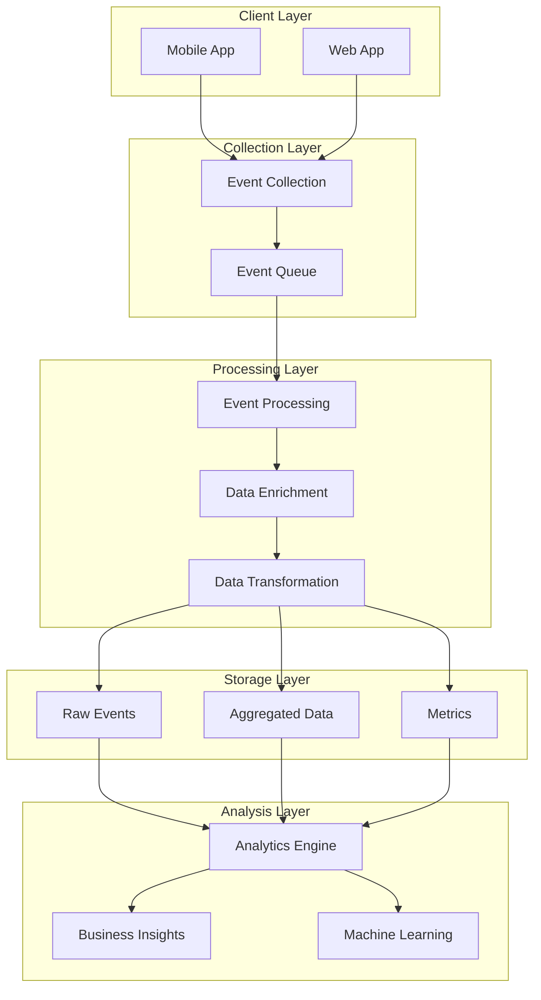

# Analytics & Tracking Implementation

## 1. Analytics Architecture



## 2. Event Tracking Implementation

### 2.1 Analytics Service

```typescript
interface AnalyticsEvent {
    name: string;
    timestamp: number;
    userId?: string;
    sessionId: string;
    properties: Record<string, any>;
    context: {
        platform: 'ios' | 'android' | 'web';
        version: string;
        deviceId: string;
        deviceInfo: {
            model: string;
            os: string;
            osVersion: string;
        };
        network: {
            type: string;
            carrier?: string;
        };
    };
}

class AnalyticsService {
    private queue: AnalyticsEvent[] = [];
    private batchSize: number = 10;
    private flushInterval: number = 30000; // 30 seconds
    
    constructor() {
        // Start flush timer
        setInterval(
            () => this.flush(),
            this.flushInterval
        );
    }
    
    async trackEvent(
        name: string,
        properties: Record<string, any>
    ): Promise<void> {
        const event: AnalyticsEvent = {
            name,
            timestamp: Date.now(),
            userId: await this.getUserId(),
            sessionId: await this.getSessionId(),
            properties,
            context: await this.getContext()
        };
        
        this.queue.push(event);
        
        if (this.queue.length >= this.batchSize) {
            await this.flush();
        }
    }
    
    private async flush(): Promise<void> {
        if (this.queue.length === 0) return;
        
        const events = [...this.queue];
        this.queue = [];
        
        try {
            await this.sendEvents(events);
        } catch (error) {
            // If send fails, add back to queue
            this.queue.unshift(...events);
            console.error('Failed to send events:', error);
        }
    }
    
    private async sendEvents(
        events: AnalyticsEvent[]
    ): Promise<void> {
        await fetch(
            'https://analytics.productivityapp.com/events',
            {
                method: 'POST',
                headers: {
                    'Content-Type': 'application/json'
                },
                body: JSON.stringify({ events })
            }
        );
    }
}
```

### 2.2 Event Definitions

```typescript
// Event Types
enum EventType {
    // Screen Views
    SCREEN_VIEW = 'screen_view',
    
    // Task Events
    TASK_CREATE = 'task_create',
    TASK_UPDATE = 'task_update',
    TASK_COMPLETE = 'task_complete',
    TASK_DELETE = 'task_delete',
    
    // Habit Events
    HABIT_CREATE = 'habit_create',
    HABIT_COMPLETE = 'habit_complete',
    HABIT_STREAK_ACHIEVED = 'habit_streak_achieved',
    HABIT_STREAK_BROKEN = 'habit_streak_broken',
    
    // Goal Events
    GOAL_CREATE = 'goal_create',
    GOAL_UPDATE = 'goal_update',
    GOAL_COMPLETE = 'goal_complete',
    
    // User Events
    USER_SIGNUP = 'user_signup',
    USER_LOGIN = 'user_login',
    USER_LOGOUT = 'user_logout',
    
    // Feature Usage
    FEATURE_USED = 'feature_used',
    SETTING_CHANGED = 'setting_changed',
    
    // Error Events
    ERROR_OCCURRED = 'error_occurred',
    SYNC_ERROR = 'sync_error'
}

// Event Properties
interface TaskEventProperties {
    taskId: string;
    title: string;
    category?: string;
    priority?: string;
    dueDate?: string;
    isRecurring: boolean;
}

interface HabitEventProperties {
    habitId: string;
    title: string;
    category?: string;
    frequency: string;
    streakCount: number;
}

interface GoalEventProperties {
    goalId: string;
    title: string;
    category?: string;
    targetDate?: string;
    progress: number;
}

interface ErrorEventProperties {
    code: string;
    message: string;
    stack?: string;
    context?: Record<string, any>;
}

// Event Tracking Functions
class EventTracker {
    private analytics: AnalyticsService;
    
    async trackTaskComplete(
        task: Task
    ): Promise<void> {
        await this.analytics.trackEvent(
            EventType.TASK_COMPLETE,
            {
                taskId: task.id,
                title: task.title,
                category: task.category,
                priority: task.priority,
                dueDate: task.dueDate,
                isRecurring: task.recurrence !== null,
                timeToComplete: Date.now() - task.createdAt,
                wasOverdue: task.dueDate < Date.now()
            }
        );
    }
    
    async trackHabitStreak(
        habit: Habit,
        streakCount: number
    ): Promise<void> {
        await this.analytics.trackEvent(
            EventType.HABIT_STREAK_ACHIEVED,
            {
                habitId: habit.id,
                title: habit.title,
                category: habit.category,
                frequency: habit.frequency,
                streakCount,
                previousBest: habit.longestStreak,
                isNewRecord: streakCount > habit.longestStreak
            }
        );
    }
    
    async trackError(
        error: Error,
        context?: Record<string, any>
    ): Promise<void> {
        await this.analytics.trackEvent(
            EventType.ERROR_OCCURRED,
            {
                code: error.name,
                message: error.message,
                stack: error.stack,
                context
            }
        );
    }
}
```

## 3. Performance Monitoring

### 3.1 Performance Metrics

```typescript
interface PerformanceMetrics {
    // App Launch Metrics
    appStartTime: number;
    timeToInteractive: number;
    
    // Navigation Metrics
    screenLoadTime: number;
    navigationTiming: {
        route: string;
        startTime: number;
        endTime: number;
    };
    
    // Network Metrics
    apiLatency: {
        endpoint: string;
        method: string;
        startTime: number;
        endTime: number;
        status: number;
    };
    
    // Resource Metrics
    memoryUsage: number;
    cpuUsage: number;
    batteryLevel: number;
    
    // Custom Metrics
    customTimings: {
        name: string;
        duration: number;
    }[];
}

class PerformanceMonitor {
    private metrics: PerformanceMetrics;
    
    async trackAppStart(): Promise<void> {
        const startTime = performance.now();
        
        // Listen for app ready
        await this.waitForAppReady();
        
        this.metrics.appStartTime = 
            performance.now() - startTime;
        
        // Track time to interactive
        await this.waitForInteractive();
        
        this.metrics.timeToInteractive = 
            performance.now() - startTime;
        
        await this.sendMetrics();
    }
    
    async trackScreenLoad(
        route: string
    ): Promise<void> {
        const start = performance.now();
        
        // Listen for screen render complete
        await this.waitForRender();
        
        this.metrics.navigationTiming = {
            route,
            startTime: start,
            endTime: performance.now()
        };
        
        await this.sendMetrics();
    }
    
    async trackApiCall(
        endpoint: string,
        method: string
    ): Promise<void> {
        const start = performance.now();
        let status: number;
        
        try {
            const response = await fetch(endpoint, { method });
            status = response.status;
        } catch (error) {
            status = 0;
            throw error;
        } finally {
            this.metrics.apiLatency = {
                endpoint,
                method,
                startTime: start,
                endTime: performance.now(),
                status
            };
            
            await this.sendMetrics();
        }
    }
}
```

### 3.2 Resource Monitoring

```typescript
class ResourceMonitor {
    private memoryWarningThreshold = 80; // 80%
    private batteryWarningThreshold = 20; // 20%
    
    async startMonitoring(): Promise<void> {
        // Monitor memory usage
        setInterval(
            async () => {
                const usage = await this.getMemoryUsage();
                if (usage > this.memoryWarningThreshold) {
                    await this.handleHighMemory(usage);
                }
            },
            60000 // Every minute
        );
        
        // Monitor battery level
        if ('getBattery' in navigator) {
            const battery = await navigator.getBattery();
            battery.addEventListener(
                'levelchange',
                () => this.handleBatteryChange(battery.level)
            );
        }
        
        // Monitor network status
        window.addEventListener(
            'online',
            () => this.handleNetworkChange(true)
        );
        window.addEventListener(
            'offline',
            () => this.handleNetworkChange(false)
        );
    }
    
    private async handleHighMemory(
        usage: number
    ): Promise<void> {
        // Log warning
        console.warn(`High memory usage: ${usage}%`);
        
        // Track event
        await analytics.trackEvent(
            'high_memory_usage',
            { usage }
        );
        
        // Attempt to free memory
        this.clearCaches();
        this.disposeUnusedResources();
    }
    
    private async handleBatteryChange(
        level: number
    ): Promise<void> {
        if (level <= this.batteryWarningThreshold) {
            // Enable battery saving mode
            await this.enableBatterySaver();
            
            // Track event
            await analytics.trackEvent(
                'low_battery_mode',
                { level }
            );
        }
    }
    
    private async handleNetworkChange(
        isOnline: boolean
    ): Promise<void> {
        if (!isOnline) {
            // Enable offline mode
            await this.enableOfflineMode();
            
            // Track event
            await analytics.trackEvent(
                'offline_mode_enabled',
                {
                    lastOnline: new Date().toISOString()
                }
            );
        }
    }
}
```

## 4. User Behavior Analysis

### 4.1 Session Tracking

```typescript
interface Session {
    id: string;
    userId: string;
    startTime: number;
    endTime?: number;
    duration?: number;
    events: AnalyticsEvent[];
    screens: string[];
    actions: string[];
    errors: ErrorEventProperties[];
}

class SessionManager {
    private currentSession?: Session;
    private sessionTimeout = 30 * 60 * 1000; // 30 minutes
    private timer?: NodeJS.Timeout;
    
    async startSession(
        userId: string
    ): Promise<void> {
        // End previous session if exists
        if (this.currentSession) {
            await this.endSession();
        }
        
        // Create new session
        this.currentSession = {
            id: uuid(),
            userId,
            startTime: Date.now(),
            events: [],
            screens: [],
            actions: [],
            errors: []
        };
        
        // Track session start
        await analytics.trackEvent(
            'session_start',
            {
                sessionId: this.currentSession.id
            }
        );
        
        // Start timeout timer
        this.resetTimer();
    }
    
    async addEvent(
        event: AnalyticsEvent
    ): Promise<void> {
        if (!this.currentSession) {
            await this.startSession(event.userId!);
        }
        
        this.currentSession!.events.push(event);
        
        if (event.name === 'screen_view') {
            this.currentSession!.screens.push(
                event.properties.screen
            );
        } else if (event.name === 'error_occurred') {
            this.currentSession!.errors.push(
                event.properties as ErrorEventProperties
            );
        } else {
            this.currentSession!.actions.push(event.name);
        }
        
        // Reset timeout timer
        this.resetTimer();
    }
    
    private async endSession(): Promise<void> {
        if (!this.currentSession) return;
        
        const session = this.currentSession;
        this.currentSession = undefined;
        
        // Calculate duration
        session.endTime = Date.now();
        session.duration = session.endTime - session.startTime;
        
        // Track session end
        await analytics.trackEvent(
            'session_end',
            {
                sessionId: session.id,
                duration: session.duration,
                screenCount: session.screens.length,
                actionCount: session.actions.length,
                errorCount: session.errors.length
            }
        );
        
        // Store session data
        await this.storeSession(session);
    }
    
    private resetTimer(): void {
        if (this.timer) {
            clearTimeout(this.timer);
        }
        
        this.timer = setTimeout(
            () => this.endSession(),
            this.sessionTimeout
        );
    }
}
```

### 4.2 User Flow Analysis

```typescript
interface UserFlow {
    sessionId: string;
    userId: string;
    startTime: number;
    endTime: number;
    steps: {
        screen: string;
        action?: string;
        timestamp: number;
        duration: number;
    }[];
    outcome: 'completed' | 'abandoned' | 'error';
    conversionMetrics?: {
        timeToComplete: number;
        stepCount: number;
        errorCount: number;
    };
}

class UserFlowAnalyzer {
    private flows: Map<string, UserFlow> = new Map();
    
    async trackStep(
        sessionId: string,
        userId: string,
        screen: string,
        action?: string
    ): Promise<void> {
        let flow = this.flows.get(sessionId);
        
        if (!flow) {
            flow = {
                sessionId,
                userId,
                startTime: Date.now(),
                endTime: 0,
                steps: [],
                outcome: 'abandoned'
            };
            this.flows.set(sessionId, flow);
        }
        
        const lastStep = flow.steps[flow.steps.length - 1];
        if (lastStep) {
            lastStep.duration = 
                Date.now() - lastStep.timestamp;
        }
        
        flow.steps.push({
            screen,
            action,
            timestamp: Date.now(),
            duration: 0
        });
        
        // Check for flow completion
        if (this.isFlowComplete(flow)) {
            await this.completeFlow(flow);
        }
    }
    
    private async completeFlow(
        flow: UserFlow
    ): Promise<void> {
        flow.endTime = Date.now();
        flow.outcome = 'completed';
        
        // Calculate conversion metrics
        flow.conversionMetrics = {
            timeToComplete: flow.endTime - flow.startTime,
            stepCount: flow.steps.length,
            errorCount: flow.steps.filter(
                step => step.action?.includes('error')
            ).length
        };
        
        // Track completion
        await analytics.trackEvent(
            'user_flow_complete',
            {
                flowId: flow.sessionId,
                ...flow.conversionMetrics
            }
        );
        
        // Store flow data
        await this.storeFlow(flow);
        
        // Remove from active flows
        this.flows.delete(flow.sessionId);
    }
}
```

## 5. Data Processing & Analysis

### 5.1 Event Processing Pipeline

```typescript
interface EventProcessor {
    process(event: AnalyticsEvent): Promise<void>;
}

class EventProcessingPipeline {
    private processors: EventProcessor[] = [
        new ValidationProcessor(),
        new EnrichmentProcessor(),
        new TransformationProcessor(),
        new StorageProcessor(),
        new AnalyticsProcessor()
    ];
    
    async processEvent(
        event: AnalyticsEvent
    ): Promise<void> {
        let processedEvent = event;
        
        for (const processor of this.processors) {
            try {
                await processor.process(processedEvent);
            } catch (error) {
                console.error(
                    `Error in ${processor.constructor.name}:`,
                    error
                );
                // Continue processing despite errors
            }
        }
    }
}

class ValidationProcessor implements EventProcessor {
    async process(
        event: AnalyticsEvent
    ): Promise<void> {
        // Validate required fields
        if (!event.name || !event.timestamp) {
            throw new Error('Invalid event format');
        }
        
        // Validate event name
        if (!Object.values(EventType).includes(event.name as EventType)) {
            throw new Error(`Invalid event type: ${event.name}`);
        }
        
        // Validate properties based on event type
        await this.validateProperties(event);
    }
}

class EnrichmentProcessor implements EventProcessor {
    async process(
        event: AnalyticsEvent
    ): Promise<void> {
        // Add user data
        if (event.userId) {
            const userData = await this.getUserData(event.userId);
            event.properties.user = userData;
        }
        
        // Add location data
        const location = await this.getLocation();
        event.properties.location = location;
        
        // Add app state
        event.properties.appState = await this.getAppState();
    }
}

class TransformationProcessor implements EventProcessor {
    async process(
        event: AnalyticsEvent
    ): Promise<void> {
        // Standardize date formats
        this.standardizeDates(event);
        
        // Normalize property names
        this.normalizeProperties(event);
        
        // Calculate derived metrics
        await this.addDerivedMetrics(event);
    }
}
```

### 5.2 Analytics Queries

```typescript
interface AnalyticsQuery {
    timeRange: {
        start: Date;
        end: Date;
    };
    dimensions: string[];
    metrics: string[];
    filters?: {
        field: string;
        operator: 'eq' | 'gt' | 'lt' | 'contains';
        value: any;
    }[];
    sort?: {
        field: string;
        direction: 'asc' | 'desc';
    };
    limit?: number;
}

class AnalyticsQueryEngine {
    async executeQuery(
        query: AnalyticsQuery
    ): Promise<any[]> {
        // Build SQL query
        const sql = this.buildSqlQuery(query);
        
        // Execute query
        const results = await this.executeSQL(sql);
        
        // Post-process results
        return this.processResults(results, query);
    }
    
    private buildSqlQuery(
        query: AnalyticsQuery
    ): string {
        const select = this.buildSelect(query);
        const from = this.buildFrom(query);
        const where = this.buildWhere(query);
        const groupBy = this.buildGroupBy(query);
        const orderBy = this.buildOrderBy(query);
        const limit = query.limit ? `LIMIT ${query.limit}` : '';
        
        return `
            ${select}
            ${from}
            ${where}
            ${groupBy}
            ${orderBy}
            ${limit}
        `;
    }
    
    private buildSelect(
        query: AnalyticsQuery
    ): string {
        const dimensions = query.dimensions.join(', ');
        const metrics = query.metrics.map(
            metric => this.buildMetricExpression(metric)
        ).join(', ');
        
        return `SELECT ${dimensions}, ${metrics}`;
    }
    
    private buildMetricExpression(
        metric: string
    ): string {
        switch (metric) {
            case 'session_duration':
                return 'AVG(EXTRACT(EPOCH FROM (end_time - start_time)))';
            case 'completion_rate':
                return 'COUNT(CASE WHEN status = \'completed\' THEN 1 END) / COUNT(*)::float';
            default:
                return `SUM(${metric})`;
        }
    }
}
```

This comprehensive analytics and tracking document provides detailed implementations for event tracking, performance monitoring, user behavior analysis, and data processing. The system is designed to collect, process, and analyze user interactions and application performance while maintaining scalability and reliability.
