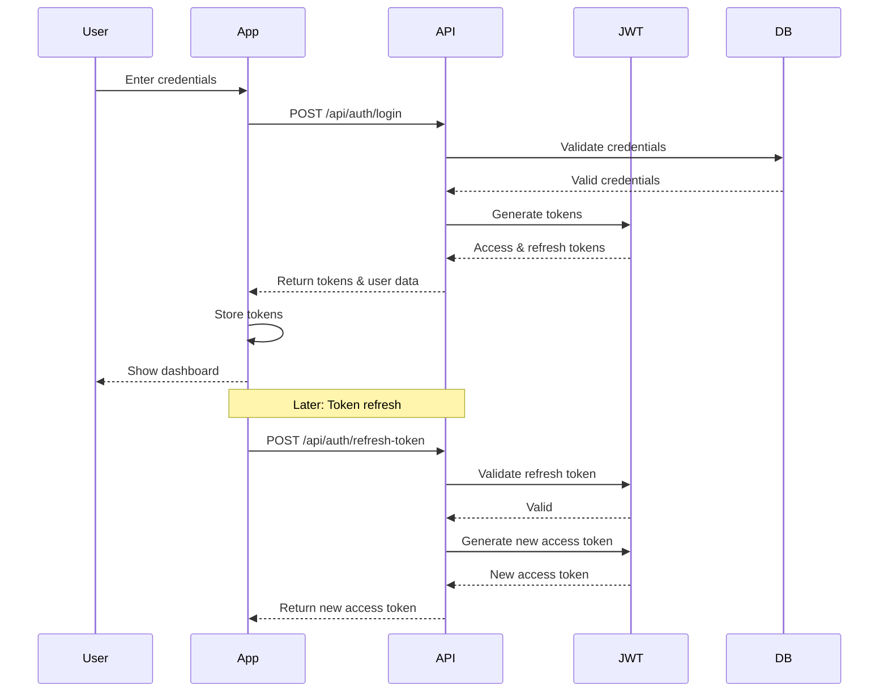

# API Documentation & Specifications v2.0

## 1. API Architecture

```mermaid
graph TD
    subgraph Client Layer
        Mobile[Mobile App]
        Web[Web App]
    end
    
    subgraph API Gateway
        Gateway[API Gateway]
        Gateway --> Auth[Authentication]
        Gateway --> Rate[Rate Limiting]
        Gateway --> Cache[Response Cache]
    end
    
    subgraph Service Layer
        Auth --> TaskS[Task Service]
        Auth --> HabitS[Habit Service]
        Auth --> GoalS[Goal Service]
        Auth --> UserS[User Service]
        Auth --> CatS[Category Service]
        Auth --> ProdS[Productivity Service]
        Auth --> AchS[Achievement Service]
    end
    
    subgraph Data Storage
        MongoDB[(MongoDB)]
        Cache1[(Redis Cache)]
    end
    
    subgraph ML Services
        ML[ML Processor]
        Analytics[Analytics Engine]
    end
    
    subgraph Documentation
        Spec[OpenAPI Spec]
        Docs[API Docs]
        Tests[API Tests]
    end
    
    Service Layer --> MongoDB
    Service Layer --> Cache1
    Service Layer --> ML
```

## 2. OpenAPI Specification

```yaml
openapi: 3.0.0
info:
  title: Productivity App API
  version: 2.0.0
  description: |
    API for managing tasks, habits, goals and user productivity in the app.
    
    Features:
    - Task management with subtasks and hierarchical organization
    - Advanced habit tracking with streak management
    - Goal setting with milestones
    - User profile management with productivity analytics
    - Category-based organization
    - Achievement system
    - Machine Learning integrations for personalization

servers:
  - url: https://api.productivityapp.com/v1
    description: Production server
  - url: https://staging-api.productivityapp.com/v1
    description: Staging server

security:
  - BearerAuth: []

components:
  securitySchemes:
    BearerAuth:
      type: http
      scheme: bearer
      bearerFormat: JWT
  
  schemas:
    User:
      type: object
      required:
        - name
        - email
      properties:
        id:
          type: string
          format: uuid
        name:
          type: string
        email:
          type: string
          format: email
        username:
          type: string
        bio:
          type: string
        avatarUrl:
          type: string
          format: uri
        coverPhotoUrl:
          type: string
          format: uri
        timezone:
          type: string
        settings:
          type: object
          properties:
            theme:
              type: string
              enum: [light, dark, system]
            startScreen:
              type: string
            notificationPreferences:
              type: object
              properties:
                tasks:
                  type: boolean
                habits:
                  type: boolean
                goals:
                  type: boolean
                system:
                  type: boolean
            privacySettings:
              type: object
              properties:
                shareActivity:
                  type: boolean
                allowSuggestions:
                  type: boolean
        productivity:
          type: object
          properties:
            peakHours:
              type: array
              items:
                type: integer
                minimum: 0
                maximum: 23
            preferredWorkDays:
              type: array
              items:
                type: integer
                minimum: 0
                maximum: 6
            focusDuration:
              type: integer
            completionRate:
              type: number
        lastLogin:
          type: string
          format: date-time
        createdAt:
          type: string
          format: date-time
        updatedAt:
          type: string
          format: date-time

    Task:
      type: object
      required:
        - title
      properties:
        id:
          type: string
          format: uuid
        title:
          type: string
          maxLength: 255
        description:
          type: string
        completed:
          type: boolean
          default: false
        completedAt:
          type: string
          format: date-time
        dueDate:
          type: string
          format: date-time
        priority:
          type: string
          enum: [low, medium, high]
          default: medium
        status:
          type: string
          enum: [todo, in_progress, completed, archived]
          default: todo
        category:
          type: string
          format: uuid
        parentTaskId:
          type: string
          format: uuid
        tags:
          type: array
          items:
            type: string
        recurrence:
          type: object
          properties:
            frequency:
              type: string
              enum: [daily, weekly, monthly]
            interval:
              type: integer
              minimum: 1
            endDate:
              type: string
              format: date-time
        reminderTime:
          type: string
          format: date-time
        effort:
          type: integer
          minimum: 1
          maximum: 5
          description: Estimated effort level (1-5)
        complexity:
          type: integer
          minimum: 1
          maximum: 5
          description: Task complexity for ML processing
        attachments:
          type: array
          items:
            type: object
            properties:
              name:
                type: string
              url:
                type: string
                format: uri
              type:
                type: string
              size:
                type: integer
        metadata:
          type: object
          properties:
            contextualUrgency:
              type: number
            estimatedDuration:
              type: integer
              description: Minutes to complete
            lastModifiedField:
              type: string
            completionContext:
              type: object
              properties:
                location:
                  type: string
                timeOfDay:
                  type: integer
                dayOfWeek:
                  type: integer
        createdAt:
          type: string
          format: date-time
        updatedAt:
          type: string
          format: date-time
    
    Habit:
      type: object
      required:
        - title
        - frequency
      properties:
        id:
          type: string
          format: uuid
        title:
          type: string
          maxLength: 255
        description:
          type: string
        frequency:
          type: string
          enum: [daily, weekly, monthly]
        frequencyConfig:
          type: object
          properties:
            daysOfWeek:
              type: array
              items:
                type: integer
                minimum: 0
                maximum: 6
            datesOfMonth:
              type: array
              items:
                type: integer
                minimum: 1
                maximum: 31
            timesPerPeriod:
              type: integer
              minimum: 1
        timePreference:
          type: object
          properties:
            preferredTime:
              type: string
              format: time
            flexibility:
              type: integer
              description: Minutes of flexibility
        streak:
          type: integer
        streakData:
          type: object
          properties:
            current:
              type: integer
            longest:
              type: integer
            lastCompleted:
              type: string
              format: date-time
        category:
          type: string
          format: uuid
        completionHistory:
          type: array
          items:
            type: object
            properties:
              date:
                type: string
                format: date-time
              completed:
                type: boolean
              value:
                type: number
              notes:
                type: string
              mood:
                type: integer
                minimum: 1
                maximum: 5
              skipReason:
                type: string
        difficulty:
          type: string
          enum: [easy, medium, hard]
        status:
          type: string
          enum: [active, paused, archived]
        startDate:
          type: string
          format: date-time
        endDate:
          type: string
          format: date-time
        reminderSettings:
          type: object
          properties:
            time:
              type: string
              format: time
            customMessage:
              type: string
            notificationStyle:
              type: string
              enum: [basic, motivational]
        successCriteria:
          type: object
          properties:
            type:
              type: string
              enum: [boolean, numeric, timer]
            target:
              type: number
            unit:
              type: string
            minimumThreshold:
              type: number
        metadata:
          type: object
          properties:
            successRate:
              type: number
            averageCompletionTime:
              type: string
            contextPatterns:
              type: object
              properties:
                location:
                  type: array
                  items:
                    type: string
                precedingActivities:
                  type: array
                  items:
                    type: string
                followingActivities:
                  type: array
                  items:
                    type: string
        consistency:
          type: number
          description: Consistency score based on completion rate
        createdAt:
          type: string
          format: date-time
        updatedAt:
          type: string
          format: date-time
    
    Goal:
      type: object
      required:
        - title
      properties:
        id:
          type: string
          format: uuid
        title:
          type: string
          maxLength: 255
        description:
          type: string
        category:
          type: string
          format: uuid
        startDate:
          type: string
          format: date
        targetDate:
          type: string
          format: date
        progress:
          type: number
          minimum: 0
          maximum: 100
        status:
          type: string
          enum: [not_started, in_progress, completed, abandoned, archived]
        timePeriod:
          type: string
          enum: [short_term, medium_term, long_term]
        priority:
          type: integer
          minimum: 1
          maximum: 5
        difficulty:
          type: integer
          minimum: 1
          maximum: 5
        measurementType:
          type: string
          enum: [numeric, boolean, checklist]
        metrics:
          type: object
          properties:
            type:
              type: string
              enum: [numeric, boolean, checklist]
            target:
              type: number
            current:
              type: number
            unit:
              type: string
        milestones:
          type: array
          items:
            type: object
            properties:
              id:
                type: string
              title:
                type: string
              description:
                type: string
              dueDate:
                type: string
                format: date
              completed:
                type: boolean
              completedAt:
                type: string
                format: date-time
              dependsOn:
                type: array
                items:
                  type: string
        relatedTasks:
          type: array
          items:
            type: string
            format: uuid
        relatedHabits:
          type: array
          items:
            type: string
            format: uuid
        impact:
          type: object
          properties:
            tasks:
              type: array
              items:
                type: object
                properties:
                  id:
                    type: string
                    format: uuid
                  weight:
                    type: number
                    minimum: 0
                    maximum: 100
            habits:
              type: array
              items:
                type: object
                properties:
                  id:
                    type: string
                    format: uuid
                  weight:
                    type: number
                    minimum: 0
                    maximum: 100
        checkIns:
          type: array
          items:
            type: object
            properties:
              date:
                type: string
                format: date-time
              notes:
                type: string
              progressUpdate:
                type: number
              blockers:
                type: array
                items:
                  type: string
        metadata:
          type: object
          properties:
            predictedCompletion:
              type: string
              format: date-time
            riskFactors:
              type: array
              items:
                type: string
            similarGoalsSuccessRate:
              type: number
        createdAt:
          type: string
          format: date-time
        updatedAt:
          type: string
          format: date-time

    Category:
      type: object
      required:
        - name
        - color
        - type
      properties:
        id:
          type: string
          format: uuid
        name:
          type: string
        color:
          type: string
          format: hex-color
        icon:
          type: string
        type:
          type: string
          enum: [task, habit, goal, all]
        isDefault:
          type: boolean
        order:
          type: integer
        createdAt:
          type: string
          format: date-time
        updatedAt:
          type: string
          format: date-time

    ProductivityMetrics:
      type: object
      required:
        - date
      properties:
        id:
          type: string
          format: uuid
        date:
          type: string
          format: date
        tasksCompleted:
          type: integer
        tasksCreated:
          type: integer
        habitCompletionRate:
          type: number
        goalProgress:
          type: array
          items:
            type: object
            properties:
              goalId:
                type: string
                format: uuid
              progress:
                type: number
        focusTime:
          type: integer
          description: Minutes of focus time
        productivityScore:
          type: number
          minimum: 0
          maximum: 100
        dayRating:
          type: integer
          minimum: 1
          maximum: 5
          description: User-provided rating of their day
        createdAt:
          type: string
          format: date-time
        updatedAt:
          type: string
          format: date-time

    Achievement:
      type: object
      required:
        - name
        - description
        - category
        - criteria
      properties:
        id:
          type: string
          format: uuid
        name:
          type: string
        description:
          type: string
        category:
          type: string
          enum: [tasks, habits, goals, special]
        points:
          type: integer
        icon:
          type: string
        criteria:
          type: object
          properties:
            type:
              type: string
              enum: [count, streak, time, complex]
            target:
              type: number
            criteria:
              type: string
              description: JSON or string criteria definition
        rarity:
          type: string
          enum: [common, rare, epic, legendary]
        createdAt:
          type: string
          format: date-time

    UserAchievement:
      type: object
      required:
        - user
        - achievement
      properties:
        id:
          type: string
          format: uuid
        user:
          type: string
          format: uuid
        achievement:
          type: string
          format: uuid
        progress:
          type: number
          minimum: 0
          maximum: 100
        earned:
          type: boolean
        earnedAt:
          type: string
          format: date-time
        createdAt:
          type: string
          format: date-time
        updatedAt:
          type: string
          format: date-time
```

## 3. Endpoint Documentation

### Authentication Endpoints

#### `POST /api/auth/register`
- **Description**: Register a new user
- **Auth Required**: No
- **Request Body**:
  ```json
  {
    "name": "string",
    "email": "string",
    "password": "string",
    "username": "string (optional)"
  }
  ```
- **Response**: User object with token

#### `POST /api/auth/login`
- **Description**: Authenticate a user
- **Auth Required**: No
- **Request Body**:
  ```json
  {
    "email": "string",
    "password": "string"
  }
  ```
- **Response**: User object with token

#### `POST /api/auth/refresh-token`
- **Description**: Refresh authentication token
- **Auth Required**: No
- **Request Body**:
  ```json
  {
    "refreshToken": "string",
    "userId": "string"
  }
  ```
- **Response**: New access token

### User Endpoints

#### `GET /api/users/profile`
- **Description**: Get current user's profile
- **Auth Required**: Yes
- **Response**: User profile object

#### `PUT /api/users/profile`
- **Description**: Update user profile
- **Auth Required**: Yes
- **Request Body**: User profile fields to update
- **Response**: Updated user profile

#### `PUT /api/users/settings`
- **Description**: Update user settings
- **Auth Required**: Yes
- **Request Body**: Settings object
- **Response**: Updated user with settings

#### `PUT /api/users/notifications`
- **Description**: Update notification preferences
- **Auth Required**: Yes
- **Request Body**: Notification preferences object
- **Response**: Updated user with notification preferences

#### `GET /api/users/productivity-stats`
- **Description**: Get user productivity statistics
- **Auth Required**: Yes
- **Query Parameters**:
  - `fromDate`: Start date (optional)
  - `toDate`: End date (optional)
- **Response**: Productivity statistics

#### `PUT /api/users/productivity-hours`
- **Description**: Update peak productivity hours
- **Auth Required**: Yes
- **Request Body**: Array of hours (0-23)
- **Response**: Updated user object

### Task Endpoints

#### `GET /api/tasks`
- **Description**: Get all tasks for the authenticated user
- **Auth Required**: Yes
- **Query Parameters**:
  - `completed`: Filter by completion status (boolean)
  - `status`: Filter by status (todo, in_progress, completed, archived)
  - `priority`: Filter by priority (low, medium, high)
  - `category`: Filter by category ID
  - `parentTaskId`: Filter by parent task ID
  - `showRootOnly`: Show only root tasks (boolean)
  - `fromDate`: Filter by due date start
  - `toDate`: Filter by due date end
  - `sort`: Field to sort by
  - `sortDir`: Sort direction (asc, desc)
- **Response**: Array of task objects

#### `POST /api/tasks`
- **Description**: Create a new task
- **Auth Required**: Yes
- **Request Body**: Task object
- **Response**: Created task object

#### `GET /api/tasks/:id`
- **Description**: Get a task by ID
- **Auth Required**: Yes
- **Response**: Task object with sub-tasks

#### `PUT /api/tasks/:id`
- **Description**: Update a task
- **Auth Required**: Yes
- **Request Body**: Task fields to update
- **Response**: Updated task object

#### `DELETE /api/tasks/:id`
- **Description**: Delete a task
- **Auth Required**: Yes
- **Query Parameters**:
  - `permanent`: Hard delete if true, otherwise soft delete (default: false)
- **Response**: Success message

#### `PATCH /api/tasks/:id/complete`
- **Description**: Toggle task completion status
- **Auth Required**: Yes
- **Response**: Updated task object

#### `GET /api/tasks/:id/subtasks`
- **Description**: Get sub-tasks for a parent task
- **Auth Required**: Yes
- **Response**: Array of sub-task objects

### Habit Endpoints

#### `GET /api/habits`
- **Description**: Get all habits for the authenticated user
- **Auth Required**: Yes
- **Query Parameters**:
  - `frequency`: Filter by frequency (daily, weekly, monthly)
  - `category`: Filter by category ID
  - `status`: Filter by status (active, paused, archived)
  - `sort`: Field to sort by
  - `sortDir`: Sort direction (asc, desc)
- **Response**: Array of habit objects

#### `POST /api/habits`
- **Description**: Create a new habit
- **Auth Required**: Yes
- **Request Body**: Habit object
- **Response**: Created habit object

#### `GET /api/habits/:id`
- **Description**: Get a habit by ID
- **Auth Required**: Yes
- **Response**: Habit object

#### `PUT /api/habits/:id`
- **Description**: Update a habit
- **Auth Required**: Yes
- **Request Body**: Habit fields to update
- **Response**: Updated habit object

#### `DELETE /api/habits/:id`
- **Description**: Delete a habit
- **Auth Required**: Yes
- **Query Parameters**:
  - `permanent`: Hard delete if true, otherwise archive (default: false)
- **Response**: Success message

#### `POST /api/habits/:id/track`
- **Description**: Track habit completion for a specific date
- **Auth Required**: Yes
- **Request Body**:
  ```json
  {
    "completed": true,
    "date": "2023-03-29",
    "notes": "Optional note about completion"
  }
  ```
- **Response**: Updated habit object

#### `GET /api/habits/:id/stats`
- **Description**: Get statistics for a habit
- **Auth Required**: Yes
- **Response**: Habit statistics object including:
  - Completion rate
  - Current streak
  - Longest streak
  - Consistency score
  - Completion patterns by day and time

### Goal Endpoints

#### `GET /api/goals`
- **Description**: Get all goals for the authenticated user
- **Auth Required**: Yes
- **Query Parameters**:
  - `status`: Filter by status
  - `category`: Filter by category ID
  - `priority`: Filter by priority level
  - `fromDate`: Filter by target date start
  - `toDate`: Filter by target date end
  - `timePeriod`: Filter by time period
  - `showArchived`: Include archived goals (default: false)
  - `sort`: Field to sort by
  - `sortDir`: Sort direction (asc, desc)
- **Response**: Array of goal objects

#### `POST /api/goals`
- **Description**: Create a new goal
- **Auth Required**: Yes
- **Request Body**: Goal object
- **Response**: Created goal object

#### `GET /api/goals/:id`
- **Description**: Get a goal by ID
- **Auth Required**: Yes
- **Response**: Goal object

#### `PUT /api/goals/:id`
- **Description**: Update a goal
- **Auth Required**: Yes
- **Request Body**: Goal fields to update
- **Response**: Updated goal object

#### `DELETE /api/goals/:id`
- **Description**: Delete a goal
- **Auth Required**: Yes
- **Query Parameters**:
  - `permanent`: Hard delete if true, otherwise archive (default: false)
- **Response**: Success message

#### `PATCH /api/goals/:id/progress`
- **Description**: Update goal progress
- **Auth Required**: Yes
- **Request Body**:
  ```json
  {
    "progress": 75,
    "note": "Optional note about progress update"
  }
  ```
- **Response**: Updated goal object

#### `POST /api/goals/:id/milestones`
- **Description**: Add a milestone to a goal
- **Auth Required**: Yes
- **Request Body**:
  ```json
  {
    "title": "Milestone title",
    "description": "Optional description",
    "dueDate": "2023-04-15",
    "completed": false
  }
  ```
- **Response**: Updated goal object with new milestone

#### `PUT /api/goals/:id/milestones/:milestoneIndex`
- **Description**: Update a milestone
- **Auth Required**: Yes
- **Request Body**: Milestone fields to update
- **Response**: Updated goal object

#### `GET /api/goals/stats`
- **Description**: Get goal statistics
- **Auth Required**: Yes
- **Response**: Goal statistics including:
  - Total goals
  - Completion rate
  - Goals by status
  - Goals by time period
  - Goals by priority

### Category Endpoints

#### `GET /api/categories`
- **Description**: Get all categories for the authenticated user
- **Auth Required**: Yes
- **Query Parameters**:
  - `type`: Filter by category type (task, habit, goal, all)
- **Response**: Array of category objects

#### `POST /api/categories`
- **Description**: Create a new category
- **Auth Required**: Yes
- **Request Body**: Category object
- **Response**: Created category object

#### `PUT /api/categories/:id`
- **Description**: Update a category
- **Auth Required**: Yes
- **Request Body**: Category fields to update
- **Response**: Updated category object

#### `DELETE /api/categories/:id`
- **Description**: Delete a category
- **Auth Required**: Yes
- **Response**: Success message

#### `PUT /api/categories/reorder`
- **Description**: Reorder categories
- **Auth Required**: Yes
- **Request Body**: Array of category IDs in desired order
- **Response**: Updated categories array

### Productivity Metrics Endpoints

#### `GET /api/productivity`
- **Description**: Get productivity metrics for a date range
- **Auth Required**: Yes
- **Query Parameters**:
  - `fromDate`: Start date
  - `toDate`: End date
- **Response**: Array of daily productivity metrics

#### `POST /api/productivity/focus-time`
- **Description**: Track focus time
- **Auth Required**: Yes
- **Request Body**:
  ```json
  {
    "minutes": 30,
    "date": "2023-03-29",
    "category": "optional-category-id"
  }
  ```
- **Response**: Updated productivity metrics

#### `POST /api/productivity/day-rating`
- **Description**: Submit daily productivity rating
- **Auth Required**: Yes
- **Request Body**:
  ```json
  {
    "rating": 4,
    "date": "2023-03-29",
    "notes": "Optional notes about the day"
  }
  ```
- **Response**: Updated productivity metrics

#### `GET /api/productivity/insights`
- **Description**: Get productivity insights
- **Auth Required**: Yes
- **Query Parameters**:
  - `period`: Time period for insights (week, month, quarter, year)
- **Response**: Productivity insights object

### Achievement Endpoints

#### `GET /api/achievements`
- **Description**: Get all achievements
- **Auth Required**: Yes
- **Query Parameters**:
  - `category`: Filter by category
  - `earned`: Filter by earned status (boolean)
  - `rarity`: Filter by rarity
- **Response**: Array of achievement objects

#### `GET /api/achievements/progress`
- **Description**: Get achievement progress for the user
- **Auth Required**: Yes
- **Response**: Achievement progress object

#### `POST /api/achievements/check`
- **Description**: Check for newly earned achievements
- **Auth Required**: Yes
- **Response**: Array of newly earned achievements

#### `GET /api/achievements/user`
- **Description**: Get achievements earned by the user
- **Auth Required**: Yes
- **Response**: Array of user achievement objects

## 4. Authentication Flow



## 5. Error Handling

All API endpoints follow a consistent error handling approach:

```json
{
  "success": false,
  "message": "Error message explaining what went wrong",
  "errors": [
    {
      "field": "email",
      "message": "Must be a valid email address"
    }
  ],
  "errorCode": "VALIDATION_ERROR",
  "statusCode": 400
}
```

Common error codes:
- `VALIDATION_ERROR`: Request validation failed
- `AUTHENTICATION_ERROR`: Authentication issues
- `AUTHORIZATION_ERROR`: Permission denied
- `RESOURCE_NOT_FOUND`: Requested resource not found
- `INVALID_REQUEST`: General request issues
- `SERVER_ERROR`: Internal server error

## 6. Pagination

Endpoints that return collections support pagination with the following parameters:

- `page`: Page number (starts at 1)
- `limit`: Items per page (default: 20, max: 100)

Response format for paginated endpoints:

```json
{
  "items": [...],
  "pagination": {
    "total": 45,
    "page": 2,
    "pages": 3,
    "limit": 20
  }
}
```

## 7. Versioning

The API uses URL-based versioning:
- Current version: `v1`
- Example: `https://api.productivityapp.com/v1/tasks`

When a breaking change is needed, a new version will be released:
- Next version: `v2`
- Example: `https://api.productivityapp.com/v2/tasks`

## 8. Rate Limiting

API requests are rate-limited to prevent abuse:

- Authenticated endpoints: 100 requests per minute
- Authentication endpoints: 10 requests per minute

Rate limit headers are included in all responses:
- `X-RateLimit-Limit`: Total allowed requests per window
- `X-RateLimit-Remaining`: Remaining requests in current window
- `X-RateLimit-Reset`: Time until reset (in seconds)

## 9. Machine Learning Integration

The API collects data for machine learning features:

- User behavior patterns
  - Task completion by time of day and day of week
  - Habit consistency patterns
  - Peak productivity hours

- Task patterns
  - Completion time based on complexity/effort
  - Connection between due dates and completion probability
  - Task categorization effectiveness

- Habit consistency
  - Streak maintenance factors
  - Contextual triggers for habit completion
  - Optimum scheduling for maximum adherence

- Goal achievement
  - Progress consistency
  - Impact of milestone structure on completion
  - Predictive completion timelines

This data is used for:
- Personalized task scheduling recommendations
- Smart habit reminders based on completion patterns
- Goal progress projections
- Success probability predictions 