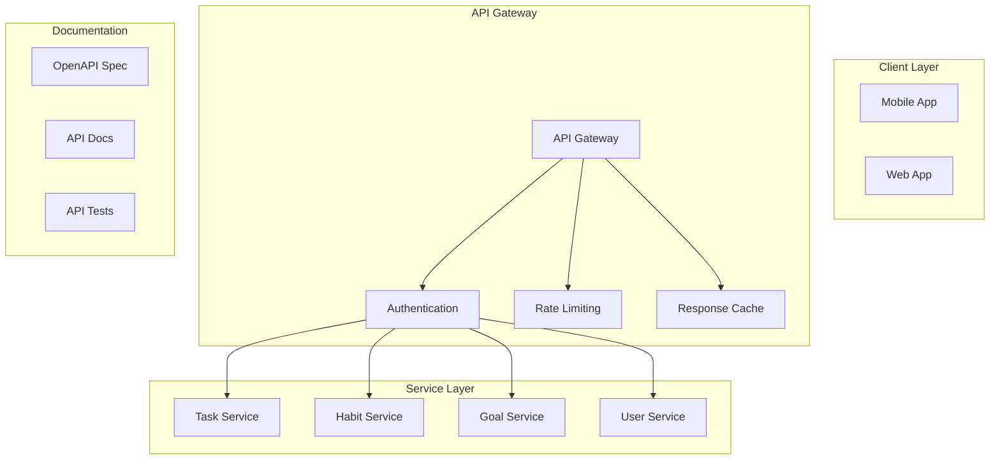

# API Documentation & Specifications

## 1. API Architecture



## 2. OpenAPI Specification

```yaml
openapi: 3.0.0
info:
  title: Productivity App API
  version: 1.0.0
  description: |
    API for managing tasks, habits, and goals in the Productivity App.
    
    Features:
    - Task management
    - Habit tracking
    - Goal setting
    - User management
    - Analytics

servers:
  - url: https://api.productivityapp.com/v1
    description: Production server
  - url: https://staging-api.productivityapp.com/v1
    description: Staging server

security:
  - BearerAuth: []

components:
  securitySchemes:
    BearerAuth:
      type: http
      scheme: bearer
      bearerFormat: JWT
  
  schemas:
    Task:
      type: object
      required:
        - title
        - status
      properties:
        id:
          type: string
          format: uuid
        title:
          type: string
          maxLength: 255
        description:
          type: string
        dueDate:
          type: string
          format: date-time
        priority:
          type: string
          enum: [low, medium, high]
        status:
          type: string
          enum: [pending, in_progress, completed]
        category:
          type: string
        tags:
          type: array
          items:
            type: string
        createdAt:
          type: string
          format: date-time
        updatedAt:
          type: string
          format: date-time
    
    Habit:
      type: object
      required:
        - title
        - frequency
      properties:
        id:
          type: string
          format: uuid
        title:
          type: string
          maxLength: 255
        description:
          type: string
        frequency:
          type: object
          required:
            - type
            - value
          properties:
            type:
              type: string
              enum: [daily, weekly, monthly]
            value:
              type: integer
            days:
              type: array
              items:
                type: integer
                minimum: 0
                maximum: 6
        currentStreak:
          type: integer
        longestStreak:
          type: integer
        lastCompleted:
          type: string
          format: date-time
    
    Goal:
      type: object
      required:
        - title
        - targetDate
      properties:
        id:
          type: string
          format: uuid
        title:
          type: string
          maxLength: 255
        description:
          type: string
        targetDate:
          type: string
          format: date
        progress:
          type: number
          minimum: 0
          maximum: 100
        status:
          type: string
          enum: [active, completed, abandoned]
        milestones:
          type: array
          items:
            type: object
            properties:
              title:
                type: string
              completed:
                type: boolean
              dueDate:
                type: string
                format: date

paths:
  /tasks:
    get:
      summary: List tasks
      parameters:
        - name: status
          in: query
          schema:
            type: string
            enum: [pending, in_progress, completed]
        - name: priority
          in: query
          schema:
            type: string
            enum: [low, medium, high]
        - name: dueDate
          in: query
          schema:
            type: string
            format: date
        - name: page
          in: query
          schema:
            type: integer
            minimum: 1
            default: 1
        - name: limit
          in: query
          schema:
            type: integer
            minimum: 1
            maximum: 100
            default: 20
      responses:
        '200':
          description: List of tasks
          content:
            application/json:
              schema:
                type: object
                properties:
                  items:
                    type: array
                    items:
                      $ref: '#/components/schemas/Task'
                  total:
                    type: integer
                  page:
                    type: integer
                  pages:
                    type: integer
    
    post:
      summary: Create task
      requestBody:
        required: true
        content:
          application/json:
            schema:
              $ref: '#/components/schemas/Task'
      responses:
        '201':
          description: Task created
          content:
            application/json:
              schema:
                $ref: '#/components/schemas/Task'
  
  /tasks/{taskId}:
    parameters:
      - name: taskId
        in: path
        required: true
        schema:
          type: string
          format: uuid
    
    get:
      summary: Get task
      responses:
        '200':
          description: Task details
          content:
            application/json:
              schema:
                $ref: '#/components/schemas/Task'
    
    put:
      summary: Update task
      requestBody:
        required: true
        content:
          application/json:
            schema:
              $ref: '#/components/schemas/Task'
      responses:
        '200':
          description: Task updated
          content:
            application/json:
              schema:
                $ref: '#/components/schemas/Task'
    
    delete:
      summary: Delete task
      responses:
        '204':
          description: Task deleted

  /habits:
    get:
      summary: List habits
      parameters:
        - name: status
          in: query
          schema:
            type: string
            enum: [active, archived]
        - name: page
          in: query
          schema:
            type: integer
            minimum: 1
            default: 1
        - name: limit
          in: query
          schema:
            type: integer
            minimum: 1
            maximum: 100
            default: 20
      responses:
        '200':
          description: List of habits
          content:
            application/json:
              schema:
                type: object
                properties:
                  items:
                    type: array
                    items:
                      $ref: '#/components/schemas/Habit'
                  total:
                    type: integer
                  page:
                    type: integer
                  pages:
                    type: integer
    
    post:
      summary: Create habit
      requestBody:
        required: true
        content:
          application/json:
            schema:
              $ref: '#/components/schemas/Habit'
      responses:
        '201':
          description: Habit created
          content:
            application/json:
              schema:
                $ref: '#/components/schemas/Habit'

  /habits/{habitId}/complete:
    parameters:
      - name: habitId
        in: path
        required: true
        schema:
          type: string
          format: uuid
    
    post:
      summary: Complete habit
      requestBody:
        required: true
        content:
          application/json:
            schema:
              type: object
              properties:
                date:
                  type: string
                  format: date
                value:
                  type: number
                notes:
                  type: string
      responses:
        '200':
          description: Habit completed
          content:
            application/json:
              schema:
                type: object
                properties:
                  streak:
                    type: integer
                  isNewRecord:
                    type: boolean
                  nextDue:
                    type: string
                    format: date

  /goals:
    get:
      summary: List goals
      parameters:
        - name: status
          in: query
          schema:
            type: string
            enum: [active, completed, abandoned]
        - name: page
          in: query
          schema:
            type: integer
            minimum: 1
            default: 1
        - name: limit
          in: query
          schema:
            type: integer
            minimum: 1
            maximum: 100
            default: 20
      responses:
        '200':
          description: List of goals
          content:
            application/json:
              schema:
                type: object
                properties:
                  items:
                    type: array
                    items:
                      $ref: '#/components/schemas/Goal'
                  total:
                    type: integer
                  page:
                    type: integer
                  pages:
                    type: integer
    
    post:
      summary: Create goal
      requestBody:
        required: true
        content:
          application/json:
            schema:
              $ref: '#/components/schemas/Goal'
      responses:
        '201':
          description: Goal created
          content:
            application/json:
              schema:
                $ref: '#/components/schemas/Goal'

  /goals/{goalId}/progress:
    parameters:
      - name: goalId
        in: path
        required: true
        schema:
          type: string
          format: uuid
    
    post:
      summary: Update goal progress
      requestBody:
        required: true
        content:
          application/json:
            schema:
              type: object
              required:
                - progress
              properties:
                progress:
                  type: number
                  minimum: 0
                  maximum: 100
                notes:
                  type: string
      responses:
        '200':
          description: Goal progress updated
          content:
            application/json:
              schema:
                $ref: '#/components/schemas/Goal'
```

## 3. API Documentation Generation

### 3.1 Documentation Setup

```typescript
import { serve, setup } from 'swagger-ui-express';
import { OpenAPIV3 } from 'openapi-types';
import * as YAML from 'yaml';
import * as fs from 'fs';
import * as path from 'path';

// Load OpenAPI spec
const spec = YAML.parse(
    fs.readFileSync(
        path.join(__dirname, 'openapi.yaml'),
        'utf8'
    )
) as OpenAPIV3.Document;

// Setup documentation route
app.use(
    '/api-docs',
    serve,
    setup(spec, {
        explorer: true,
        customSiteTitle: 'Productivity App API',
        customfavIcon: '/favicon.ico',
        customCss: '.swagger-ui .topbar { display: none }',
        swaggerOptions: {
            persistAuthorization: true,
            displayRequestDuration: true,
            filter: true,
            tryItOutEnabled: true
        }
    })
);

// Generate static documentation
import { generateDocumentation } from './docgen';

async function buildDocs(): Promise<void> {
    await generateDocumentation(spec, {
        format: 'markdown',
        output: './docs',
        templates: './templates',
        examples: './examples'
    });
}
```

### 3.2 Example Generation

```typescript
interface Example {
    title: string;
    description: string;
    request: {
        method: string;
        path: string;
        headers?: Record<string, string>;
        query?: Record<string, string>;
        body?: any;
    };
    response: {
        status: number;
        headers?: Record<string, string>;
        body: any;
    };
}

class ExampleGenerator {
    private examples: Example[] = [];
    
    async generateExamples(): Promise<void> {
        // Generate task examples
        await this.generateTaskExamples();
        
        // Generate habit examples
        await this.generateHabitExamples();
        
        // Generate goal examples
        await this.generateGoalExamples();
        
        // Write examples
        await this.writeExamples();
    }
    
    private async generateTaskExamples(): Promise<void> {
        // Create task
        this.examples.push({
            title: 'Create Task',
            description: 'Create a new task with due date and priority',
            request: {
                method: 'POST',
                path: '/tasks',
                headers: {
                    'Content-Type': 'application/json',
                    'Authorization': 'Bearer {token}'
                },
                body: {
                    title: 'Complete project proposal',
                    description: 'Write and review project proposal',
                    dueDate: '2024-03-01T12:00:00Z',
                    priority: 'high',
                    tags: ['work', 'project']
                }
            },
            response: {
                status: 201,
                body: {
                    id: '123e4567-e89b-12d3-a456-426614174000',
                    title: 'Complete project proposal',
                    description: 'Write and review project proposal',
                    dueDate: '2024-03-01T12:00:00Z',
                    priority: 'high',
                    status: 'pending',
                    tags: ['work', 'project'],
                    createdAt: '2024-02-18T10:00:00Z',
                    updatedAt: '2024-02-18T10:00:00Z'
                }
            }
        });
        
        // List tasks
        this.examples.push({
            title: 'List Tasks',
            description: 'Get a list of pending tasks',
            request: {
                method: 'GET',
                path: '/tasks',
                query: {
                    status: 'pending',
                    priority: 'high',
                    page: '1',
                    limit: '20'
                },
                headers: {
                    'Authorization': 'Bearer {token}'
                }
            },
            response: {
                status: 200,
                body: {
                    items: [
                        {
                            id: '123e4567-e89b-12d3-a456-426614174000',
                            title: 'Complete project proposal',
                            description: 'Write and review project proposal',
                            dueDate: '2024-03-01T12:00:00Z',
                            priority: 'high',
                            status: 'pending',
                            tags: ['work', 'project'],
                            createdAt: '2024-02-18T10:00:00Z',
                            updatedAt: '2024-02-18T10:00:00Z'
                        }
                    ],
                    total: 1,
                    page: 1,
                    pages: 1
                }
            }
        });
    }
}
```

## 4. API Testing Tools

### 4.1 Integration Tests

```typescript
import { describe, it, expect, beforeAll } from 'jest';
import request from 'supertest';
import { app } from '../app';
import { createTestUser, getAuthToken } from './helpers';

describe('Task API', () => {
    let authToken: string;
    let userId: string;
    
    beforeAll(async () => {
        const user = await createTestUser();
        userId = user.id;
        authToken = await getAuthToken(user);
    });
    
    describe('POST /tasks', () => {
        it('should create task', async () => {
            const response = await request(app)
                .post('/tasks')
                .set('Authorization', `Bearer ${authToken}`)
                .send({
                    title: 'Test Task',
                    description: 'Test Description',
                    dueDate: '2024-03-01T12:00:00Z',
                    priority: 'high'
                });
            
            expect(response.status).toBe(201);
            expect(response.body).toMatchObject({
                title: 'Test Task',
                description: 'Test Description',
                dueDate: '2024-03-01T12:00:00Z',
                priority: 'high',
                status: 'pending'
            });
        });
        
        it('should validate request body', async () => {
            const response = await request(app)
                .post('/tasks')
                .set('Authorization', `Bearer ${authToken}`)
                .send({
                    description: 'Missing title'
                });
            
            expect(response.status).toBe(400);
            expect(response.body).toHaveProperty('error');
            expect(response.body.error).toContain('title');
        });
    });
    
    describe('GET /tasks', () => {
        beforeEach(async () => {
            // Create test tasks
            await Promise.all([
                request(app)
                    .post('/tasks')
                    .set('Authorization', `Bearer ${authToken}`)
                    .send({
                        title: 'Task 1',
                        priority: 'high'
                    }),
                request(app)
                    .post('/tasks')
                    .set('Authorization', `Bearer ${authToken}`)
                    .send({
                        title: 'Task 2',
                        priority: 'medium'
                    })
            ]);
        });
        
        it('should list tasks', async () => {
            const response = await request(app)
                .get('/tasks')
                .set('Authorization', `Bearer ${authToken}`);
            
            expect(response.status).toBe(200);
            expect(response.body.items).toHaveLength(2);
            expect(response.body.total).toBe(2);
        });
        
        it('should filter tasks', async () => {
            const response = await request(app)
                .get('/tasks')
                .query({ priority: 'high' })
                .set('Authorization', `Bearer ${authToken}`);
            
            expect(response.status).toBe(200);
            expect(response.body.items).toHaveLength(1);
            expect(response.body.items[0].priority).toBe('high');
        });
    });
});
```

### 4.2 Contract Tests

```typescript
import { Verifier } from '@pact-foundation/pact';
import { app } from '../app';

describe('Pact Verification', () => {
    it('validates the expectations of Task Service', async () => {
        const opts = {
            provider: 'Task Service',
            providerBaseUrl: 'http://localhost:3000',
            pactUrls: [
                './pacts/task-client-task-service.json'
            ],
            stateHandlers: {
                'a task exists': async () => {
                    await createTestTask({
                        id: '123',
                        title: 'Test Task'
                    });
                },
                'no tasks exist': async () => {
                    await deleteAllTasks();
                }
            }
        };
        
        await new Verifier(opts).verifyProvider();
    });
});
```

### 4.3 Performance Tests

```typescript
import { check, sleep } from 'k6';
import http from 'k6/http';

export const options = {
    scenarios: {
        api_load: {
            executor: 'ramping-vus',
            startVUs: 0,
            stages: [
                { duration: '1m', target: 50 },
                { duration: '3m', target: 50 },
                { duration: '1m', target: 0 }
            ],
            gracefulRampDown: '30s'
        }
    },
    thresholds: {
        http_req_duration: ['p(95)<500'],
        http_req_failed: ['rate<0.01']
    }
};

const BASE_URL = 'https://api.productivityapp.com';

export default function() {
    const authToken = authenticate();
    
    group('Task API', () => {
        // List tasks
        const listResponse = http.get(
            `${BASE_URL}/tasks`,
            {
                headers: {
                    'Authorization': `Bearer ${authToken}`
                }
            }
        );
        
        check(listResponse, {
            'list tasks status 200': (r) => r.status === 200,
            'list tasks duration < 500ms': (r) => r.timings.duration < 500
        });
        
        sleep(1);
        
        // Create task
        const createResponse = http.post(
            `${BASE_URL}/tasks`,
            JSON.stringify({
                title: 'Performance Test Task',
                priority: 'medium'
            }),
            {
                headers: {
                    'Authorization': `Bearer ${authToken}`,
                    'Content-Type': 'application/json'
                }
            }
        );
        
        check(createResponse, {
            'create task status 201': (r) => r.status === 201,
            'create task duration < 1s': (r) => r.timings.duration < 1000
        });
        
        sleep(1);
    });
}
```

This comprehensive API documentation provides detailed specifications, examples, and testing strategies for the application's API. The documentation includes OpenAPI specifications, example generation, and various testing approaches to ensure API reliability and performance.
