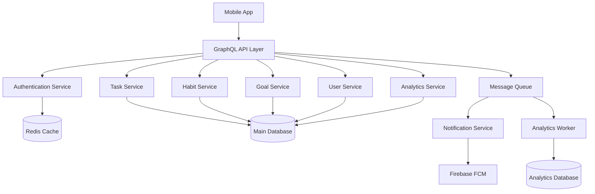
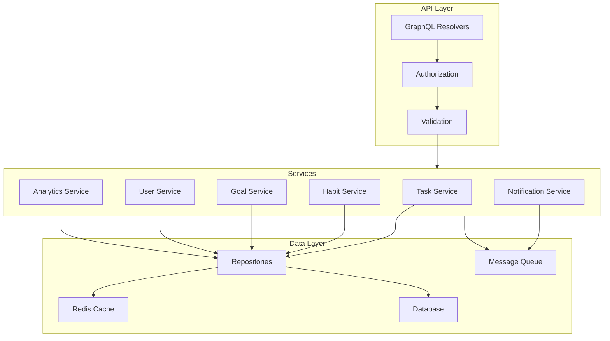

# Backend Architecture & Database Design

## System Architecture



## Database Schema

### Core Tables

#### users
```sql
CREATE TABLE users (
    id UUID PRIMARY KEY,
    email VARCHAR(255) UNIQUE NOT NULL,
    password_hash VARCHAR(255) NOT NULL,
    full_name VARCHAR(100) NOT NULL,
    username VARCHAR(50) UNIQUE NOT NULL,
    bio TEXT,
    avatar_url VARCHAR(255),
    cover_photo_url VARCHAR(255),
    timezone VARCHAR(50) NOT NULL,
    created_at TIMESTAMP NOT NULL DEFAULT NOW(),
    updated_at TIMESTAMP NOT NULL DEFAULT NOW(),
    last_login_at TIMESTAMP,
    settings JSONB NOT NULL DEFAULT '{}'::jsonb,
    notification_preferences JSONB NOT NULL DEFAULT '{}'::jsonb,
    is_active BOOLEAN NOT NULL DEFAULT true
);

CREATE INDEX idx_users_email ON users(email);
CREATE INDEX idx_users_username ON users(username);
```

#### tasks
```sql
CREATE TABLE tasks (
    id UUID PRIMARY KEY,
    user_id UUID NOT NULL REFERENCES users(id),
    title VARCHAR(255) NOT NULL,
    description TEXT,
    due_date TIMESTAMP,
    priority SMALLINT NOT NULL DEFAULT 0,
    status VARCHAR(20) NOT NULL DEFAULT 'pending',
    category_id UUID REFERENCES categories(id),
    parent_task_id UUID REFERENCES tasks(id),
    created_at TIMESTAMP NOT NULL DEFAULT NOW(),
    updated_at TIMESTAMP NOT NULL DEFAULT NOW(),
    completed_at TIMESTAMP,
    reminder_time TIMESTAMP,
    recurrence_rule JSONB,
    metadata JSONB NOT NULL DEFAULT '{}'::jsonb,
    is_deleted BOOLEAN NOT NULL DEFAULT false
);

CREATE INDEX idx_tasks_user_id ON tasks(user_id);
CREATE INDEX idx_tasks_due_date ON tasks(due_date);
CREATE INDEX idx_tasks_status ON tasks(status);
CREATE INDEX idx_tasks_parent ON tasks(parent_task_id);
```

#### habits
```sql
CREATE TABLE habits (
    id UUID PRIMARY KEY,
    user_id UUID NOT NULL REFERENCES users(id),
    title VARCHAR(255) NOT NULL,
    description TEXT,
    frequency_type VARCHAR(20) NOT NULL,
    frequency_config JSONB NOT NULL,
    start_date DATE NOT NULL,
    end_date DATE,
    category_id UUID REFERENCES categories(id),
    current_streak INTEGER NOT NULL DEFAULT 0,
    longest_streak INTEGER NOT NULL DEFAULT 0,
    total_completions INTEGER NOT NULL DEFAULT 0,
    created_at TIMESTAMP NOT NULL DEFAULT NOW(),
    updated_at TIMESTAMP NOT NULL DEFAULT NOW(),
    last_completed_at TIMESTAMP,
    reminder_time TIME,
    is_archived BOOLEAN NOT NULL DEFAULT false
);

CREATE INDEX idx_habits_user_id ON habits(user_id);
CREATE INDEX idx_habits_frequency ON habits(frequency_type);
```

#### goals
```sql
CREATE TABLE goals (
    id UUID PRIMARY KEY,
    user_id UUID NOT NULL REFERENCES users(id),
    title VARCHAR(255) NOT NULL,
    description TEXT,
    category_id UUID REFERENCES categories(id),
    start_date DATE NOT NULL,
    target_date DATE,
    status VARCHAR(20) NOT NULL DEFAULT 'active',
    progress NUMERIC(5,2) NOT NULL DEFAULT 0,
    measurement_type VARCHAR(20) NOT NULL,
    target_value NUMERIC,
    current_value NUMERIC NOT NULL DEFAULT 0,
    created_at TIMESTAMP NOT NULL DEFAULT NOW(),
    updated_at TIMESTAMP NOT NULL DEFAULT NOW(),
    completed_at TIMESTAMP,
    is_archived BOOLEAN NOT NULL DEFAULT false
);

CREATE INDEX idx_goals_user_id ON goals(user_id);
CREATE INDEX idx_goals_status ON goals(status);
```

#### categories
```sql
CREATE TABLE categories (
    id UUID PRIMARY KEY,
    user_id UUID NOT NULL REFERENCES users(id),
    name VARCHAR(50) NOT NULL,
    color VARCHAR(7) NOT NULL,
    icon VARCHAR(50),
    type VARCHAR(20) NOT NULL,
    created_at TIMESTAMP NOT NULL DEFAULT NOW(),
    updated_at TIMESTAMP NOT NULL DEFAULT NOW(),
    is_deleted BOOLEAN NOT NULL DEFAULT false
);

CREATE UNIQUE INDEX idx_categories_user_name ON categories(user_id, name) WHERE NOT is_deleted;
```

### Tracking & Progress Tables

#### habit_logs
```sql
CREATE TABLE habit_logs (
    id UUID PRIMARY KEY,
    habit_id UUID NOT NULL REFERENCES habits(id),
    user_id UUID NOT NULL REFERENCES users(id),
    completed_date DATE NOT NULL,
    completed_at TIMESTAMP NOT NULL DEFAULT NOW(),
    value NUMERIC,
    notes TEXT,
    mood SMALLINT,
    skip_reason TEXT
);

CREATE UNIQUE INDEX idx_habit_logs_date ON habit_logs(habit_id, completed_date);
CREATE INDEX idx_habit_logs_user ON habit_logs(user_id, completed_date);
```

#### task_history
```sql
CREATE TABLE task_history (
    id UUID PRIMARY KEY,
    task_id UUID NOT NULL REFERENCES tasks(id),
    user_id UUID NOT NULL REFERENCES users(id),
    action VARCHAR(50) NOT NULL,
    old_status VARCHAR(20),
    new_status VARCHAR(20),
    notes TEXT,
    created_at TIMESTAMP NOT NULL DEFAULT NOW()
);

CREATE INDEX idx_task_history_task ON task_history(task_id);
CREATE INDEX idx_task_history_user ON task_history(user_id);
```

#### goal_updates
```sql
CREATE TABLE goal_updates (
    id UUID PRIMARY KEY,
    goal_id UUID NOT NULL REFERENCES goals(id),
    user_id UUID NOT NULL REFERENCES users(id),
    old_value NUMERIC,
    new_value NUMERIC NOT NULL,
    notes TEXT,
    created_at TIMESTAMP NOT NULL DEFAULT NOW()
);

CREATE INDEX idx_goal_updates_goal ON goal_updates(goal_id);
CREATE INDEX idx_goal_updates_user ON goal_updates(user_id);
```

### Gamification Tables

#### achievements
```sql
CREATE TABLE achievements (
    id UUID PRIMARY KEY,
    name VARCHAR(100) NOT NULL,
    description TEXT NOT NULL,
    category VARCHAR(50) NOT NULL,
    points INTEGER NOT NULL,
    icon VARCHAR(50) NOT NULL,
    criteria JSONB NOT NULL,
    created_at TIMESTAMP NOT NULL DEFAULT NOW()
);
```

#### user_achievements
```sql
CREATE TABLE user_achievements (
    id UUID PRIMARY KEY,
    user_id UUID NOT NULL REFERENCES users(id),
    achievement_id UUID NOT NULL REFERENCES achievements(id),
    earned_at TIMESTAMP NOT NULL DEFAULT NOW(),
    progress NUMERIC(5,2) NOT NULL DEFAULT 0,
    UNIQUE(user_id, achievement_id)
);

CREATE INDEX idx_user_achievements_user ON user_achievements(user_id);
```

#### streaks
```sql
CREATE TABLE streaks (
    id UUID PRIMARY KEY,
    user_id UUID NOT NULL REFERENCES users(id),
    habit_id UUID NOT NULL REFERENCES habits(id),
    start_date DATE NOT NULL,
    end_date DATE,
    length INTEGER NOT NULL DEFAULT 1,
    is_active BOOLEAN NOT NULL DEFAULT true,
    created_at TIMESTAMP NOT NULL DEFAULT NOW(),
    updated_at TIMESTAMP NOT NULL DEFAULT NOW()
);

CREATE INDEX idx_streaks_user_habit ON streaks(user_id, habit_id);
CREATE INDEX idx_streaks_active ON streaks(is_active);
```

### Analytics Tables

#### user_activity
```sql
CREATE TABLE user_activity (
    id UUID PRIMARY KEY,
    user_id UUID NOT NULL REFERENCES users(id),
    activity_type VARCHAR(50) NOT NULL,
    entity_type VARCHAR(50) NOT NULL,
    entity_id UUID NOT NULL,
    action VARCHAR(50) NOT NULL,
    metadata JSONB,
    created_at TIMESTAMP NOT NULL DEFAULT NOW()
);

CREATE INDEX idx_user_activity_user ON user_activity(user_id);
CREATE INDEX idx_user_activity_type ON user_activity(activity_type);
CREATE INDEX idx_user_activity_created ON user_activity(created_at);
```

#### productivity_metrics
```sql
CREATE TABLE productivity_metrics (
    id UUID PRIMARY KEY,
    user_id UUID NOT NULL REFERENCES users(id),
    date DATE NOT NULL,
    tasks_completed INTEGER NOT NULL DEFAULT 0,
    habits_completed INTEGER NOT NULL DEFAULT 0,
    goals_progress JSONB,
    focus_time INTEGER DEFAULT 0,
    productivity_score NUMERIC(5,2),
    created_at TIMESTAMP NOT NULL DEFAULT NOW(),
    updated_at TIMESTAMP NOT NULL DEFAULT NOW(),
    UNIQUE(user_id, date)
);

CREATE INDEX idx_productivity_metrics_user ON productivity_metrics(user_id);
CREATE INDEX idx_productivity_metrics_date ON productivity_metrics(date);
```

## Redis Cache Structure

### Session Storage
```
Key: session:{sessionId}
Type: Hash
Fields:
    - userId
    - deviceId
    - lastActive
    - permissions
TTL: 24 hours
```

### User Data Cache
```
Key: user:{userId}
Type: Hash
Fields:
    - profile (JSON string)
    - settings
    - notifications
TTL: 1 hour
```

### Task Lists
```
Key: tasks:user:{userId}:status:{status}
Type: Sorted Set
Score: dueDate (timestamp)
Value: taskId
TTL: 15 minutes
```

### Habit Streaks
```
Key: streaks:habit:{habitId}
Type: Hash
Fields:
    - current
    - longest
    - lastCompleted
TTL: 1 hour
```

### Achievement Progress
```
Key: achievements:user:{userId}
Type: Hash
Fields:
    - {achievementId}: progress (JSON string)
TTL: 30 minutes
```

## Message Queue Structure

### Task Notifications
```json
{
    "type": "TASK_REMINDER",
    "userId": "uuid",
    "taskId": "uuid",
    "title": "Task Title",
    "dueIn": "3600",
    "priority": "high"
}
```

### Habit Reminders
```json
{
    "type": "HABIT_REMINDER",
    "userId": "uuid",
    "habitId": "uuid",
    "title": "Habit Title",
    "streakCount": 5
}
```

### Achievement Unlocked
```json
{
    "type": "ACHIEVEMENT_UNLOCKED",
    "userId": "uuid",
    "achievementId": "uuid",
    "name": "Achievement Name",
    "points": 100
}
```

## API Layer Structure

### GraphQL Schema Overview

```graphql
type User {
    id: ID!
    email: String!
    fullName: String!
    username: String!
    bio: String
    avatarUrl: String
    coverPhotoUrl: String
    timezone: String!
    settings: JSONObject!
    stats: UserStats!
    tasks: [Task!]!
    habits: [Habit!]!
    goals: [Goal!]!
    achievements: [Achievement!]!
}

type Task {
    id: ID!
    title: String!
    description: String
    dueDate: DateTime
    priority: Priority!
    status: TaskStatus!
    category: Category
    parentTask: Task
    subtasks: [Task!]!
    recurrence: RecurrenceRule
    completedAt: DateTime
    createdAt: DateTime!
    updatedAt: DateTime!
}

type Habit {
    id: ID!
    title: String!
    description: String
    frequencyType: FrequencyType!
    frequencyConfig: JSONObject!
    startDate: Date!
    endDate: Date
    category: Category
    currentStreak: Int!
    longestStreak: Int!
    totalCompletions: Int!
    lastCompletedAt: DateTime
    progress: HabitProgress!
}

type Goal {
    id: ID!
    title: String!
    description: String
    category: Category
    startDate: Date!
    targetDate: Date
    status: GoalStatus!
    progress: Float!
    measurementType: MeasurementType!
    targetValue: Float
    currentValue: Float!
    milestones: [Milestone!]!
    relatedTasks: [Task!]!
    relatedHabits: [Habit!]!
}
```

### Service Layer Architecture



## Implementation Notes

### Security Measures
1. Authentication
   - JWT tokens with short expiry (15 minutes)
   - Refresh tokens with rotation
   - Rate limiting on auth endpoints
   - Password hashing with bcrypt

2. Data Protection
   - Encryption at rest
   - TLS for all connections
   - Regular security audits
   - Data backup strategy

### Performance Optimizations
1. Caching Strategy
   - User profile data
   - Active task lists
   - Streak calculations
   - Achievement progress

2. Database Optimization
   - Appropriate indexes
   - Partitioning for large tables
   - Regular vacuum and maintenance
   - Query optimization

### Scalability Considerations
1. Horizontal Scaling
   - Stateless services
   - Load balancing
   - Service discovery
   - Database replication

2. Vertical Scaling
   - Resource monitoring
   - Performance metrics
   - Capacity planning
   - Optimization opportunities

This detailed architecture document provides a comprehensive overview of the backend system, including database schema, caching strategy, message queue structure, and API layer design. Each component is specified with exact requirements and considerations for security, performance, and scalability.
