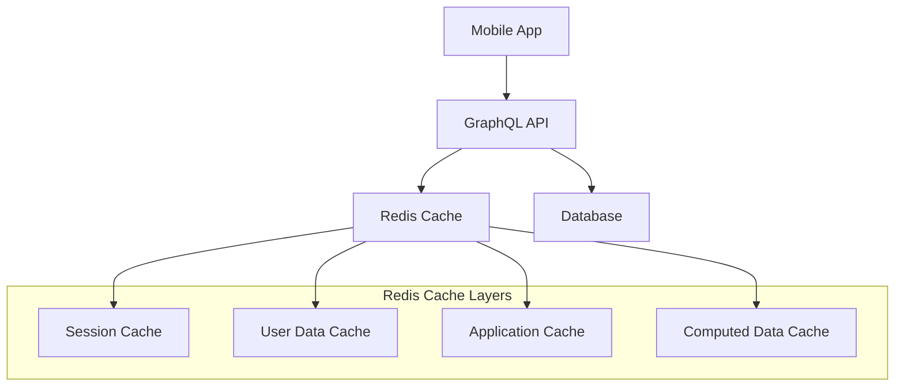

# Caching Strategy & Performance Optimization

## 1. Redis Cache Architecture

### 1.1 Cache Layer Overview



### 1.2 Cache Categories

1. **Session Data**
   ```
   Key: session:{sessionId}
   TTL: 24 hours
   Structure: Hash
   {
     "userId": "uuid",
     "deviceId": "string",
     "permissions": ["array"],
     "lastActive": "timestamp"
   }
   ```

2. **User Profile Data**
   ```
   Key: user:{userId}
   TTL: 1 hour
   Structure: Hash
   {
     "profile": {
       "name": "string",
       "email": "string",
       "settings": "json"
     },
     "preferences": "json",
     "notifications": "json"
   }
   ```

3. **Task Lists**
   ```
   Key: tasks:user:{userId}:status:{status}
   TTL: 15 minutes
   Structure: Sorted Set
   Score: dueDate (timestamp)
   Members: [taskId1, taskId2, ...]
   ```

4. **Habit Streaks**
   ```
   Key: streaks:habit:{habitId}
   TTL: 1 hour
   Structure: Hash
   {
     "current": "number",
     "longest": "number",
     "lastCompleted": "timestamp"
   }
   ```

## 2. Caching Strategies

### 2.1 Write Strategies

1. **Write-Through**
```typescript
async function updateTask(taskId: string, data: TaskUpdate): Promise<Task> {
    // Update database
    const updatedTask = await db.tasks.update(taskId, data);
    
    // Update cache immediately
    await cache.set(
        `task:${taskId}`,
        JSON.stringify(updatedTask),
        'EX',
        3600
    );
    
    // Invalidate task lists
    await cache.del(`tasks:user:${updatedTask.userId}:*`);
    
    return updatedTask;
}
```

2. **Write-Behind**
```typescript
async function logHabitCompletion(habitId: string, data: CompletionData): Promise<void> {
    // Write to cache immediately
    await cache.lpush(
        `habit:${habitId}:pending_logs`,
        JSON.stringify({ ...data, timestamp: Date.now() })
    );
    
    // Schedule background processing
    await queue.add('process-habit-logs', {
        habitId,
        batchSize: 100
    });
}
```

3. **Cache Invalidation**
```typescript
async function updateUserSettings(userId: string, settings: UserSettings): Promise<void> {
    // Update database
    await db.users.updateSettings(userId, settings);
    
    // Invalidate specific cache keys
    const keys = [
        `user:${userId}`,
        `user:${userId}:settings`,
        `user:${userId}:preferences`
    ];
    
    await cache.del(keys);
}
```

### 2.2 Read Strategies

1. **Read-Through**
```typescript
async function getTask(taskId: string): Promise<Task> {
    // Try cache first
    const cached = await cache.get(`task:${taskId}`);
    if (cached) {
        return JSON.parse(cached);
    }
    
    // Cache miss - get from database
    const task = await db.tasks.findById(taskId);
    if (task) {
        // Store in cache for next time
        await cache.set(
            `task:${taskId}`,
            JSON.stringify(task),
            'EX',
            3600
        );
    }
    
    return task;
}
```

2. **Bulk Loading**
```typescript
async function getUserTasks(userId: string, status: TaskStatus): Promise<Task[]> {
    const cacheKey = `tasks:user:${userId}:status:${status}`;
    
    // Try cache first
    const cachedIds = await cache.zrange(cacheKey, 0, -1);
    if (cachedIds.length > 0) {
        // Bulk load tasks from cache
        const tasks = await Promise.all(
            cachedIds.map(id => getTask(id))
        );
        return tasks.filter(t => t !== null);
    }
    
    // Cache miss - load from database
    const tasks = await db.tasks.findAll({
        userId,
        status,
        order: [['dueDate', 'ASC']]
    });
    
    // Store in cache
    if (tasks.length > 0) {
        const multi = cache.multi();
        
        // Store individual tasks
        tasks.forEach(task => {
            multi.set(
                `task:${task.id}`,
                JSON.stringify(task),
                'EX',
                3600
            );
        });
        
        // Store sorted set of IDs
        tasks.forEach(task => {
            multi.zadd(cacheKey, task.dueDate.getTime(), task.id);
        });
        multi.expire(cacheKey, 900); // 15 minutes
        
        await multi.exec();
    }
    
    return tasks;
}
```

3. **Computed Data**
```typescript
async function getUserStats(userId: string): Promise<UserStats> {
    const cacheKey = `user:${userId}:stats`;
    
    // Try cache first
    const cached = await cache.get(cacheKey);
    if (cached) {
        return JSON.parse(cached);
    }
    
    // Compute stats from database
    const stats = await computeUserStats(userId);
    
    // Cache for 5 minutes
    await cache.set(cacheKey, JSON.stringify(stats), 'EX', 300);
    
    return stats;
}
```

## 3. Cache Optimization Techniques

### 3.1 Memory Optimization

1. **Key Expiration Strategy**
```typescript
const CACHE_TTL = {
    SESSION: 86400,     // 24 hours
    USER_PROFILE: 3600, // 1 hour
    TASK_LIST: 900,     // 15 minutes
    COMPUTED: 300,      // 5 minutes
    TEMPORARY: 60       // 1 minute
};

async function setCacheWithTTL<T>(
    key: string,
    data: T,
    type: keyof typeof CACHE_TTL
): Promise<void> {
    await cache.set(
        key,
        JSON.stringify(data),
        'EX',
        CACHE_TTL[type]
    );
}
```

2. **Data Compression**
```typescript
import { compress, decompress } from 'lz-string';

async function setCacheCompressed<T>(
    key: string,
    data: T,
    ttl: number
): Promise<void> {
    const compressed = compress(JSON.stringify(data));
    await cache.set(key, compressed, 'EX', ttl);
}

async function getCacheCompressed<T>(key: string): Promise<T | null> {
    const compressed = await cache.get(key);
    if (!compressed) return null;
    
    const decompressed = decompress(compressed);
    return JSON.parse(decompressed);
}
```

### 3.2 Pattern-Based Invalidation

1. **Wildcard Invalidation**
```typescript
async function invalidateUserCache(userId: string): Promise<void> {
    const pattern = `user:${userId}:*`;
    const keys = await cache.keys(pattern);
    
    if (keys.length > 0) {
        await cache.del(keys);
    }
}
```

2. **Tag-Based Invalidation**
```typescript
async function setWithTags(
    key: string,
    data: any,
    tags: string[]
): Promise<void> {
    const multi = cache.multi();
    
    // Store the data
    multi.set(key, JSON.stringify(data));
    
    // Add key to each tag set
    tags.forEach(tag => {
        multi.sadd(`tag:${tag}`, key);
    });
    
    await multi.exec();
}

async function invalidateByTag(tag: string): Promise<void> {
    // Get all keys for this tag
    const keys = await cache.smembers(`tag:${tag}`);
    
    if (keys.length > 0) {
        const multi = cache.multi();
        
        // Delete all keys
        multi.del(keys);
        // Delete the tag set
        multi.del(`tag:${tag}`);
        
        await multi.exec();
    }
}
```

### 3.3 Cache Warming

1. **Predictive Loading**
```typescript
async function warmUserCache(userId: string): Promise<void> {
    // Load user profile
    const profile = await db.users.findById(userId);
    await cache.set(
        `user:${userId}`,
        JSON.stringify(profile),
        'EX',
        3600
    );
    
    // Load today's tasks
    const tasks = await db.tasks.findAll({
        userId,
        dueDate: {
            $gte: startOfDay(),
            $lte: endOfDay()
        }
    });
    
    const multi = cache.multi();
    tasks.forEach(task => {
        multi.set(
            `task:${task.id}`,
            JSON.stringify(task),
            'EX',
            3600
        );
    });
    
    await multi.exec();
}
```

2. **Background Refresh**
```typescript
async function refreshCache(): Promise<void> {
    // Get keys nearing expiration
    const keys = await cache.keys('*');
    
    for (const key of keys) {
        const ttl = await cache.ttl(key);
        
        // Refresh if less than 5 minutes remaining
        if (ttl > 0 && ttl < 300) {
            const data = await loadFreshData(key);
            await cache.set(key, JSON.stringify(data), 'EX', 3600);
        }
    }
}
```

## 4. Monitoring & Maintenance

### 4.1 Cache Metrics

```typescript
interface CacheMetrics {
    hits: number;
    misses: number;
    ratio: number;
    size: number;
    evictions: number;
}

async function trackCacheMetrics(
    operation: 'hit' | 'miss',
    key: string
): Promise<void> {
    const multi = cache.multi();
    
    // Increment counter
    multi.hincrby('cache:metrics', operation, 1);
    
    // Store key access pattern
    multi.zincrby('cache:keys:frequency', 1, key);
    
    await multi.exec();
}
```

### 4.2 Cache Maintenance

```typescript
async function optimizeCache(): Promise<void> {
    // Get least used keys
    const leastUsed = await cache.zrange(
        'cache:keys:frequency',
        0,
        100,
        'WITHSCORES'
    );
    
    // Remove keys with low usage
    const keysToRemove = leastUsed
        .filter(([_, score]) => Number(score) < 10)
        .map(([key]) => key);
    
    if (keysToRemove.length > 0) {
        await cache.del(keysToRemove);
    }
}
```

This comprehensive caching strategy document provides detailed implementations for various caching patterns, optimization techniques, and maintenance procedures. The strategies are designed to improve application performance while maintaining data consistency and efficient resource utilization.
