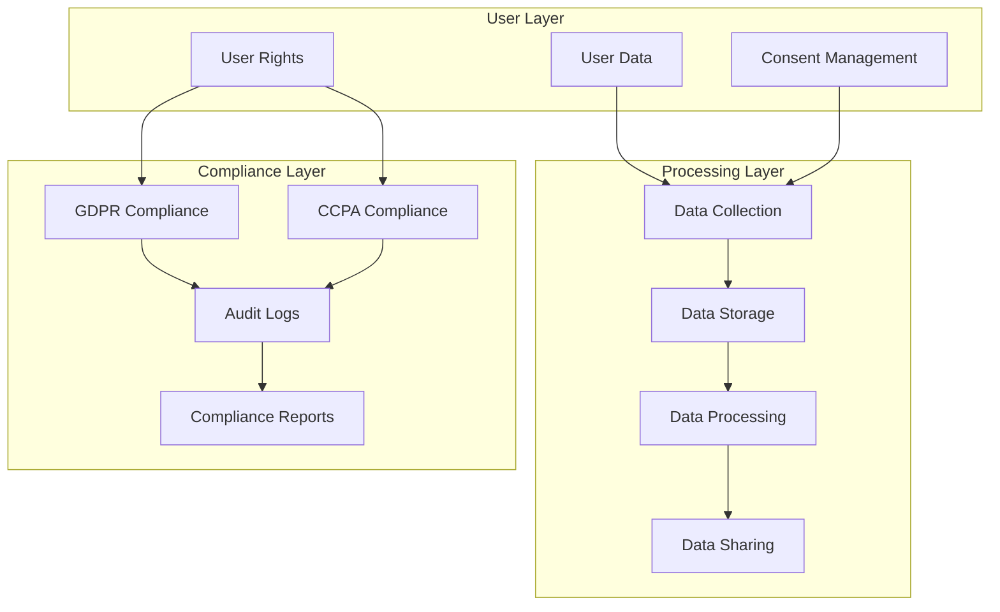

# Data Privacy & Compliance Strategy

## 1. Privacy Architecture



## 2. Data Protection Implementation

### 2.1 Data Classification

```typescript
enum DataSensitivity {
    PUBLIC = 'public',
    INTERNAL = 'internal',
    CONFIDENTIAL = 'confidential',
    RESTRICTED = 'restricted'
}

enum DataCategory {
    PERSONAL = 'personal',
    BEHAVIORAL = 'behavioral',
    FINANCIAL = 'financial',
    HEALTH = 'health',
    DEVICE = 'device',
    USAGE = 'usage'
}

interface DataClassification {
    sensitivity: DataSensitivity;
    category: DataCategory;
    retention: number; // days
    encryption: boolean;
    pseudonymization: boolean;
    accessControl: string[];
}

const dataClassifications: Record<string, DataClassification> = {
    'user.email': {
        sensitivity: DataSensitivity.CONFIDENTIAL,
        category: DataCategory.PERSONAL,
        retention: 365 * 7, // 7 years
        encryption: true,
        pseudonymization: false,
        accessControl: ['user.read', 'admin.user']
    },
    'user.password': {
        sensitivity: DataSensitivity.RESTRICTED,
        category: DataCategory.PERSONAL,
        retention: 365 * 7,
        encryption: true,
        pseudonymization: false,
        accessControl: ['auth.service']
    },
    'user.preferences': {
        sensitivity: DataSensitivity.INTERNAL,
        category: DataCategory.BEHAVIORAL,
        retention: 365 * 2,
        encryption: false,
        pseudonymization: true,
        accessControl: ['user.read', 'analytics.read']
    },
    'task.title': {
        sensitivity: DataSensitivity.CONFIDENTIAL,
        category: DataCategory.PERSONAL,
        retention: 365 * 2,
        encryption: true,
        pseudonymization: false,
        accessControl: ['task.read']
    },
    'analytics.usage': {
        sensitivity: DataSensitivity.INTERNAL,
        category: DataCategory.USAGE,
        retention: 365,
        encryption: false,
        pseudonymization: true,
        accessControl: ['analytics.read']
    }
};
```

### 2.2 Data Encryption

```typescript
interface EncryptionConfig {
    algorithm: string;
    keySize: number;
    ivSize: number;
    saltSize: number;
    iterations: number;
}

class DataEncryption {
    private config: EncryptionConfig = {
        algorithm: 'aes-256-gcm',
        keySize: 32,
        ivSize: 16,
        saltSize: 16,
        iterations: 100000
    };
    
    async encryptData(
        data: any,
        classification: DataClassification
    ): Promise<EncryptedData> {
        if (!classification.encryption) {
            return { data };
        }
        
        // Generate encryption key
        const salt = crypto.randomBytes(
            this.config.saltSize
        );
        
        const key = await this.deriveKey(
            process.env.MASTER_KEY!,
            salt
        );
        
        // Generate IV
        const iv = crypto.randomBytes(this.config.ivSize);
        
        // Create cipher
        const cipher = crypto.createCipheriv(
            this.config.algorithm,
            key,
            iv
        );
        
        // Encrypt data
        const encrypted = Buffer.concat([
            cipher.update(
                JSON.stringify(data),
                'utf8'
            ),
            cipher.final()
        ]);
        
        // Get auth tag
        const authTag = cipher.getAuthTag();
        
        return {
            data: encrypted.toString('base64'),
            iv: iv.toString('base64'),
            authTag: authTag.toString('base64'),
            salt: salt.toString('base64')
        };
    }
    
    async decryptData(
        encryptedData: EncryptedData,
        classification: DataClassification
    ): Promise<any> {
        if (!classification.encryption) {
            return encryptedData.data;
        }
        
        // Derive key
        const salt = Buffer.from(
            encryptedData.salt,
            'base64'
        );
        
        const key = await this.deriveKey(
            process.env.MASTER_KEY!,
            salt
        );
        
        // Create decipher
        const decipher = crypto.createDecipheriv(
            this.config.algorithm,
            key,
            Buffer.from(encryptedData.iv, 'base64')
        );
        
        decipher.setAuthTag(
            Buffer.from(encryptedData.authTag, 'base64')
        );
        
        // Decrypt data
        const decrypted = Buffer.concat([
            decipher.update(
                Buffer.from(encryptedData.data, 'base64')
            ),
            decipher.final()
        ]);
        
        return JSON.parse(decrypted.toString('utf8'));
    }
}
```

### 2.3 Data Pseudonymization

```typescript
interface PseudonymizationConfig {
    salt: string;
    algorithm: string;
}

class DataPseudonymizer {
    private config: PseudonymizationConfig = {
        salt: process.env.PSEUDONYM_SALT!,
        algorithm: 'sha256'
    };
    
    async pseudonymize(
        data: any,
        classification: DataClassification
    ): Promise<any> {
        if (!classification.pseudonymization) {
            return data;
        }
        
        if (typeof data === 'object') {
            const result: Record<string, any> = {};
            
            for (const [key, value] of Object.entries(data)) {
                const fieldClass = dataClassifications[key];
                
                if (fieldClass?.pseudonymization) {
                    result[key] = await this.hashValue(value);
                } else {
                    result[key] = value;
                }
            }
            
            return result;
        }
        
        return this.hashValue(data);
    }
    
    private async hashValue(value: any): Promise<string> {
        const hash = crypto.createHash(this.config.algorithm);
        hash.update(this.config.salt);
        hash.update(String(value));
        return hash.digest('hex');
    }
}
```

## 3. Consent Management

### 3.1 Consent Tracking

```typescript
interface ConsentOption {
    id: string;
    name: string;
    description: string;
    required: boolean;
    category: string;
    defaultValue: boolean;
}

interface ConsentRecord {
    userId: string;
    optionId: string;
    granted: boolean;
    timestamp: string;
    expiresAt?: string;
    source: string;
    version: string;
}

class ConsentManager {
    private options: ConsentOption[] = [
        {
            id: 'essential',
            name: 'Essential Features',
            description: 'Required for basic app functionality',
            required: true,
            category: 'essential',
            defaultValue: true
        },
        {
            id: 'analytics',
            name: 'Analytics',
            description: 'Help us improve the app',
            required: false,
            category: 'analytics',
            defaultValue: false
        },
        {
            id: 'marketing',
            name: 'Marketing',
            description: 'Receive marketing communications',
            required: false,
            category: 'marketing',
            defaultValue: false
        }
    ];
    
    async updateConsent(
        userId: string,
        optionId: string,
        granted: boolean
    ): Promise<void> {
        const option = this.options.find(
            opt => opt.id === optionId
        );
        
        if (!option) {
            throw new Error(`Invalid consent option: ${optionId}`);
        }
        
        if (option.required && !granted) {
            throw new Error(
                `Cannot revoke required consent: ${optionId}`
            );
        }
        
        const record: ConsentRecord = {
            userId,
            optionId,
            granted,
            timestamp: new Date().toISOString(),
            source: 'user_action',
            version: '1.0'
        };
        
        await this.storeConsent(record);
        await this.updateUserPreferences(userId, record);
    }
    
    async checkConsent(
        userId: string,
        optionId: string
    ): Promise<boolean> {
        const record = await this.getLatestConsent(
            userId,
            optionId
        );
        
        if (!record) {
            const option = this.options.find(
                opt => opt.id === optionId
            );
            return option?.defaultValue ?? false;
        }
        
        return record.granted;
    }
    
    async getConsentHistory(
        userId: string
    ): Promise<ConsentRecord[]> {
        return db.consentRecords.find({
            userId,
            order: [['timestamp', 'DESC']]
        });
    }
}
```

### 3.2 Privacy Preferences

```typescript
interface PrivacyPreferences {
    dataSharing: {
        analytics: boolean;
        marketing: boolean;
        thirdParty: boolean;
    };
    communications: {
        email: boolean;
        push: boolean;
        inApp: boolean;
    };
    retention: {
        deleteAfterInactive: number; // days
        autoDeleteData: boolean;
    };
}

class PrivacyManager {
    async updatePreferences(
        userId: string,
        preferences: Partial<PrivacyPreferences>
    ): Promise<void> {
        // Validate preferences
        this.validatePreferences(preferences);
        
        // Get current preferences
        const current = await this.getPreferences(userId);
        
        // Merge updates
        const updated = {
            ...current,
            ...preferences,
            updatedAt: new Date().toISOString()
        };
        
        // Store preferences
        await this.storePreferences(userId, updated);
        
        // Apply changes
        await this.applyPreferences(userId, updated);
    }
    
    private async applyPreferences(
        userId: string,
        preferences: PrivacyPreferences
    ): Promise<void> {
        // Update analytics settings
        if (!preferences.dataSharing.analytics) {
            await this.disableAnalytics(userId);
        }
        
        // Update communication settings
        await this.updateCommunicationSettings(
            userId,
            preferences.communications
        );
        
        // Update retention settings
        if (preferences.retention.autoDeleteData) {
            await this.scheduleDataDeletion(
                userId,
                preferences.retention.deleteAfterInactive
            );
        }
    }
}
```

## 4. Data Subject Rights

### 4.1 Right to Access

```typescript
interface DataAccessRequest {
    userId: string;
    requestId: string;
    timestamp: string;
    status: 'pending' | 'processing' | 'completed' | 'failed';
    data?: {
        personal: any;
        usage: any;
        preferences: any;
    };
}

class DataAccessHandler {
    async handleAccessRequest(
        userId: string
    ): Promise<DataAccessRequest> {
        // Create request record
        const request: DataAccessRequest = {
            userId,
            requestId: uuid(),
            timestamp: new Date().toISOString(),
            status: 'pending'
        };
        
        try {
            // Collect personal data
            const personal = await this.collectPersonalData(userId);
            
            // Collect usage data
            const usage = await this.collectUsageData(userId);
            
            // Collect preferences
            const preferences = await this.collectPreferences(userId);
            
            // Update request with data
            request.status = 'completed';
            request.data = {
                personal,
                usage,
                preferences
            };
            
            // Store request
            await this.storeRequest(request);
            
            // Notify user
            await this.notifyUser(userId, request);
            
            return request;
        } catch (error) {
            request.status = 'failed';
            await this.storeRequest(request);
            throw error;
        }
    }
    
    private async collectPersonalData(
        userId: string
    ): Promise<any> {
        const user = await db.users.findById(userId);
        const tasks = await db.tasks.findAll({ userId });
        const habits = await db.habits.findAll({ userId });
        const goals = await db.goals.findAll({ userId });
        
        return {
            profile: user,
            activities: {
                tasks,
                habits,
                goals
            }
        };
    }
}
```

### 4.2 Right to Erasure

```typescript
interface ErasureRequest {
    userId: string;
    requestId: string;
    timestamp: string;
    status: 'pending' | 'processing' | 'completed' | 'failed';
    scope: 'all' | 'partial';
    dataCategories?: string[];
}

class DataErasureHandler {
    async handleErasureRequest(
        userId: string,
        scope: ErasureRequest['scope'],
        dataCategories?: string[]
    ): Promise<ErasureRequest> {
        // Create request record
        const request: ErasureRequest = {
            userId,
            requestId: uuid(),
            timestamp: new Date().toISOString(),
            status: 'pending',
            scope,
            dataCategories
        };
        
        try {
            // Start transaction
            await db.transaction(async (trx) => {
                // Delete user data
                if (scope === 'all') {
                    await this.deleteAllUserData(userId, trx);
                } else {
                    await this.deleteSelectedData(
                        userId,
                        dataCategories!,
                        trx
                    );
                }
                
                // Update request status
                request.status = 'completed';
                await this.storeRequest(request, trx);
            });
            
            // Notify user
            await this.notifyUser(userId, request);
            
            return request;
        } catch (error) {
            request.status = 'failed';
            await this.storeRequest(request);
            throw error;
        }
    }
    
    private async deleteAllUserData(
        userId: string,
        trx: Transaction
    ): Promise<void> {
        // Delete user records
        await trx.users.delete({ userId });
        
        // Delete tasks
        await trx.tasks.delete({ userId });
        
        // Delete habits
        await trx.habits.delete({ userId });
        
        // Delete goals
        await trx.goals.delete({ userId });
        
        // Delete analytics
        await trx.analytics.delete({ userId });
        
        // Delete preferences
        await trx.preferences.delete({ userId });
    }
}
```

## 5. Compliance Monitoring

### 5.1 Audit Logging

```typescript
interface AuditLog {
    id: string;
    timestamp: string;
    actor: {
        id: string;
        type: 'user' | 'system' | 'admin';
    };
    action: string;
    resource: {
        type: string;
        id: string;
    };
    changes?: {
        before: any;
        after: any;
    };
    metadata?: Record<string, any>;
}

class AuditLogger {
    async logAction(
        action: string,
        actor: AuditLog['actor'],
        resource: AuditLog['resource'],
        changes?: AuditLog['changes'],
        metadata?: AuditLog['metadata']
    ): Promise<void> {
        const log: AuditLog = {
            id: uuid(),
            timestamp: new Date().toISOString(),
            actor,
            action,
            resource,
            changes,
            metadata
        };
        
        // Store log
        await this.storeLogs([log]);
        
        // Check for sensitive actions
        if (this.isSensitiveAction(action)) {
            await this.notifyAdmins(log);
        }
        
        // Update metrics
        await this.updateMetrics(log);
    }
    
    private isSensitiveAction(action: string): boolean {
        const sensitiveActions = [
            'user.delete',
            'data.export',
            'privacy.update',
            'security.change'
        ];
        
        return sensitiveActions.includes(action);
    }
    
    async generateReport(
        timeRange: {
            start: Date;
            end: Date;
        }
    ): Promise<AuditReport> {
        const logs = await this.getLogs(timeRange);
        
        return {
            timeRange,
            totalActions: logs.length,
            actionsByType: this.groupByAction(logs),
            sensitiveActions: this.filterSensitive(logs),
            userActions: this.groupByUser(logs)
        };
    }
}
```

### 5.2 Compliance Reports

```typescript
interface ComplianceReport {
    timestamp: string;
    period: {
        start: string;
        end: string;
    };
    metrics: {
        dataRequests: {
            access: number;
            erasure: number;
            rectification: number;
            portability: number;
        };
        consentChanges: number;
        dataBreaches: number;
        sensitiveActions: number;
    };
    issues: {
        severity: 'low' | 'medium' | 'high';
        description: string;
        recommendations: string[];
    }[];
    recommendations: string[];
}

class ComplianceMonitor {
    async generateReport(
        period: {
            start: Date;
            end: Date;
        }
    ): Promise<ComplianceReport> {
        // Get audit logs
        const logs = await this.getAuditLogs(period);
        
        // Get data requests
        const requests = await this.getDataRequests(period);
        
        // Get consent changes
        const consentChanges = await this.getConsentChanges(period);
        
        // Analyze compliance
        const issues = await this.analyzeCompliance(
            logs,
            requests,
            consentChanges
        );
        
        // Generate recommendations
        const recommendations = this.generateRecommendations(
            issues
        );
        
        return {
            timestamp: new Date().toISOString(),
            period: {
                start: period.start.toISOString(),
                end: period.end.toISOString()
            },
            metrics: {
                dataRequests: {
                    access: requests.filter(r => r.type === 'access').length,
                    erasure: requests.filter(r => r.type === 'erasure').length,
                    rectification: requests.filter(r => r.type === 'rectification').length,
                    portability: requests.filter(r => r.type === 'portability').length
                },
                consentChanges: consentChanges.length,
                dataBreaches: this.countDataBreaches(logs),
                sensitiveActions: this.countSensitiveActions(logs)
            },
            issues,
            recommendations
        };
    }
    
    private async analyzeCompliance(
        logs: AuditLog[],
        requests: DataRequest[],
        consentChanges: ConsentRecord[]
    ): Promise<ComplianceReport['issues']> {
        const issues: ComplianceReport['issues'] = [];
        
        // Check request response times
        const slowResponses = this.checkResponseTimes(requests);
        if (slowResponses.length > 0) {
            issues.push({
                severity: 'medium',
                description: 'Slow response to data requests',
                recommendations: [
                    'Optimize data collection process',
                    'Increase resources for request handling',
                    'Implement request prioritization'
                ]
            });
        }
        
        // Check for unusual patterns
        const patterns = this.detectAnomalies(logs);
        if (patterns.length > 0) {
            issues.push({
                severity: 'high',
                description: 'Unusual access patterns detected',
                recommendations: [
                    'Review access controls',
                    'Implement additional monitoring',
                    'Update security policies'
                ]
            });
        }
        
        return issues;
    }
}
```

This comprehensive data privacy document provides detailed implementations for data protection, consent management, data subject rights, and compliance monitoring. The system is designed to ensure GDPR and CCPA compliance while maintaining data security and user privacy.
