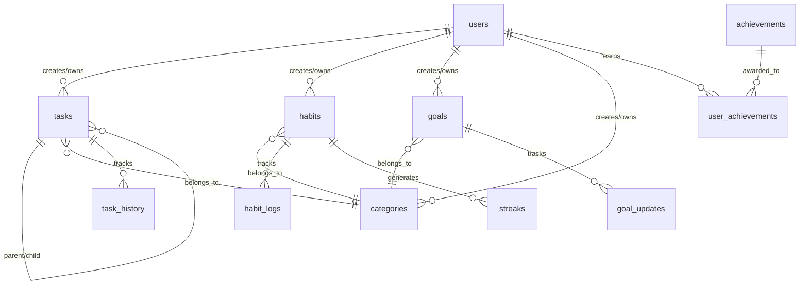
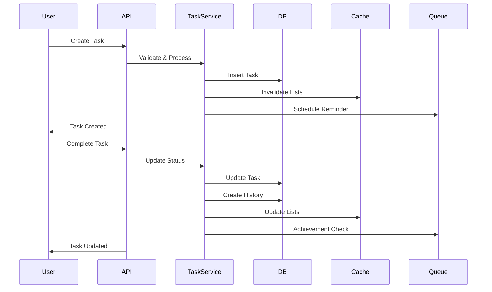
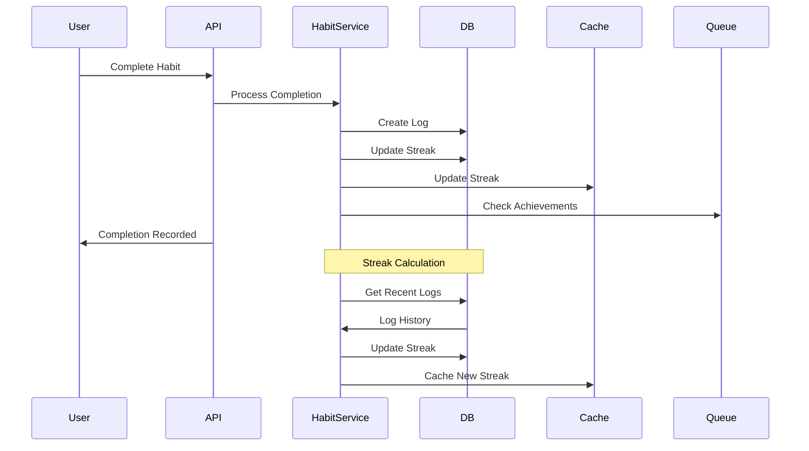
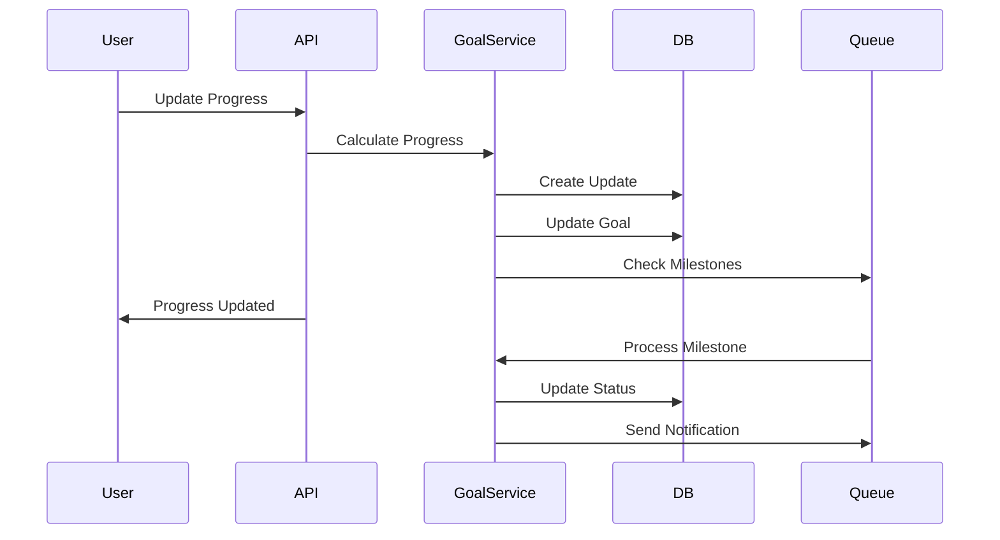

# Database Relationships & Data Flow Analysis

## 1. Core Entity Relationships



### Relationship Details

1. User-Centric Relationships
   - One user can have many tasks, habits, and goals
   - Each task, habit, and goal must belong to exactly one user
   - Users can create multiple categories for organization
   - User achievements track accomplishments
   - Cascade delete on user deletion

2. Category Organization
   - Categories can be applied to tasks, habits, and goals
   - Categories are user-specific
   - Optional relationship (items can exist without category)
   - Categories have type field to restrict usage

3. Task Hierarchy
   - Tasks can have parent-child relationships
   - Multiple levels of nesting supported
   - Circular references prevented
   - Cascade updates for status changes

4. Progress Tracking
   - Habit logs track daily completions
   - Task history records all status changes
   - Goal updates track progress changes
   - All tracking tables link to user for quick queries

## 2. Data Flow Patterns

### 2.1 Task Management Flow



### 2.2 Habit Tracking Flow



### 2.3 Goal Progress Flow



## 3. Data Integrity Rules

### 3.1 Referential Integrity
```sql
-- Example of enforced relationships
ALTER TABLE tasks
ADD CONSTRAINT fk_task_user
FOREIGN KEY (user_id)
REFERENCES users(id)
ON DELETE CASCADE;

ALTER TABLE tasks
ADD CONSTRAINT fk_task_parent
FOREIGN KEY (parent_task_id)
REFERENCES tasks(id)
ON DELETE CASCADE;

ALTER TABLE habit_logs
ADD CONSTRAINT fk_log_habit
FOREIGN KEY (habit_id)
REFERENCES habits(id)
ON DELETE CASCADE;
```

### 3.2 Business Rules
```sql
-- Prevent circular task references
CREATE OR REPLACE FUNCTION check_task_hierarchy()
RETURNS TRIGGER AS $$
BEGIN
    IF EXISTS (
        WITH RECURSIVE task_tree AS (
            SELECT id, parent_task_id
            FROM tasks
            WHERE id = NEW.parent_task_id
            UNION ALL
            SELECT t.id, t.parent_task_id
            FROM tasks t
            JOIN task_tree tt ON t.id = tt.parent_task_id
        )
        SELECT 1 FROM task_tree WHERE id = NEW.id
    ) THEN
        RAISE EXCEPTION 'Circular task reference detected';
    END IF;
    RETURN NEW;
END;
$$ LANGUAGE plpgsql;

CREATE TRIGGER prevent_circular_tasks
BEFORE INSERT OR UPDATE ON tasks
FOR EACH ROW
WHEN (NEW.parent_task_id IS NOT NULL)
EXECUTE FUNCTION check_task_hierarchy();
```

### 3.3 Data Validation Rules
```sql
-- Ensure valid date ranges
ALTER TABLE goals
ADD CONSTRAINT valid_date_range
CHECK (target_date > start_date);

-- Ensure valid progress values
ALTER TABLE goals
ADD CONSTRAINT valid_progress
CHECK (progress >= 0 AND progress <= 100);

-- Ensure valid streak counts
ALTER TABLE habits
ADD CONSTRAINT valid_streaks
CHECK (current_streak >= 0 AND longest_streak >= current_streak);
```

## 4. Query Optimization

### 4.1 Common Query Patterns
```sql
-- Efficient task retrieval with related data
SELECT t.*, c.name as category_name, 
       COUNT(st.id) as subtask_count
FROM tasks t
LEFT JOIN categories c ON t.category_id = c.id
LEFT JOIN tasks st ON st.parent_task_id = t.id
WHERE t.user_id = $1 
  AND t.status = 'pending'
GROUP BY t.id, c.name
ORDER BY t.due_date
LIMIT 10;

-- Habit streak calculation
SELECT h.id, h.title,
       COUNT(hl.id) FILTER (
           WHERE hl.completed_date >= CURRENT_DATE - INTERVAL '7 days'
       ) as week_completions
FROM habits h
LEFT JOIN habit_logs hl ON h.id = hl.habit_id
WHERE h.user_id = $1
  AND h.is_archived = false
GROUP BY h.id
HAVING COUNT(hl.id) > 0;

-- Goal progress with related items
SELECT g.*, 
       COUNT(DISTINCT rt.id) as related_tasks,
       COUNT(DISTINCT rh.id) as related_habits
FROM goals g
LEFT JOIN tasks rt ON rt.metadata->>'goal_id' = g.id::text
LEFT JOIN habits rh ON rh.metadata->>'goal_id' = g.id::text
WHERE g.user_id = $1
  AND g.status = 'active'
GROUP BY g.id;
```

### 4.2 Index Strategy
```sql
-- Composite indexes for common queries
CREATE INDEX idx_tasks_user_status_due
ON tasks(user_id, status, due_date)
WHERE is_deleted = false;

CREATE INDEX idx_habits_user_active
ON habits(user_id, frequency_type)
WHERE is_archived = false;

CREATE INDEX idx_goals_user_progress
ON goals(user_id, status, progress)
WHERE is_archived = false;

-- Partial indexes for active records
CREATE INDEX idx_active_tasks
ON tasks(user_id, due_date)
WHERE status = 'pending' AND is_deleted = false;

CREATE INDEX idx_active_habits
ON habits(user_id, last_completed_at)
WHERE is_archived = false;
```

### 4.3 Materialized Views
```sql
-- User statistics materialized view
CREATE MATERIALIZED VIEW user_statistics AS
SELECT 
    u.id as user_id,
    COUNT(DISTINCT t.id) FILTER (
        WHERE t.status = 'completed'
    ) as completed_tasks,
    COUNT(DISTINCT h.id) FILTER (
        WHERE h.current_streak > 0
    ) as active_habits,
    COUNT(DISTINCT g.id) FILTER (
        WHERE g.status = 'completed'
    ) as achieved_goals
FROM users u
LEFT JOIN tasks t ON u.id = t.user_id
LEFT JOIN habits h ON u.id = h.user_id
LEFT JOIN goals g ON u.id = g.user_id
GROUP BY u.id;

-- Refresh strategy
CREATE OR REPLACE FUNCTION refresh_user_statistics()
RETURNS TRIGGER AS $$
BEGIN
    REFRESH MATERIALIZED VIEW CONCURRENTLY user_statistics;
    RETURN NULL;
END;
$$ LANGUAGE plpgsql;
```

## 5. Data Migration Patterns

### 5.1 Schema Evolution
```sql
-- Example of safe schema evolution
BEGIN;

-- Add new column with default
ALTER TABLE tasks
ADD COLUMN priority_score NUMERIC;

-- Populate existing records
UPDATE tasks
SET priority_score = 
    CASE priority
        WHEN 'high' THEN 3
        WHEN 'medium' THEN 2
        WHEN 'low' THEN 1
    END;

-- Make column required
ALTER TABLE tasks
ALTER COLUMN priority_score SET NOT NULL;

COMMIT;
```

### 5.2 Data Backfill
```sql
-- Backfill missing streak data
DO $$
DECLARE
    habit_record RECORD;
BEGIN
    FOR habit_record IN 
        SELECT id FROM habits 
        WHERE current_streak IS NULL 
    LOOP
        WITH streak_calc AS (
            SELECT 
                habit_id,
                COUNT(*) as streak_length
            FROM habit_logs
            WHERE habit_id = habit_record.id
            GROUP BY habit_id
        )
        UPDATE habits
        SET current_streak = streak_calc.streak_length
        FROM streak_calc
        WHERE habits.id = habit_record.id;
    END LOOP;
END $$;
```

This detailed analysis of database relationships and data flow patterns provides a comprehensive understanding of how data moves through the system and how different entities interact. The documentation includes specific implementation details, optimization strategies, and maintenance patterns to ensure reliable and efficient data management.
