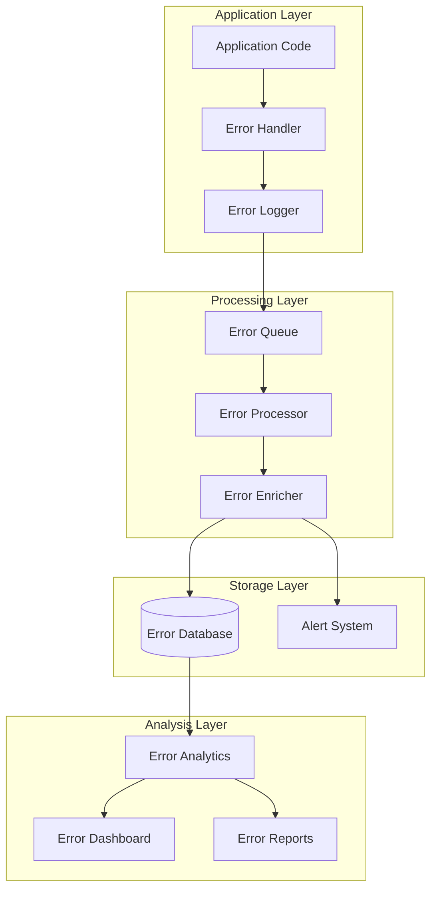

# Error Handling & Logging Strategy

## 1. Error Handling Architecture



## 2. Error Handling Implementation

### 2.1 Error Types

```typescript
// Base Error Class
class AppError extends Error {
    constructor(
        message: string,
        public code: string,
        public status: number,
        public data?: any
    ) {
        super(message);
        this.name = this.constructor.name;
        Error.captureStackTrace(this, this.constructor);
    }
    
    toJSON() {
        return {
            name: this.name,
            message: this.message,
            code: this.code,
            status: this.status,
            data: this.data,
            stack: this.stack
        };
    }
}

// API Errors
class APIError extends AppError {
    constructor(
        message: string,
        code = 'API_ERROR',
        status = 500,
        data?: any
    ) {
        super(message, code, status, data);
    }
}

// Validation Errors
class ValidationError extends AppError {
    constructor(
        message: string,
        data?: any
    ) {
        super(
            message,
            'VALIDATION_ERROR',
            400,
            data
        );
    }
}

// Authentication Errors
class AuthError extends AppError {
    constructor(
        message: string,
        code = 'AUTH_ERROR',
        status = 401
    ) {
        super(message, code, status);
    }
}

// Database Errors
class DatabaseError extends AppError {
    constructor(
        message: string,
        code = 'DB_ERROR',
        status = 500,
        data?: any
    ) {
        super(message, code, status, data);
    }
}

// Network Errors
class NetworkError extends AppError {
    constructor(
        message: string,
        code = 'NETWORK_ERROR',
        status = 503,
        data?: any
    ) {
        super(message, code, status, data);
    }
}
```

### 2.2 Error Handler

```typescript
interface ErrorContext {
    userId?: string;
    sessionId?: string;
    request?: {
        method: string;
        url: string;
        headers: Record<string, string>;
        body?: any;
    };
    response?: {
        status: number;
        headers: Record<string, string>;
        body?: any;
    };
    additionalData?: Record<string, any>;
}

class ErrorHandler {
    private static instance: ErrorHandler;
    private errorLogger: ErrorLogger;
    
    private constructor() {
        this.errorLogger = new ErrorLogger();
        this.setupGlobalHandlers();
    }
    
    static getInstance(): ErrorHandler {
        if (!ErrorHandler.instance) {
            ErrorHandler.instance = new ErrorHandler();
        }
        return ErrorHandler.instance;
    }
    
    async handleError(
        error: Error | AppError,
        context?: ErrorContext
    ): Promise<void> {
        try {
            // Normalize error
            const normalizedError = this.normalizeError(error);
            
            // Enrich with context
            const enrichedError = await this.enrichError(
                normalizedError,
                context
            );
            
            // Log error
            await this.errorLogger.logError(enrichedError);
            
            // Check if alert needed
            if (this.shouldAlert(enrichedError)) {
                await this.sendAlert(enrichedError);
            }
            
            // Handle specific error types
            await this.handleSpecificError(enrichedError);
        } catch (handlingError) {
            // If error handling fails, log to console
            console.error(
                'Error handling failed:',
                handlingError
            );
        }
    }
    
    private setupGlobalHandlers(): void {
        // Unhandled promise rejections
        process.on(
            'unhandledRejection',
            (reason: any) => {
                this.handleError(
                    new AppError(
                        'Unhandled Promise Rejection',
                        'UNHANDLED_REJECTION',
                        500,
                        { reason }
                    )
                );
            }
        );
        
        // Uncaught exceptions
        process.on(
            'uncaughtException',
            (error: Error) => {
                this.handleError(
                    new AppError(
                        'Uncaught Exception',
                        'UNCAUGHT_EXCEPTION',
                        500,
                        { originalError: error }
                    )
                );
            }
        );
    }
    
    private async enrichError(
        error: AppError,
        context?: ErrorContext
    ): Promise<AppError> {
        const enriched = { ...error };
        
        // Add timestamp
        enriched.data = {
            ...enriched.data,
            timestamp: new Date().toISOString()
        };
        
        // Add context if provided
        if (context) {
            enriched.data = {
                ...enriched.data,
                context
            };
        }
        
        // Add system info
        enriched.data = {
            ...enriched.data,
            system: await this.getSystemInfo()
        };
        
        return enriched;
    }
    
    private shouldAlert(error: AppError): boolean {
        // Check error severity
        if (error.status >= 500) return true;
        
        // Check error frequency
        const frequency = this.getErrorFrequency(error.code);
        if (frequency > 10) return true; // 10 errors/minute
        
        // Check specific error codes
        const criticalCodes = [
            'AUTH_BREACH',
            'DATA_CORRUPTION',
            'SYSTEM_FAILURE'
        ];
        if (criticalCodes.includes(error.code)) return true;
        
        return false;
    }
    
    private async handleSpecificError(
        error: AppError
    ): Promise<void> {
        switch (error.code) {
            case 'AUTH_ERROR':
                await this.handleAuthError(error);
                break;
            case 'NETWORK_ERROR':
                await this.handleNetworkError(error);
                break;
            case 'DB_ERROR':
                await this.handleDatabaseError(error);
                break;
            // Add more specific handlers
        }
    }
}
```

## 3. Logging Implementation

### 3.1 Logger Service

```typescript
interface LogEntry {
    level: 'debug' | 'info' | 'warn' | 'error';
    message: string;
    timestamp: string;
    context?: Record<string, any>;
    tags?: string[];
}

class Logger {
    private static instance: Logger;
    private logQueue: LogEntry[] = [];
    private batchSize: number = 100;
    private flushInterval: number = 5000; // 5 seconds
    
    private constructor() {
        setInterval(
            () => this.flush(),
            this.flushInterval
        );
    }
    
    static getInstance(): Logger {
        if (!Logger.instance) {
            Logger.instance = new Logger();
        }
        return Logger.instance;
    }
    
    async log(
        level: LogEntry['level'],
        message: string,
        context?: Record<string, any>,
        tags?: string[]
    ): Promise<void> {
        const entry: LogEntry = {
            level,
            message,
            timestamp: new Date().toISOString(),
            context,
            tags
        };
        
        this.logQueue.push(entry);
        
        if (this.logQueue.length >= this.batchSize) {
            await this.flush();
        }
    }
    
    private async flush(): Promise<void> {
        if (this.logQueue.length === 0) return;
        
        const entries = [...this.logQueue];
        this.logQueue = [];
        
        try {
            await this.writeLogs(entries);
        } catch (error) {
            // If write fails, add back to queue
            this.logQueue.unshift(...entries);
            console.error('Failed to write logs:', error);
        }
    }
    
    private async writeLogs(
        entries: LogEntry[]
    ): Promise<void> {
        // Group entries by level
        const grouped = entries.reduce(
            (acc, entry) => {
                if (!acc[entry.level]) {
                    acc[entry.level] = [];
                }
                acc[entry.level].push(entry);
                return acc;
            },
            {} as Record<string, LogEntry[]>
        );
        
        // Write to different destinations based on level
        await Promise.all([
            this.writeToFile(grouped.debug, 'debug.log'),
            this.writeToFile(grouped.info, 'info.log'),
            this.writeToFile(grouped.warn, 'warn.log'),
            this.writeToFile(grouped.error, 'error.log'),
            this.writeToDatabase(entries),
            this.writeToMonitoring(entries)
        ]);
    }
}
```

### 3.2 Log Processors

```typescript
interface LogProcessor {
    process(entries: LogEntry[]): Promise<void>;
}

// File Processor
class FileLogProcessor implements LogProcessor {
    private logDir: string;
    private maxFileSize: number = 10 * 1024 * 1024; // 10MB
    private maxFiles: number = 5;
    
    async process(
        entries: LogEntry[]
    ): Promise<void> {
        for (const entry of entries) {
            const fileName = `${entry.level}.log`;
            const filePath = path.join(
                this.logDir,
                fileName
            );
            
            // Check file size
            if (await this.shouldRotate(filePath)) {
                await this.rotateLog(filePath);
            }
            
            // Write entry
            await fs.appendFile(
                filePath,
                this.formatEntry(entry) + '\n'
            );
        }
    }
    
    private async shouldRotate(
        filePath: string
    ): Promise<boolean> {
        try {
            const stats = await fs.stat(filePath);
            return stats.size >= this.maxFileSize;
        } catch {
            return false;
        }
    }
    
    private async rotateLog(
        filePath: string
    ): Promise<void> {
        // Rotate existing files
        for (let i = this.maxFiles - 1; i >= 0; i--) {
            const oldPath = `${filePath}.${i}`;
            const newPath = `${filePath}.${i + 1}`;
            
            try {
                if (i === 0) {
                    await fs.rename(filePath, newPath);
                } else {
                    await fs.rename(oldPath, newPath);
                }
            } catch {
                // Ignore errors if files don't exist
            }
        }
    }
}

// Database Processor
class DatabaseLogProcessor implements LogProcessor {
    private batchSize: number = 1000;
    
    async process(
        entries: LogEntry[]
    ): Promise<void> {
        // Split into batches
        const batches = this.splitIntoBatches(
            entries,
            this.batchSize
        );
        
        // Process each batch
        for (const batch of batches) {
            await this.processBatch(batch);
        }
    }
    
    private async processBatch(
        entries: LogEntry[]
    ): Promise<void> {
        const client = await pool.connect();
        
        try {
            await client.query('BEGIN');
            
            // Insert entries
            const query = `
                INSERT INTO logs (
                    level,
                    message,
                    timestamp,
                    context,
                    tags
                ) VALUES ($1, $2, $3, $4, $5)
            `;
            
            await Promise.all(
                entries.map(entry =>
                    client.query(query, [
                        entry.level,
                        entry.message,
                        entry.timestamp,
                        JSON.stringify(entry.context),
                        entry.tags
                    ])
                )
            );
            
            await client.query('COMMIT');
        } catch (error) {
            await client.query('ROLLBACK');
            throw error;
        } finally {
            client.release();
        }
    }
}

// Monitoring Processor
class MonitoringLogProcessor implements LogProcessor {
    private metrics: Map<string, number> = new Map();
    private alertThresholds: Map<string, number> = new Map([
        ['error', 10],    // 10 errors/minute
        ['warn', 100]     // 100 warnings/minute
    ]);
    
    async process(
        entries: LogEntry[]
    ): Promise<void> {
        // Update metrics
        for (const entry of entries) {
            this.updateMetrics(entry);
        }
        
        // Check thresholds
        await this.checkThresholds();
        
        // Send to monitoring service
        await this.sendToMonitoring(entries);
    }
    
    private updateMetrics(entry: LogEntry): void {
        const key = `${entry.level}_count`;
        const current = this.metrics.get(key) || 0;
        this.metrics.set(key, current + 1);
        
        if (entry.tags) {
            for (const tag of entry.tags) {
                const tagKey = `${entry.level}_${tag}`;
                const tagCount = this.metrics.get(tagKey) || 0;
                this.metrics.set(tagKey, tagCount + 1);
            }
        }
    }
    
    private async checkThresholds(): Promise<void> {
        for (const [level, threshold] of this.alertThresholds) {
            const count = this.metrics.get(`${level}_count`) || 0;
            
            if (count >= threshold) {
                await this.sendAlert({
                    level,
                    count,
                    threshold
                });
            }
        }
    }
}
```

## 4. Error Analysis & Reporting

### 4.1 Error Analytics

```typescript
interface ErrorMetrics {
    count: number;
    uniqueCount: number;
    topErrors: {
        code: string;
        count: number;
        lastOccurred: string;
    }[];
    errorRates: {
        timestamp: string;
        count: number;
    }[];
    impactedUsers: number;
    avgResolutionTime: number;
}

class ErrorAnalytics {
    async getErrorMetrics(
        timeRange: {
            start: Date;
            end: Date;
        }
    ): Promise<ErrorMetrics> {
        const query = `
            WITH error_stats AS (
                SELECT
                    code,
                    COUNT(*) as error_count,
                    COUNT(DISTINCT user_id) as user_count,
                    MAX(timestamp) as last_occurred
                FROM errors
                WHERE timestamp BETWEEN $1 AND $2
                GROUP BY code
                ORDER BY error_count DESC
                LIMIT 10
            ),
            error_timeline AS (
                SELECT
                    date_trunc('hour', timestamp) as hour,
                    COUNT(*) as count
                FROM errors
                WHERE timestamp BETWEEN $1 AND $2
                GROUP BY hour
                ORDER BY hour
            ),
            resolution_times AS (
                SELECT
                    AVG(
                        EXTRACT(EPOCH FROM (resolved_at - created_at))
                    ) as avg_time
                FROM error_incidents
                WHERE
                    created_at BETWEEN $1 AND $2
                    AND resolved_at IS NOT NULL
            )
            SELECT
                (SELECT COUNT(*) FROM errors WHERE timestamp BETWEEN $1 AND $2) as total_count,
                (SELECT COUNT(DISTINCT error_hash) FROM errors WHERE timestamp BETWEEN $1 AND $2) as unique_count,
                (SELECT json_agg(error_stats.*) FROM error_stats) as top_errors,
                (SELECT json_agg(error_timeline.*) FROM error_timeline) as error_rates,
                (SELECT COUNT(DISTINCT user_id) FROM errors WHERE timestamp BETWEEN $1 AND $2) as impacted_users,
                (SELECT avg_time FROM resolution_times) as avg_resolution_time
        `;
        
        const result = await db.query(query, [
            timeRange.start,
            timeRange.end
        ]);
        
        return result.rows[0];
    }
    
    async getErrorDetails(
        errorCode: string,
        timeRange: {
            start: Date;
            end: Date;
        }
    ): Promise<any> {
        const query = `
            WITH error_instances AS (
                SELECT
                    timestamp,
                    context,
                    user_id,
                    session_id
                FROM errors
                WHERE
                    code = $1
                    AND timestamp BETWEEN $2 AND $3
                ORDER BY timestamp DESC
                LIMIT 100
            ),
            user_impact AS (
                SELECT
                    COUNT(DISTINCT user_id) as user_count,
                    COUNT(DISTINCT session_id) as session_count
                FROM errors
                WHERE
                    code = $1
                    AND timestamp BETWEEN $2 AND $3
            ),
            error_context AS (
                SELECT
                    jsonb_object_keys(context) as context_key,
                    COUNT(*) as occurrence_count
                FROM errors
                WHERE
                    code = $1
                    AND timestamp BETWEEN $2 AND $3
                GROUP BY context_key
                ORDER BY occurrence_count DESC
            )
            SELECT
                error_instances.*,
                user_impact.*,
                (
                    SELECT json_agg(error_context.*)
                    FROM error_context
                ) as context_analysis
            FROM error_instances, user_impact
        `;
        
        const result = await db.query(query, [
            errorCode,
            timeRange.start,
            timeRange.end
        ]);
        
        return result.rows;
    }
}
```

### 4.2 Error Reports

```typescript
interface ErrorReport {
    timeRange: {
        start: Date;
        end: Date;
    };
    summary: {
        totalErrors: number;
        uniqueErrors: number;
        impactedUsers: number;
        criticalErrors: number;
    };
    trends: {
        daily: {
            date: string;
            count: number;
            uniqueCount: number;
        }[];
        weekly: {
            week: string;
            count: number;
            uniqueCount: number;
        }[];
    };
    topIssues: {
        code: string;
        count: number;
        impact: number;
        firstSeen: string;
        lastSeen: string;
        status: 'open' | 'resolved' | 'investigating';
    }[];
    categories: {
        name: string;
        count: number;
        percentage: number;
    }[];
}

class ErrorReportGenerator {
    async generateReport(
        timeRange: {
            start: Date;
            end: Date;
        }
    ): Promise<ErrorReport> {
        // Gather all required data
        const [
            metrics,
            trends,
            issues,
            categories
        ] = await Promise.all([
            this.getErrorMetrics(timeRange),
            this.getErrorTrends(timeRange),
            this.getTopIssues(timeRange),
            this.getErrorCategories(timeRange)
        ]);
        
        // Generate report
        const report: ErrorReport = {
            timeRange,
            summary: {
                totalErrors: metrics.count,
                uniqueErrors: metrics.uniqueCount,
                impactedUsers: metrics.impactedUsers,
                criticalErrors: metrics.criticalCount
            },
            trends: {
                daily: trends.daily,
                weekly: trends.weekly
            },
            topIssues: issues,
            categories
        };
        
        // Store report
        await this.storeReport(report);
        
        // Send notifications if needed
        if (this.shouldNotify(report)) {
            await this.sendNotifications(report);
        }
        
        return report;
    }
    
    private shouldNotify(report: ErrorReport): boolean {
        // Check if critical errors increased
        const criticalThreshold = 10;
        if (report.summary.criticalErrors > criticalThreshold) {
            return true;
        }
        
        // Check if error rate increased significantly
        const errorRateIncrease = this.calculateErrorRateIncrease(
            report.trends.daily
        );
        if (errorRateIncrease > 50) { // 50% increase
            return true;
        }
        
        // Check if new error types emerged
        const newErrorTypes = this.findNewErrorTypes(
            report.topIssues
        );
        if (newErrorTypes.length > 0) {
            return true;
        }
        
        return false;
    }
    
    private async sendNotifications(
        report: ErrorReport
    ): Promise<void> {
        // Email notification
        await this.sendEmailReport(report);
        
        // Slack notification
        await this.sendSlackAlert(report);
        
        // PagerDuty if critical
        if (report.summary.criticalErrors > 0) {
            await this.createPagerDutyIncident(report);
        }
    }
}
```

This comprehensive error handling and logging document provides detailed implementations for error management, logging systems, and error analysis. The system is designed to catch, process, and analyze errors while providing meaningful insights and alerts for maintaining application reliability.
