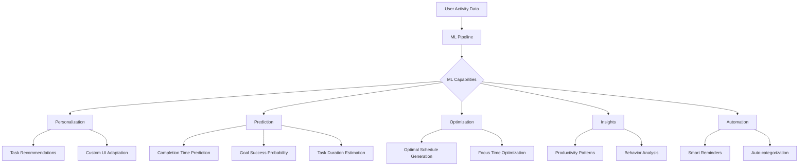
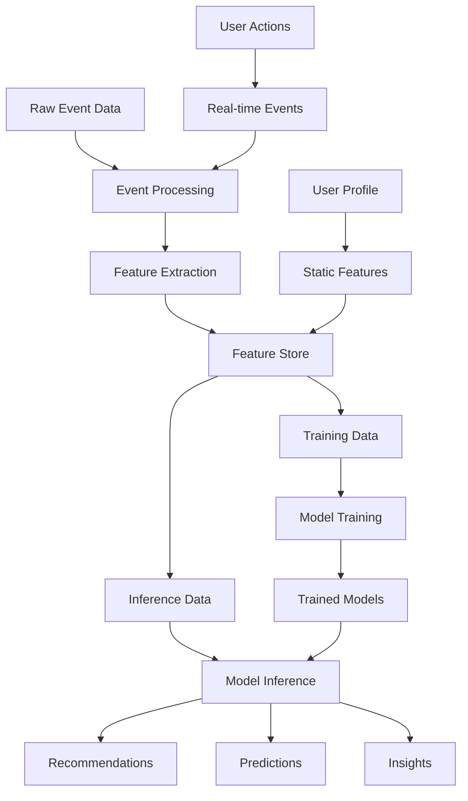
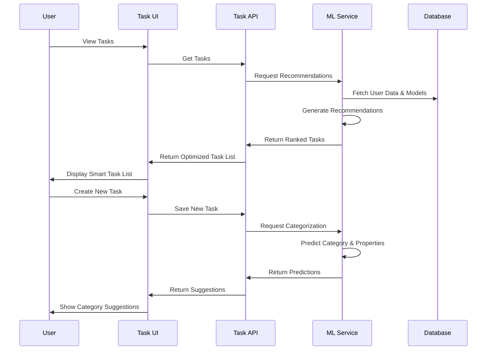
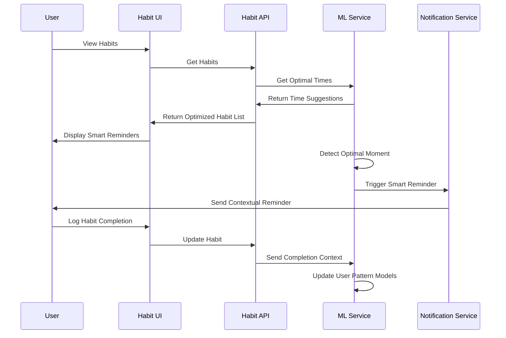
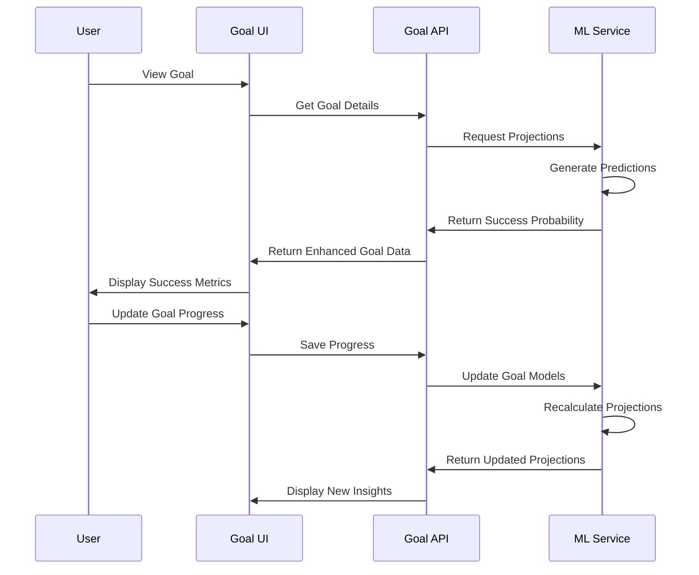
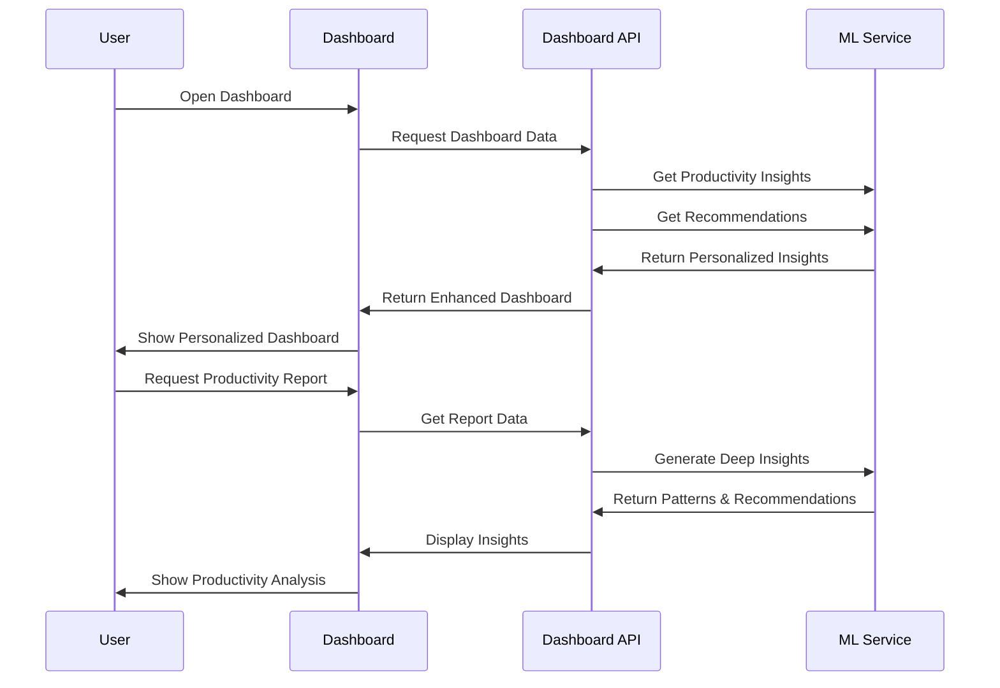
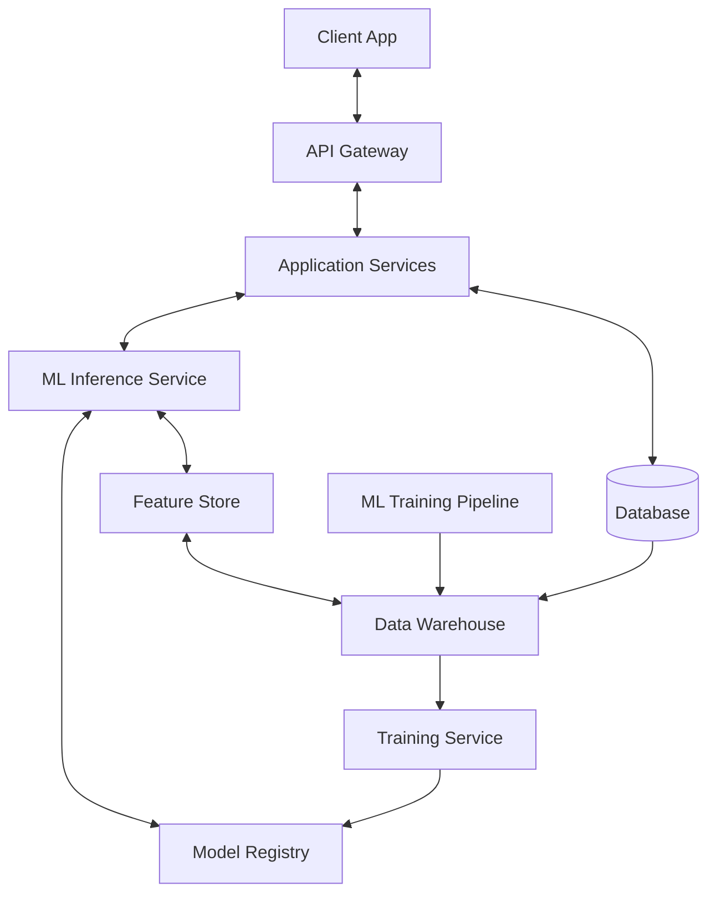

# Machine Learning Integration Architecture

This document outlines the architecture and integration of machine learning (ML) capabilities within our productivity application. It serves as a guide for implementing intelligent features that enhance user productivity through personalized recommendations, insights, and automation.

## Table of Contents
1. [Overview](#overview)
2. [Data Collection & Processing](#data-collection)
3. [Machine Learning Models](#ml-models)
4. [Integration Points](#integration-points)
5. [Deployment Architecture](#deployment)
6. [Privacy & Security Considerations](#privacy)
7. [Implementation Roadmap](#roadmap)

## 1. Overview

The ML integration aims to transform our productivity app from a simple task manager to an intelligent assistant that understands user behavior patterns, provides personalized recommendations, and automates routine decisions.

### Core ML Capabilities

## 2. Data Collection & Processing

### 2.1 Data Sources

The ML system collects and processes data from various sources within the application:

| Data Source | Description | Usage |
|-------------|-------------|-------|
| Tasks | Completion times, priorities, complexity, context | Task recommendations, time estimation |
| Habits | Completion patterns, streaks, contextual success | Optimal timing, streak maintenance |
| Goals | Progress rates, milestone completion, success factors | Success probability, milestone recommendations |
| User Activity | App usage patterns, focus periods, interaction times | UI optimization, peak productivity hours |
| Categories | Organization patterns, category effectiveness | Category suggestions, organization optimization |
| Productivity Metrics | Daily/weekly patterns, focus session effectiveness | Productivity insights, optimal scheduling |
| User Feedback | Explicit ratings and preferences | Model improvement, preference learning |

### 2.2 Data Processing Pipeline

### 2.3 Feature Engineering

Key features extracted from raw data include:

- **Temporal Features**: Time of day, day of week, month patterns
- **Task Features**: Complexity, priority, category, completion time
- **Contextual Features**: Location, preceding/following actions
- **User Features**: Productivity patterns, preference weights, work habits
- **Relational Features**: Task-habit-goal relationships, impact weights
- **Engagement Features**: Response to suggestions, reminder effectiveness

## 3. Machine Learning Models

The application uses several specialized models to provide different types of intelligence:

### 3.1 Recommendation Models

1. **Task Recommendation Model**
   - **Type**: Personalized ranking model
   - **Purpose**: Suggest next tasks based on context, priority, and user behavior
   - **Implementation**: Gradient Boosted Decision Trees / Neural Ranking
   - **Features**: Time, user state, task properties, historical patterns
   - **Output**: Ranked list of tasks with confidence scores

2. **Habit Timing Model**
   - **Type**: Time-series prediction model
   - **Purpose**: Identify optimal times for habit completion
   - **Implementation**: LSTM / Transformer network
   - **Features**: Historical completion times, success rates, contextual factors
   - **Output**: Probability of completion success by time slot

### 3.2 Predictive Models

1. **Duration Estimation Model**
   - **Type**: Regression model
   - **Purpose**: Predict how long tasks will take based on properties and history
   - **Implementation**: Random Forest / XGBoost
   - **Features**: Task type, complexity, user's historical completion times
   - **Output**: Estimated duration with confidence interval

2. **Goal Completion Prediction**
   - **Type**: Classification + Time-series model
   - **Purpose**: Predict likelihood of goal completion by target date
   - **Implementation**: Ensemble of classifiers with time-series components
   - **Features**: Progress rate, milestone completion, similar goal outcomes
   - **Output**: Completion probability + projected completion date

### 3.3 Pattern Recognition Models

1. **Productivity Pattern Model**
   - **Type**: Clustering + Time-series model
   - **Purpose**: Identify productivity patterns and peak hours
   - **Implementation**: K-means clustering + LSTM
   - **Features**: Activity types, completion rates, focus duration by hour/day
   - **Output**: Productivity clusters, peak productivity periods

2. **Category Suggestion Model**
   - **Type**: Multi-class classification
   - **Purpose**: Automatically suggest categories for new items
   - **Implementation**: BERT-based text classifier
   - **Features**: Item text, description, user's category usage patterns
   - **Output**: Ranked category suggestions with confidence scores

### 3.4 Optimization Models

1. **Schedule Optimization Model**
   - **Type**: Constraint-based optimization
   - **Purpose**: Generate optimal task schedules
   - **Implementation**: Integer Linear Programming + Reinforcement Learning
   - **Features**: Task priorities, deadlines, estimated durations, user preferences
   - **Output**: Optimized daily/weekly schedule

2. **Focus Session Optimization**
   - **Type**: Reinforcement Learning model
   - **Purpose**: Recommend optimal focus session parameters
   - **Implementation**: Deep Q-Network
   - **Features**: Historical session success, duration, breaks, time of day
   - **Output**: Recommended session length, break intervals, focus techniques

## 4. Integration Points

The ML capabilities are integrated at various points in the application:

### 4.1 Task Management Integration

### 4.2 Habit Tracking Integration

### 4.3 Goal Management Integration

### 4.4 Dashboard Integration

## 5. Deployment Architecture

The ML system is deployed using a hybrid architecture that balances responsiveness, processing power, and privacy:

### 5.1 Overall Architecture

### 5.2 Model Deployment Strategies

| Model Type | Deployment Strategy | Update Frequency | Serving Location |
|------------|---------------------|------------------|------------------|
| Recommendation Models | Real-time serving | Weekly retraining | Server-side |
| Classification Models | Pre-computed + Real-time | Bi-weekly retraining | Server-side |
| Simple Predictions | Edge deployment | Monthly retraining | Client-side |
| Optimization Models | API endpoints | Weekly retraining | Server-side |
| Pattern Recognition | Batch prediction | Daily updates | Server-side |

### 5.3 Scaling Considerations

- **Inference Service**: Horizontally scaled based on user load
- **Training Pipeline**: Scheduled batch processing with priority queuing
- **Feature Store**: Distributed with read replicas for high availability
- **Model Registry**: Versioned models with A/B testing capability
- **Monitoring**: Real-time model performance monitoring with degradation alerts

## 6. Privacy & Security Considerations

### 6.1 Data Privacy Principles

1. **Transparency**: Clear documentation of what data is used for ML
2. **Consent**: Opt-in for advanced personalization features
3. **Data Minimization**: Collect only necessary data for models
4. **On-device Processing**: Edge ML for privacy-sensitive predictions
5. **Anonymization**: Remove PII from training data

### 6.2 Security Measures

1. **Encryption**: All data in transit and at rest
2. **Access Control**: Fine-grained permissions for ML systems
3. **Audit Logging**: Track all data access by ML systems
4. **Regular Audits**: Periodic review of ML data usage
5. **Model Security**: Protection against adversarial attacks and model extraction

### 6.3 Ethical Considerations

1. **Bias Monitoring**: Regular analysis of model fairness across user segments
2. **Explainability**: Transparent recommendations with reasoning
3. **Human Oversight**: Critical decisions reviewed by humans
4. **User Control**: Ability to modify or reject ML-based suggestions
5. **Impact Assessment**: Regular evaluation of ML features on user wellbeing

## 7. Implementation Roadmap

### Phase 1: Foundation (Current)
- Data collection infrastructure
- Basic feature engineering
- Simple recommendation models (task prioritization)
- Privacy controls and user opt-in

### Phase 2: Core ML Features (Next 3 months)
- Task duration prediction
- Category suggestion system
- Basic productivity pattern recognition
- Habit timing optimization

### Phase 3: Advanced Intelligence (6-9 months)
- Schedule optimization
- Goal success prediction
- Advanced personalization
- Cross-entity recommendations (task-habit-goal)

### Phase 4: Autonomous Assistance (12+ months)
- Proactive productivity assistant
- Automated scheduling and rescheduling
- Comprehensive productivity insights
- Behavioral pattern coaching

## Implementation Considerations

### Model Training Requirements

| Model | Training Data Size | Training Frequency | Infrastructure |
|-------|-------------------|-------------------|----------------|
| Task Recommendation | 10k+ user actions | Weekly | GPU cluster |
| Duration Estimation | 5k+ completed tasks | Bi-weekly | CPU cluster |
| Category Suggestion | 2k+ categorized items | Monthly | GPU instance |
| Productivity Patterns | 30+ days per user | Daily incremental | CPU cluster |
| Schedule Optimization | User-specific | Weekly | CPU instance |

### Client-Side Requirements

- Lightweight inference for category suggestions (~5MB model)
- Simple pattern recognition for habit timing (~2MB model)
- Feature extraction for server-side models
- Secure local storage of personal ML features

### Server-Side Requirements

- High-performance inference API (<100ms response time)
- Batch prediction for non-time-critical features
- Secure multi-tenant model serving
- A/B testing infrastructure
- Model performance monitoring

### Development Skills Required

- Python (TensorFlow/PyTorch, scikit-learn)
- Data engineering (feature pipelines)
- MLOps (model deployment, monitoring)
- Mobile ML integration (TFLite/CoreML)
- Privacy-preserving ML techniques 