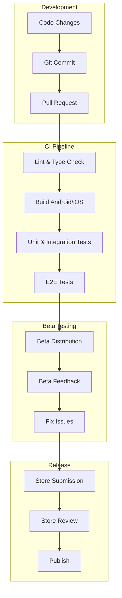

# Mobile App Deployment Strategy

## 1. CI/CD Pipeline for Mobile



## 2. GitHub Actions Workflow

### 2.1 Android Build & Deploy

```yaml
name: Android CI/CD

on:
  push:
    branches: [ main, develop ]
    tags: [ 'v*' ]
  pull_request:
    branches: [ main, develop ]

jobs:
  build:
    runs-on: ubuntu-latest
    
    steps:
      - uses: actions/checkout@v2
      
      - name: Set up JDK
        uses: actions/setup-java@v2
        with:
          distribution: 'adopt'
          java-version: '11'
      
      - name: Setup Node.js
        uses: actions/setup-node@v2
        with:
          node-version: '16'
          cache: 'npm'
      
      - name: Install dependencies
        run: npm ci
      
      - name: Run lint
        run: npm run lint
      
      - name: Run tests
        run: npm run test
      
      - name: Setup Android SDK
        uses: android-actions/setup-android@v2
      
      - name: Build Android App
        run: |
          cd android
          ./gradlew bundleRelease
      
      - name: Sign Android App Bundle
        uses: r0adkll/sign-android-release@v1
        with:
          releaseDirectory: android/app/build/outputs/bundle/release
          signingKeyBase64: ${{ secrets.ANDROID_SIGNING_KEY }}
          alias: ${{ secrets.ANDROID_KEY_ALIAS }}
          keyStorePassword: ${{ secrets.ANDROID_KEYSTORE_PASSWORD }}
          keyPassword: ${{ secrets.ANDROID_KEY_PASSWORD }}
      
      - name: Upload to Play Store
        if: startsWith(github.ref, 'refs/tags/v')
        uses: r0adkll/upload-google-play@v1
        with:
          serviceAccountJsonPlainText: ${{ secrets.PLAY_STORE_CONFIG }}
          packageName: com.productivityapp
          releaseFiles: android/app/build/outputs/bundle/release/app-release.aab
          track: internal
          status: completed
          
  beta-distribution:
    needs: build
    runs-on: ubuntu-latest
    if: github.ref == 'refs/heads/develop'
    
    steps:
      - name: Upload to Firebase App Distribution
        uses: wzieba/Firebase-Distribution-Github-Action@v1
        with:
          appId: ${{ secrets.FIREBASE_APP_ID }}
          token: ${{ secrets.FIREBASE_TOKEN }}
          groups: beta-testers
          file: android/app/build/outputs/apk/release/app-release.apk
          releaseNotes: |
            Changes in this build:
            - ${{ github.event.head_commit.message }}
```

### 2.2 iOS Build & Deploy

```yaml
name: iOS CI/CD

on:
  push:
    branches: [ main, develop ]
    tags: [ 'v*' ]
  pull_request:
    branches: [ main, develop ]

jobs:
  build:
    runs-on: macos-latest
    
    steps:
      - uses: actions/checkout@v2
      
      - name: Setup Node.js
        uses: actions/setup-node@v2
        with:
          node-version: '16'
          cache: 'npm'
      
      - name: Install dependencies
        run: |
          npm ci
          cd ios && pod install
      
      - name: Run lint
        run: npm run lint
      
      - name: Run tests
        run: npm run test
      
      - name: Setup Ruby
        uses: ruby/setup-ruby@v1
        with:
          ruby-version: '3.0'
          bundler-cache: true
      
      - name: Setup Fastlane
        run: |
          cd ios
          bundle install
      
      - name: Build & Sign iOS App
        env:
          MATCH_PASSWORD: ${{ secrets.MATCH_PASSWORD }}
          MATCH_GIT_BASIC_AUTH: ${{ secrets.MATCH_GIT_BASIC_AUTH }}
          FASTLANE_APPLE_APPLICATION_SPECIFIC_PASSWORD: ${{ secrets.APPLE_APP_PASSWORD }}
        run: |
          cd ios
          bundle exec fastlane build
      
      - name: Upload to TestFlight
        if: startsWith(github.ref, 'refs/tags/v')
        env:
          FASTLANE_APPLE_APPLICATION_SPECIFIC_PASSWORD: ${{ secrets.APPLE_APP_PASSWORD }}
        run: |
          cd ios
          bundle exec fastlane beta
```

## 3. Fastlane Configuration

### 3.1 Android Fastfile

```ruby
default_platform(:android)

platform :android do
  desc "Build release app bundle"
  lane :build do
    gradle(
      task: "clean bundleRelease",
      properties: {
        "android.injected.signing.store.file" => ENV["KEYSTORE_FILE"],
        "android.injected.signing.store.password" => ENV["STORE_PASSWORD"],
        "android.injected.signing.key.alias" => ENV["KEY_ALIAS"],
        "android.injected.signing.key.password" => ENV["KEY_PASSWORD"],
      }
    )
  end
  
  desc "Deploy to internal track"
  lane :internal do
    upload_to_play_store(
      track: 'internal',
      json_key_data: ENV['PLAY_STORE_CONFIG'],
      aab: lane_context[SharedValues::GRADLE_AAB_OUTPUT_PATH]
    )
  end
  
  desc "Deploy to beta track"
  lane :beta do
    upload_to_play_store(
      track: 'beta',
      json_key_data: ENV['PLAY_STORE_CONFIG'],
      aab: lane_context[SharedValues::GRADLE_AAB_OUTPUT_PATH]
    )
  end
  
  desc "Deploy to production"
  lane :production do
    upload_to_play_store(
      track: 'production',
      json_key_data: ENV['PLAY_STORE_CONFIG'],
      aab: lane_context[SharedValues::GRADLE_AAB_OUTPUT_PATH]
    )
  end
end
```

### 3.2 iOS Fastfile

```ruby
default_platform(:ios)

platform :ios do
  desc "Build app"
  lane :build do
    setup_ci if is_ci
    
    sync_code_signing(
      type: "appstore",
      readonly: true
    )
    
    update_code_signing_settings(
      use_automatic_signing: false,
      path: "ProductivityApp.xcodeproj"
    )
    
    build_ios_app(
      scheme: "ProductivityApp",
      export_method: "app-store",
      configuration: "Release",
      clean: true,
      output_directory: "build"
    )
  end
  
  desc "Push a new beta build to TestFlight"
  lane :beta do
    upload_to_testflight(
      skip_waiting_for_build_processing: true
    )
  end
  
  desc "Push a new release build to the App Store"
  lane :release do
    upload_to_app_store(
      force: true,
      skip_metadata: true,
      skip_screenshots: true,
      precheck_include_in_app_purchases: false
    )
  end
end
```

## 4. App Store Metadata

### 4.1 Google Play Store

```yaml
title:
  en-US: Productivity App
  
short_description:
  en-US: Boost your productivity with smart task and habit tracking
  
full_description:
  en-US: |
    Take control of your productivity with our comprehensive task and habit tracking app.
    
    Features:
    • Smart task management
    • Habit tracking with streaks
    • Goal setting and monitoring
    • Personalized recommendations
    • Progress analytics
    • Offline support
    
    Download now and start building better habits!

release_notes:
  en-US: |
    What's new in this version:
    • Improved task organization
    • Enhanced habit tracking
    • Better performance
    • Bug fixes and improvements

keywords:
  en-US: productivity, tasks, habits, goals, time management

categories:
  primary: PRODUCTIVITY
  secondary: LIFESTYLE

content_rating:
  ESRB: EVERYONE
  
pricing:
  type: FREE_WITH_IAP

graphics:
  icon: fastlane/metadata/android/en-US/images/icon.png
  feature_graphic: fastlane/metadata/android/en-US/images/feature.png
  screenshots:
    phone:
      - fastlane/metadata/android/en-US/images/phoneScreenshots/1.png
      - fastlane/metadata/android/en-US/images/phoneScreenshots/2.png
      - fastlane/metadata/android/en-US/images/phoneScreenshots/3.png
    tablet:
      - fastlane/metadata/android/en-US/images/tabletScreenshots/1.png
      - fastlane/metadata/android/en-US/images/tabletScreenshots/2.png
```

### 4.2 Apple App Store

```ruby
# fastlane/metadata/en-US/description.txt
Take control of your productivity with our comprehensive task and habit tracking app.

Features:
• Smart task management
• Habit tracking with streaks
• Goal setting and monitoring
• Personalized recommendations
• Progress analytics
• Offline support

Download now and start building better habits!

# fastlane/metadata/en-US/keywords.txt
productivity, tasks, habits, goals, time management, todo, planner, tracker

# fastlane/metadata/en-US/release_notes.txt
What's new in this version:
• Improved task organization
• Enhanced habit tracking
• Better performance
• Bug fixes and improvements

# fastlane/metadata/en-US/support_url.txt
https://productivityapp.com/support

# fastlane/metadata/en-US/privacy_url.txt
https://productivityapp.com/privacy

# fastlane/metadata/en-US/marketing_url.txt
https://productivityapp.com

# fastlane/metadata/review_information.txt
First name: John
Last name: Doe
Phone number: +1 123-456-7890
Email address: review@productivityapp.com
Demo account: demo@productivityapp.com
Demo password: demo123
Notes: Please test with the demo account provided
```

## 5. Beta Testing Strategy

### 5.1 Firebase App Distribution

```typescript
interface BetaConfig {
    android: {
        appId: string;
        groups: string[];
        releaseNotes: string;
    };
    ios: {
        appId: string;
        groups: string[];
        releaseNotes: string;
    };
}

class BetaDistribution {
    private config: BetaConfig;
    
    async distributeBuild(
        platform: 'android' | 'ios',
        buildPath: string
    ): Promise<void> {
        const config = this.config[platform];
        
        await firebase.appdistribution().createDistribution({
            app: config.appId,
            groups: config.groups,
            releaseNotes: this.getReleaseNotes(),
            binary: buildPath
        });
    }
    
    private getReleaseNotes(): string {
        const commits = git.getRecentCommits(10);
        return commits
            .map(commit => `• ${commit.subject}`)
            .join('\n');
    }
}
```

### 5.2 TestFlight Configuration

```ruby
# Fastfile
desc "Submit build to TestFlight"
lane :beta do
  # Ensure code signing is set up
  sync_code_signing(
    type: "appstore",
    readonly: true
  )
  
  # Build the app
  build_ios_app(
    scheme: "ProductivityApp",
    export_method: "app-store",
    configuration: "Release",
    clean: true,
    output_directory: "build"
  )
  
  # Upload to TestFlight
  upload_to_testflight(
    skip_waiting_for_build_processing: true,
    beta_app_description: "Beta test version of Productivity App",
    beta_app_feedback_email: "beta@productivityapp.com",
    localized_app_info: {
      "default": {
        feedback_email: "beta@productivityapp.com",
        marketing_url: "https://productivityapp.com",
        privacy_policy_url: "https://productivityapp.com/privacy",
        description: "Test the latest features of our productivity app"
      }
    },
    distribute_external: true,
    groups: ["Beta Testers", "Internal Team"],
    changelog: git_branch.last_git_tag_message
  )
end
```

## 6. Release Process

### 6.1 Version Management

```typescript
interface VersionConfig {
    major: number;
    minor: number;
    patch: number;
    buildNumber: number;
}

class VersionManager {
    private config: VersionConfig;
    
    async bumpVersion(
        type: 'major' | 'minor' | 'patch'
    ): Promise<void> {
        // Update version numbers
        switch (type) {
            case 'major':
                this.config.major++;
                this.config.minor = 0;
                this.config.patch = 0;
                break;
            case 'minor':
                this.config.minor++;
                this.config.patch = 0;
                break;
            case 'patch':
                this.config.patch++;
                break;
        }
        
        // Increment build number
        this.config.buildNumber++;
        
        // Update version files
        await this.updateAndroidVersion();
        await this.updateiOSVersion();
        
        // Create git tag
        const version = this.getVersionString();
        await git.createTag(version);
    }
    
    private getVersionString(): string {
        return `v${this.config.major}.${this.config.minor}.${this.config.patch}`;
    }
    
    private async updateAndroidVersion(): Promise<void> {
        const gradleProperties = await fs.readFile(
            'android/gradle.properties',
            'utf8'
        );
        
        const updated = gradleProperties
            .replace(
                /versionName=.*/,
                `versionName=${this.getVersionString()}`
            )
            .replace(
                /versionCode=.*/,
                `versionCode=${this.config.buildNumber}`
            );
        
        await fs.writeFile(
            'android/gradle.properties',
            updated
        );
    }
    
    private async updateiOSVersion(): Promise<void> {
        await exec(
            'xcrun',
            [
                'agvtool',
                'new-version',
                '-all',
                this.config.buildNumber.toString()
            ]
        );
        
        await exec(
            'xcrun',
            [
                'agvtool',
                'new-marketing-version',
                this.getVersionString()
            ]
        );
    }
}
```

### 6.2 Release Checklist

```typescript
interface ReleaseCheck {
    name: string;
    check: () => Promise<boolean>;
    fix?: () => Promise<void>;
}

class ReleaseManager {
    private checks: ReleaseCheck[] = [
        {
            name: "Version numbers consistent",
            check: async () => {
                const android = await this.getAndroidVersion();
                const ios = await this.getiOSVersion();
                return android === ios;
            }
        },
        {
            name: "All tests passing",
            check: async () => {
                const results = await runTests();
                return results.failedTests === 0;
            }
        },
        {
            name: "No lint errors",
            check: async () => {
                const results = await runLint();
                return results.errorCount === 0;
            }
        },
        {
            name: "Release notes updated",
            check: async () => {
                const notes = await this.getReleaseNotes();
                return notes.length > 0;
            }
        },
        {
            name: "Screenshots up to date",
            check: async () => {
                const screenshots = await this.getScreenshots();
                return screenshots.length >= 5;
            }
        },
        {
            name: "Beta testing completed",
            check: async () => {
                const feedback = await this.getBetaFeedback();
                return feedback.criticalIssues === 0;
            }
        }
    ];
    
    async performRelease(): Promise<void> {
        // Run all checks
        for (const check of this.checks) {
            const passed = await check.check();
            if (!passed) {
                if (check.fix) {
                    await check.fix();
                } else {
                    throw new Error(
                        `Release check failed: ${check.name}`
                    );
                }
            }
        }
        
        // Create release
        await this.createGitHubRelease();
        await this.deployToStores();
    }
}
```

This comprehensive mobile deployment document provides detailed implementations for CI/CD pipelines, app store submissions, beta testing, and release management. The configuration ensures reliable and automated mobile app deployment while maintaining quality through thorough testing and validation processes.
