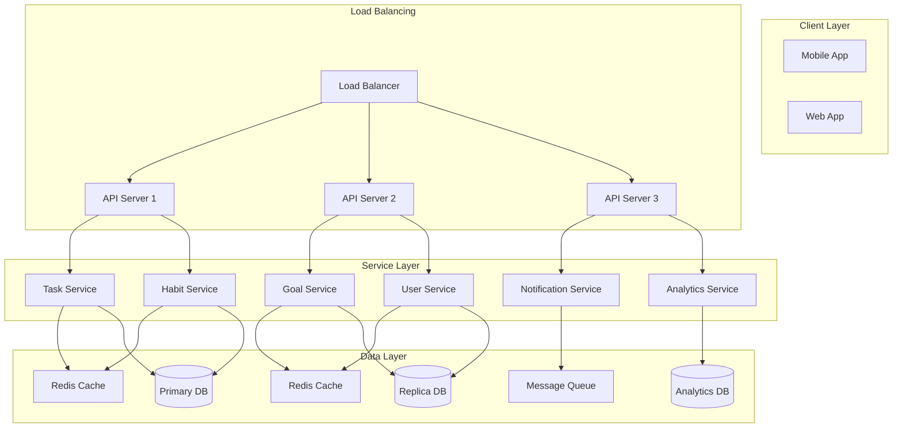

# Scaling Strategy & Infrastructure Design

## 1. System Architecture Overview



## 2. Horizontal Scaling Strategy

### 2.1 API Layer Scaling

1. **Load Balancer Configuration**
```nginx
upstream api_servers {
    least_conn;  # Least connections algorithm
    server api1.internal:8000 max_fails=3 fail_timeout=30s;
    server api2.internal:8000 max_fails=3 fail_timeout=30s;
    server api3.internal:8000 max_fails=3 fail_timeout=30s;
}

server {
    listen 80;
    server_name api.productivityapp.com;

    location / {
        proxy_pass http://api_servers;
        proxy_set_header Host $host;
        proxy_set_header X-Real-IP $remote_addr;
        proxy_set_header X-Request-ID $request_id;
        
        # Health checks
        health_check interval=5s
                     fails=3
                     passes=2;
    }
}
```

2. **Service Discovery**
```yaml
# Docker Compose configuration
version: '3.8'
services:
  api:
    image: productivity-api:latest
    deploy:
      replicas: 3
      update_config:
        parallelism: 1
        delay: 10s
      restart_policy:
        condition: on-failure
    environment:
      - SERVICE_NAME=api
      - SERVICE_TAGS=production
    networks:
      - api_network

  consul:
    image: consul:latest
    ports:
      - "8500:8500"
    command: agent -server -bootstrap-expect=1 -ui
    networks:
      - api_network
```

3. **Auto-Scaling Rules**
```typescript
interface ScalingRule {
    metric: 'cpu' | 'memory' | 'requests';
    threshold: number;
    scaleUp: {
        increment: number;
        cooldown: number;
    };
    scaleDown: {
        decrement: number;
        cooldown: number;
    };
}

const apiScalingRules: ScalingRule[] = [
    {
        metric: 'cpu',
        threshold: 70,  // 70% CPU usage
        scaleUp: {
            increment: 1,
            cooldown: 300  // 5 minutes
        },
        scaleDown: {
            decrement: 1,
            cooldown: 600  // 10 minutes
        }
    },
    {
        metric: 'requests',
        threshold: 1000,  // requests per second
        scaleUp: {
            increment: 2,
            cooldown: 180
        },
        scaleDown: {
            decrement: 1,
            cooldown: 600
        }
    }
];
```

### 2.2 Database Scaling

1. **Read Replicas**
```sql
-- Primary DB Configuration
ALTER SYSTEM SET wal_level = logical;
ALTER SYSTEM SET max_wal_senders = 10;
ALTER SYSTEM SET max_replication_slots = 10;

-- Create replication user
CREATE USER replicator WITH REPLICATION ENCRYPTED PASSWORD 'xxx';

-- Create replication slot
SELECT pg_create_physical_replication_slot('replica_1_slot');

-- postgresql.conf on replica
primary_conninfo = 'host=primary.internal port=5432 user=replicator password=xxx'
primary_slot_name = 'replica_1_slot'
hot_standby = on
```

2. **Sharding Strategy**
```typescript
interface ShardConfig {
    totalShards: number;
    shardKey: keyof User;
    shardMap: Map<number, DatabaseConnection>;
}

class ShardManager {
    private config: ShardConfig;
    
    constructor(config: ShardConfig) {
        this.config = config;
    }
    
    getShardId(userId: string): number {
        const hash = this.hashUserId(userId);
        return hash % this.config.totalShards;
    }
    
    async routeQuery(userId: string, query: string): Promise<any> {
        const shardId = this.getShardId(userId);
        const connection = this.config.shardMap.get(shardId);
        
        if (!connection) {
            throw new Error(`No connection for shard ${shardId}`);
        }
        
        return connection.executeQuery(query);
    }
}

// Usage example
const shardConfig: ShardConfig = {
    totalShards: 4,
    shardKey: 'id',
    shardMap: new Map([
        [0, new DatabaseConnection('shard0.internal')],
        [1, new DatabaseConnection('shard1.internal')],
        [2, new DatabaseConnection('shard2.internal')],
        [3, new DatabaseConnection('shard3.internal')]
    ])
};
```

3. **Connection Pooling**
```typescript
interface PoolConfig {
    min: number;
    max: number;
    idleTimeoutMillis: number;
    connectionTimeoutMillis: number;
}

class ConnectionPool {
    private pools: Map<number, Pool>;
    
    constructor(shardConfig: ShardConfig, poolConfig: PoolConfig) {
        this.pools = new Map();
        
        for (const [shardId, connection] of shardConfig.shardMap) {
            this.pools.set(
                shardId,
                new Pool({
                    ...poolConfig,
                    host: connection.host,
                    port: connection.port,
                    database: `shard_${shardId}`
                })
            );
        }
    }
    
    async executeQuery(shardId: number, query: string): Promise<any> {
        const pool = this.pools.get(shardId);
        if (!pool) {
            throw new Error(`No pool for shard ${shardId}`);
        }
        
        const client = await pool.connect();
        try {
            return await client.query(query);
        } finally {
            client.release();
        }
    }
}
```

## 3. Vertical Scaling Optimizations

### 3.1 Resource Allocation

1. **Memory Optimization**
```typescript
interface ResourceLimits {
    memory: {
        min: number;
        max: number;
        swappiness: number;
    };
    cpu: {
        shares: number;
        quota: number;
    };
}

// Docker container limits
const serviceResources: Record<string, ResourceLimits> = {
    api: {
        memory: {
            min: 512 * 1024 * 1024,  // 512MB
            max: 1024 * 1024 * 1024, // 1GB
            swappiness: 0
        },
        cpu: {
            shares: 1024,
            quota: 100000
        }
    },
    worker: {
        memory: {
            min: 256 * 1024 * 1024,  // 256MB
            max: 512 * 1024 * 1024,  // 512MB
            swappiness: 0
        },
        cpu: {
            shares: 512,
            quota: 50000
        }
    }
};
```

2. **Database Tuning**
```sql
-- PostgreSQL performance settings
ALTER SYSTEM SET shared_buffers = '4GB';
ALTER SYSTEM SET effective_cache_size = '12GB';
ALTER SYSTEM SET maintenance_work_mem = '1GB';
ALTER SYSTEM SET work_mem = '32MB';
ALTER SYSTEM SET max_worker_processes = 8;
ALTER SYSTEM SET max_parallel_workers_per_gather = 4;
ALTER SYSTEM SET random_page_cost = 1.1;
ALTER SYSTEM SET effective_io_concurrency = 200;

-- Table partitioning
CREATE TABLE tasks_partition (
    LIKE tasks INCLUDING DEFAULTS INCLUDING CONSTRAINTS
) PARTITION BY RANGE (created_at);

CREATE TABLE tasks_y2024m01 
    PARTITION OF tasks_partition
    FOR VALUES FROM ('2024-01-01') TO ('2024-02-01');

CREATE TABLE tasks_y2024m02 
    PARTITION OF tasks_partition
    FOR VALUES FROM ('2024-02-01') TO ('2024-03-01');
```

### 3.2 Query Optimization

1. **Materialized Views**
```sql
-- User statistics materialized view
CREATE MATERIALIZED VIEW user_stats AS
SELECT 
    u.id,
    COUNT(DISTINCT t.id) as total_tasks,
    COUNT(DISTINCT t.id) FILTER (
        WHERE t.status = 'completed'
    ) as completed_tasks,
    COUNT(DISTINCT h.id) as total_habits,
    MAX(h.current_streak) as best_streak
FROM users u
LEFT JOIN tasks t ON t.user_id = u.id
LEFT JOIN habits h ON h.user_id = u.id
GROUP BY u.id;

-- Refresh strategy
CREATE OR REPLACE FUNCTION refresh_user_stats()
RETURNS trigger AS $$
BEGIN
    REFRESH MATERIALIZED VIEW CONCURRENTLY user_stats;
    RETURN NULL;
END;
$$ LANGUAGE plpgsql;

CREATE TRIGGER refresh_user_stats_trigger
AFTER INSERT OR UPDATE OR DELETE
ON tasks
FOR EACH STATEMENT
EXECUTE FUNCTION refresh_user_stats();
```

2. **Query Planning**
```typescript
class QueryOptimizer {
    private queryCache: Map<string, string>;
    
    optimizeQuery(query: string, params: any[]): string {
        const cacheKey = this.generateCacheKey(query, params);
        
        if (this.queryCache.has(cacheKey)) {
            return this.queryCache.get(cacheKey)!;
        }
        
        const optimizedQuery = this.analyze(query, params);
        this.queryCache.set(cacheKey, optimizedQuery);
        
        return optimizedQuery;
    }
    
    private analyze(query: string, params: any[]): string {
        // Analyze query plan
        const plan = this.explainQuery(query, params);
        
        // Apply optimizations based on plan
        let optimized = query;
        
        if (plan.sequential_scan && plan.rows > 1000) {
            optimized = this.addIndexHints(optimized);
        }
        
        if (plan.nested_loop && plan.rows > 10000) {
            optimized = this.convertToHashJoin(optimized);
        }
        
        return optimized;
    }
}
```

## 4. Monitoring & Alerts

### 4.1 Performance Metrics

```typescript
interface ServiceMetrics {
    timestamp: number;
    service: string;
    instance: string;
    metrics: {
        cpu: {
            usage: number;
            load: number[];
        };
        memory: {
            used: number;
            free: number;
            cached: number;
        };
        network: {
            rx_bytes: number;
            tx_bytes: number;
            connections: number;
        };
        application: {
            requests: number;
            errors: number;
            latency: number[];
        };
    };
}

class MetricsCollector {
    private metrics: ServiceMetrics[] = [];
    
    async collect(): Promise<void> {
        const metrics = await this.gatherMetrics();
        this.metrics.push(metrics);
        
        if (this.shouldAlert(metrics)) {
            await this.sendAlert(metrics);
        }
        
        // Rotate metrics after 7 days
        const oneWeekAgo = Date.now() - 7 * 24 * 60 * 60 * 1000;
        this.metrics = this.metrics.filter(m => m.timestamp > oneWeekAgo);
    }
    
    private shouldAlert(metrics: ServiceMetrics): boolean {
        return (
            metrics.metrics.cpu.usage > 90 ||
            metrics.metrics.memory.free < 100 * 1024 * 1024 ||
            metrics.metrics.application.errors > 100
        );
    }
}
```

### 4.2 Scaling Triggers

```typescript
interface ScalingTrigger {
    metric: keyof ServiceMetrics['metrics'];
    condition: 'gt' | 'lt' | 'eq';
    threshold: number;
    duration: number;  // seconds
    action: 'scale_up' | 'scale_down' | 'alert';
}

class ScalingManager {
    private triggers: ScalingTrigger[] = [
        {
            metric: 'cpu',
            condition: 'gt',
            threshold: 80,
            duration: 300,
            action: 'scale_up'
        },
        {
            metric: 'memory',
            condition: 'gt',
            threshold: 90,
            duration: 300,
            action: 'scale_up'
        },
        {
            metric: 'application',
            condition: 'gt',
            threshold: 1000,
            duration: 60,
            action: 'scale_up'
        }
    ];
    
    async evaluate(metrics: ServiceMetrics[]): Promise<void> {
        for (const trigger of this.triggers) {
            if (this.isTriggered(trigger, metrics)) {
                await this.executeAction(trigger.action);
            }
        }
    }
    
    private async executeAction(action: string): Promise<void> {
        switch (action) {
            case 'scale_up':
                await this.scaleService('up');
                break;
            case 'scale_down':
                await this.scaleService('down');
                break;
            case 'alert':
                await this.sendAlert();
                break;
        }
    }
}
```

This comprehensive scaling strategy document provides detailed implementations for both horizontal and vertical scaling approaches, along with monitoring and optimization techniques. The strategies are designed to ensure the application can handle increased load while maintaining performance and reliability.
