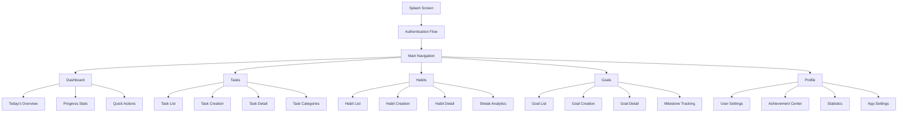
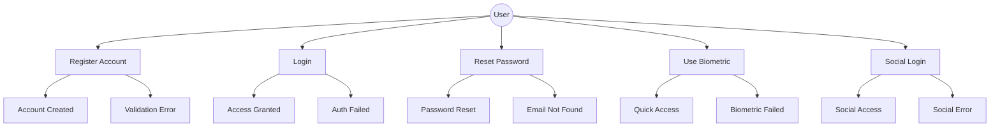
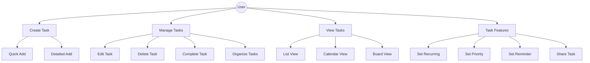
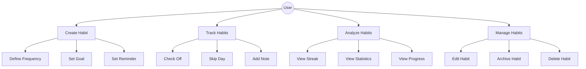
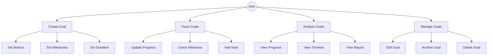
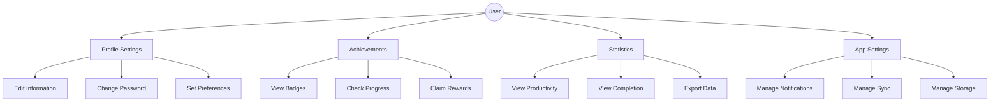
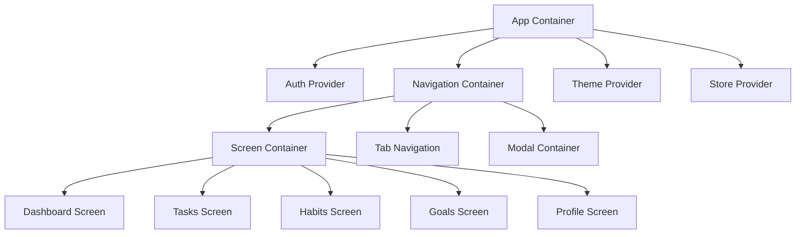
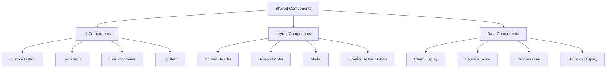

# UI Architecture & Screen Flow Design

## 1. Screen Architecture

### 1.1 Core Navigation Structure
- Bottom Navigation Bar with 5 main sections:
  1. Dashboard
  2. Tasks
  3. Habits
  4. Goals
  5. Profile

### 1.2 Screen Hierarchy

## 2. Detailed Screen Specifications

### 2.1 Authentication Flow

#### Splash Screen
- App logo animation
- Version number
- Loading progress indicator

#### Login Screen
- Email/password fields
- "Remember me" checkbox
- Biometric login option
- "Forgot password" link
- Google Sign-In button
- Sign up link

#### Registration Screen
- Email field
- Password field with strength indicator
- Confirm password field
- Terms & conditions checkbox
- Google Sign-Up button
- Back to login link

#### Password Reset Screen
- Email field
- Reset instructions
- Confirmation message
- Return to login option

### 2.2 Dashboard Section

#### Today's Overview Screen
- Date display
- Weather integration
- Priority tasks for today
- Habits due today
- Goal progress highlights
- Quick add FAB (Floating Action Button)

#### Progress Stats Screen
- Weekly task completion rate
- Active habit streaks
- Goal progress visualization
- Productivity score
- Time distribution chart

#### Quick Actions Screen
- Most used tasks/habits
- Suggested actions
- Recent items
- Shortcuts to frequent operations

### 2.3 Tasks Section

#### Task List Screen
- Filter options (date, priority, status)
- Sort options
- List/Board view toggle
- Search functionality
- Quick add task input
- Task grouping options
- Batch actions menu

#### Task Creation Screen
- Title input
- Description (rich text)
- Due date/time picker
- Priority selector
- Category/Project selector
- Labels input
- Reminder settings
- Recurrence options
- Attachment option
- Save/Cancel buttons

#### Task Detail Screen
- All task information
- Edit capability
- Complete/Archive actions
- Sub-tasks list
- Comments/notes section
- Activity history
- Related tasks
- Share options

#### Task Categories Screen
- Category list
- Category creation
- Category editing
- Task count per category
- Color coding options
- Archive category option

### 2.4 Habits Section

#### Habit List Screen
- Active habits list
- Completion checkmarks
- Streak indicators
- Category filters
- Progress bars
- Quick complete actions

#### Habit Creation Screen
- Habit name input
- Description field
- Frequency selector
- Reminder settings
- Category assignment
- Success criteria definition
- Difficulty level selector
- Related goals linking

#### Habit Detail Screen
- Habit information
- Streak statistics
- Historical calendar
- Progress graphs
- Edit options
- Archive function

#### Streak Analytics Screen
- Current streaks
- Best streaks
- Completion rate
- Time-based analysis
- Success patterns
- Improvement suggestions

### 2.5 Goals Section

#### Goal List Screen
- Active goals list
- Progress indicators
- Timeline view
- Category filters
- Priority sorting
- Quick actions

#### Goal Creation Screen
- Goal title input
- Description field
- Category selection
- Deadline setting
- Milestone creation
- Success metrics definition
- Related habits/tasks linking
- Priority level

#### Goal Detail Screen
- Goal information
- Progress tracking
- Milestone list
- Related items
- Activity feed
- Edit options
- Share function

#### Milestone Tracking Screen
- Milestone timeline
- Completion status
- Due dates
- Dependencies
- Progress updates
- Reminder settings

### 2.6 Profile Section

#### User Settings Screen
- Profile information
- Notification preferences
- Privacy settings
- Language selection
- Theme customization
- Data backup options

#### Achievement Center Screen
- Badges earned
- Progress towards next achievements
- Leaderboard (if applicable)
- Rewards history
- Available perks

#### Statistics Screen
- Productivity trends
- Completion rates
- Time analysis
- Category distribution
- Streak records
- Custom reports

#### App Settings Screen
- General preferences
- Sync settings
- Storage management
- Integration settings
- Help & support
- About section

## 3. Use Case Diagrams

### 3.1 Authentication Use Cases

### 3.2 Task Management Use Cases

### 3.3 Habit Tracking Use Cases

### 3.4 Goal Management Use Cases

### 3.5 Profile Management Use Cases

## 4. Component Architecture

### 4.1 Core Components

### 4.2 Shared Components

This comprehensive UI architecture and screen flow design document serves as a blueprint for the development team. It covers all aspects of the user interface, from high-level navigation to detailed screen specifications and use cases. The mermaid diagrams provide clear visualization of the relationships and flows between different components of the system.
