# User Flows & Interaction Diagrams

This document outlines the key user flows and interactions within the productivity application. It serves as a reference for both development and design teams to ensure consistent user experience.

## Table of Contents
1. [Authentication Flows](#authentication-flows)
2. [Task Management Flows](#task-management-flows)
3. [Habit Tracking Flows](#habit-tracking-flows)
4. [Goal Management Flows](#goal-management-flows)
5. [Dashboard & Overview Flows](#dashboard-flows)
6. [Settings & Profile Management](#settings-flows)
7. [Category Management Flows](#category-flows)
8. [Productivity Tracking Flows](#productivity-flows)
9. [Achievement System Flows](#achievement-flows)

## 1. Authentication Flows

### 1.1 Registration Flow

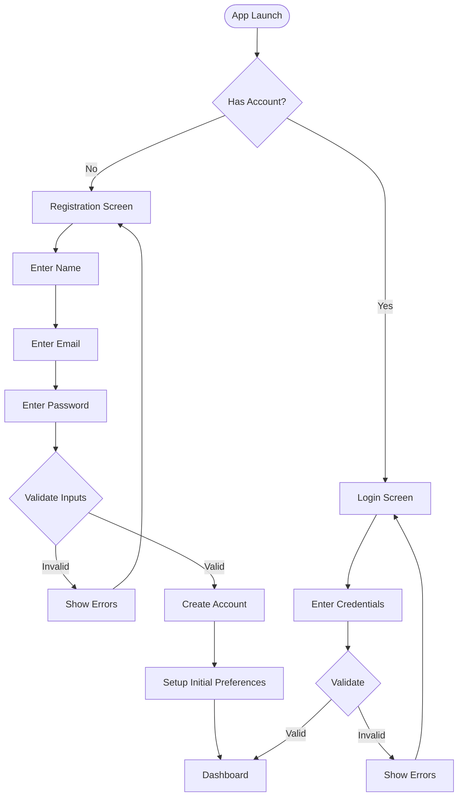

### 1.2 Authentication Decision Tree

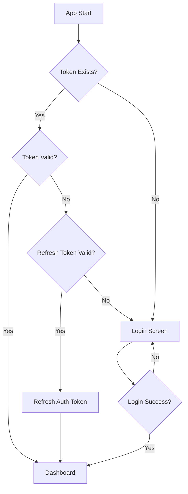

## 2. Task Management Flows

### 2.1 Task Creation Flow

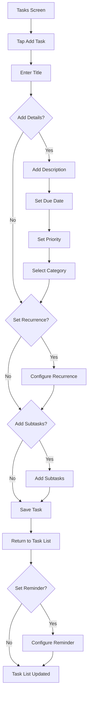

### 2.2 Task Management Flow

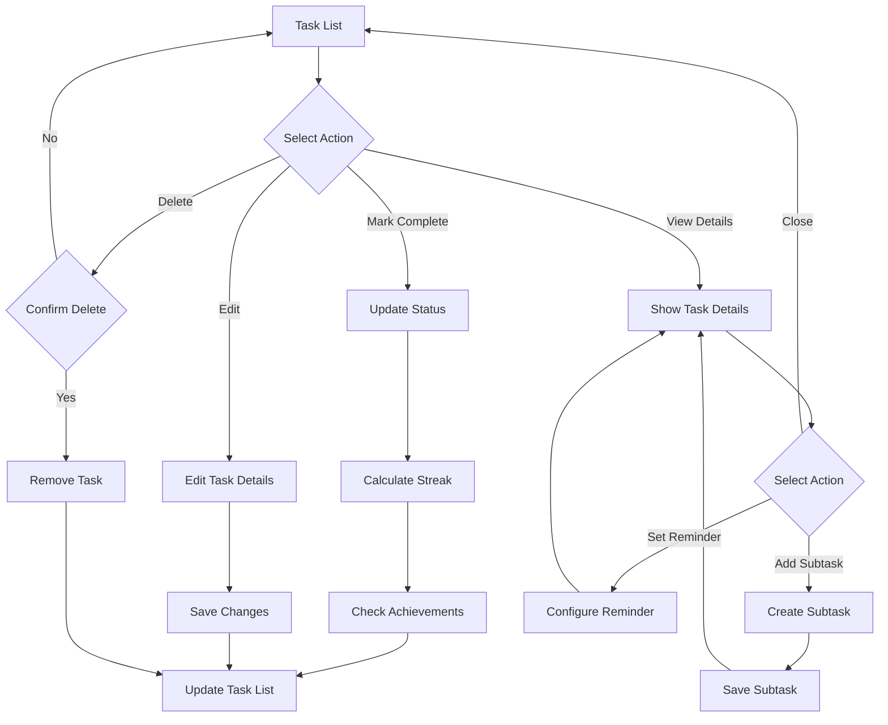

## 3. Habit Tracking Flows

### 3.1 Habit Creation Flow

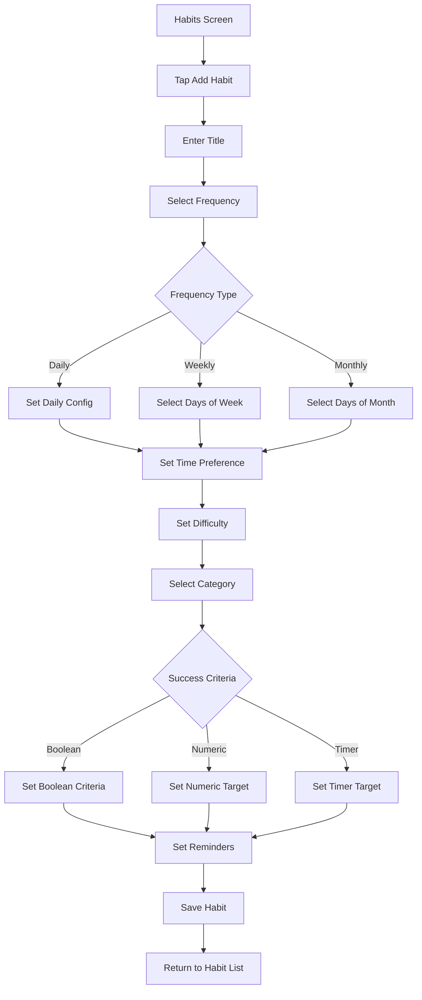

### 3.2 Habit Tracking Flow

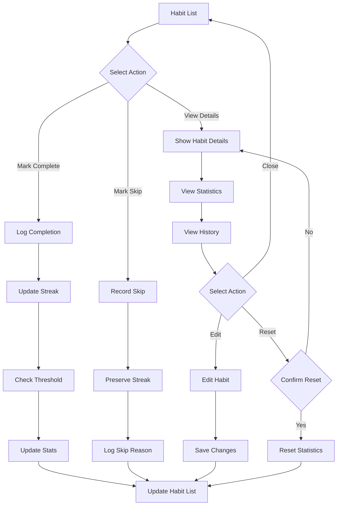

## 4. Goal Management Flows

### 4.1 Goal Creation Flow

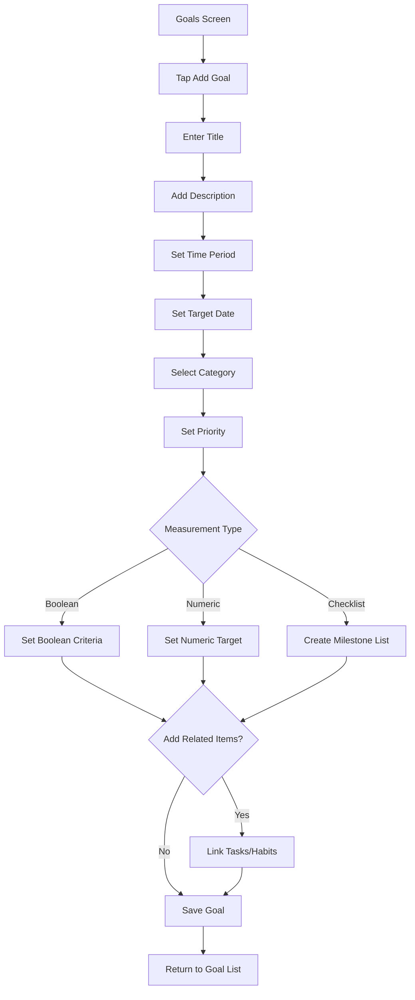

### 4.2 Goal Progress Tracking Flow

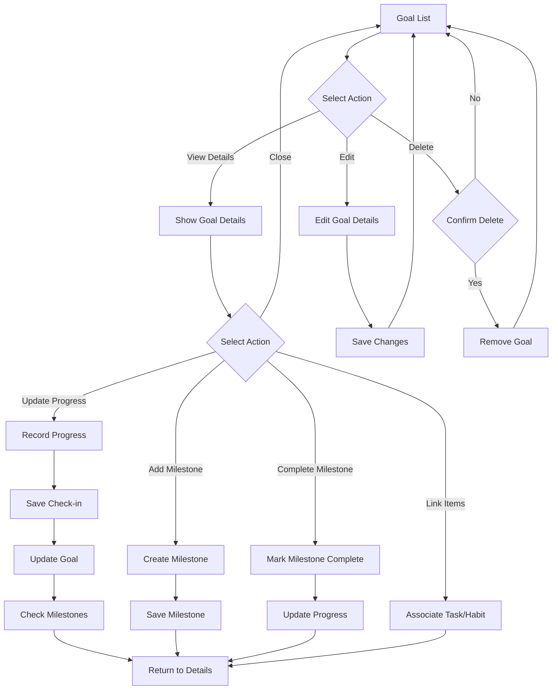

## 5. Dashboard & Overview Flows

### 5.1 Dashboard Interaction Flow

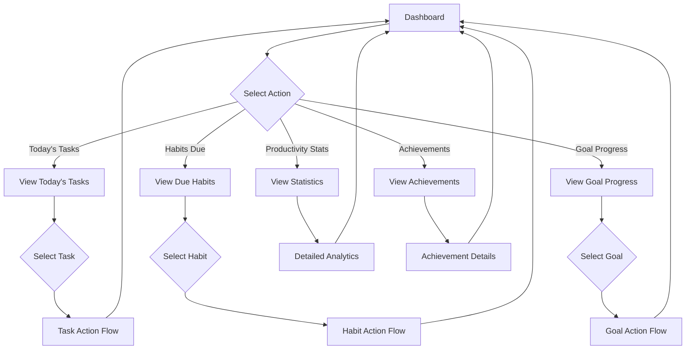

### 5.2 Daily Review Flow

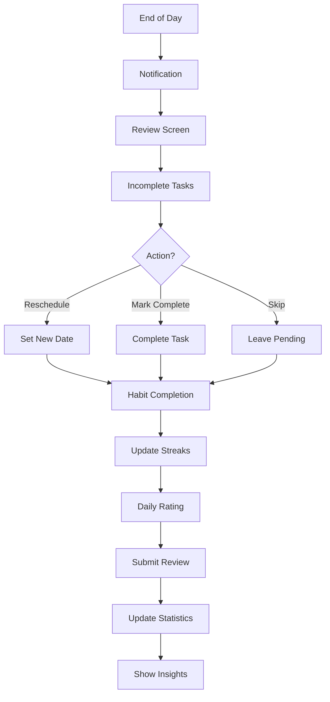

## 6. Settings & Profile Management

### 6.1 Profile Management Flow

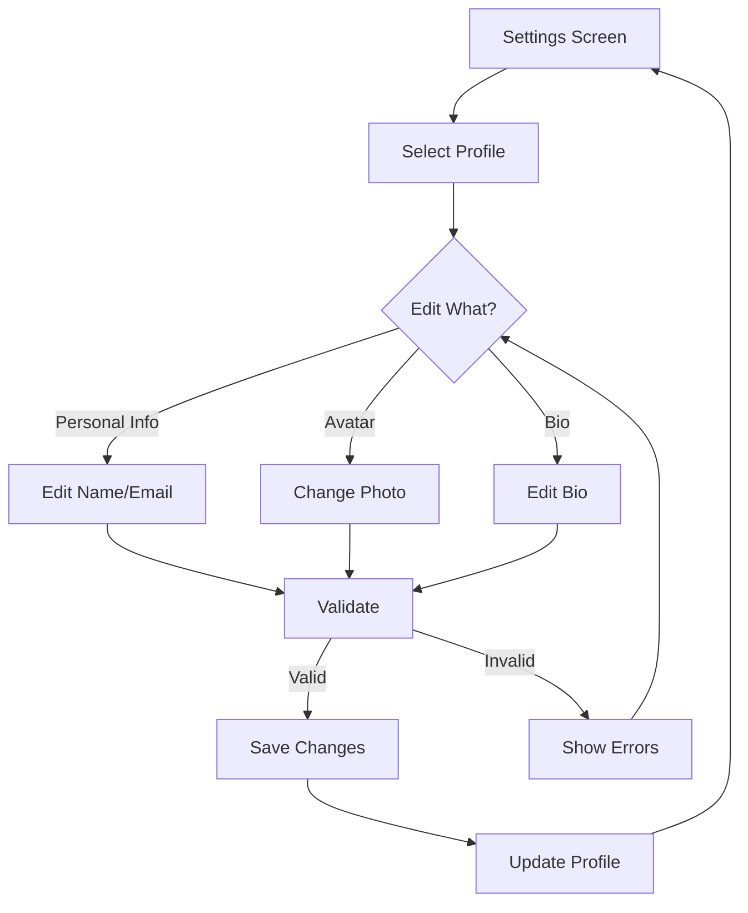

### 6.2 Settings Configuration Flow

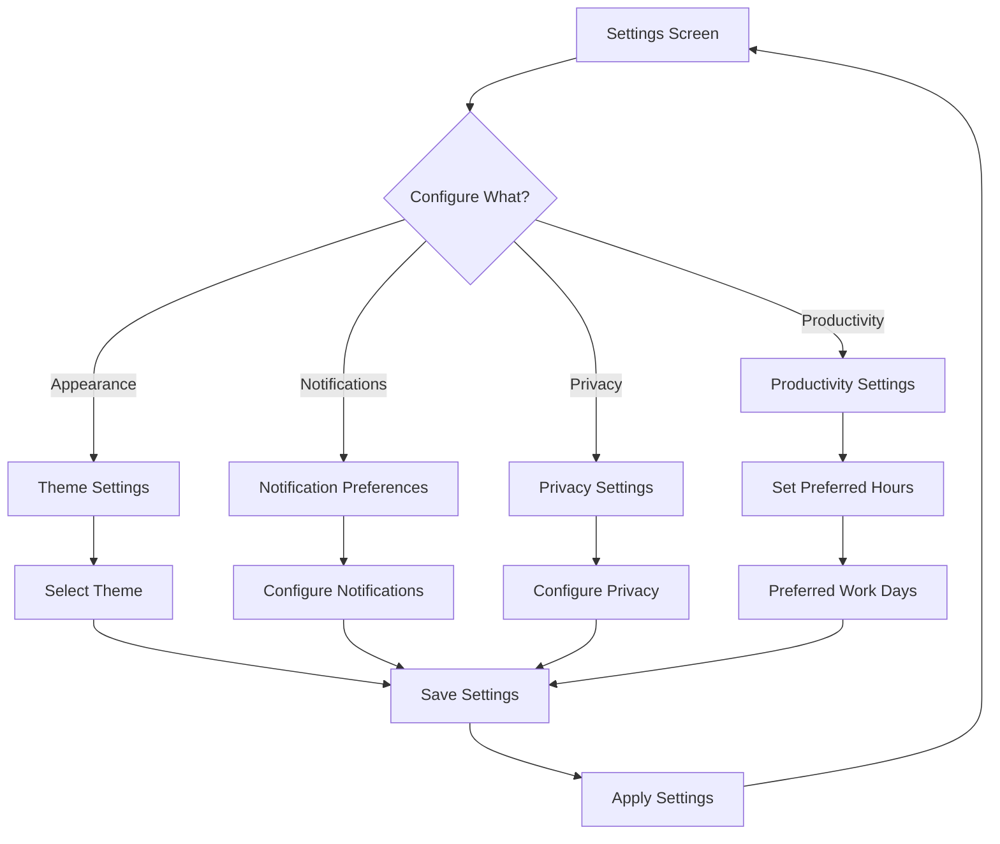

## 7. Category Management Flows

### 7.1 Category Creation and Management

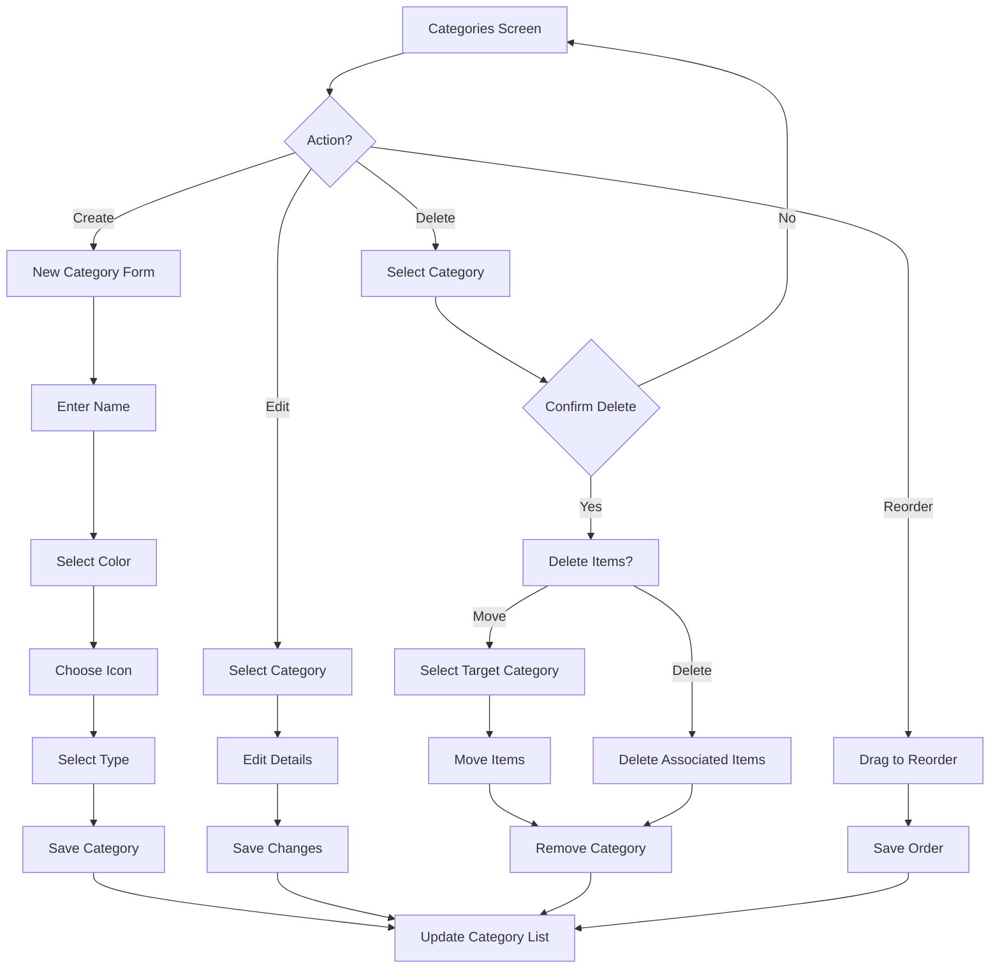

## 8. Productivity Tracking Flows

### 8.1 Focus Timer Flow

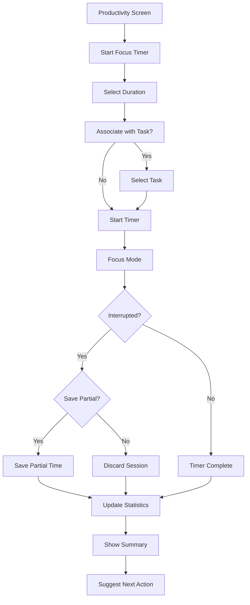

### 8.2 Productivity Analysis Flow

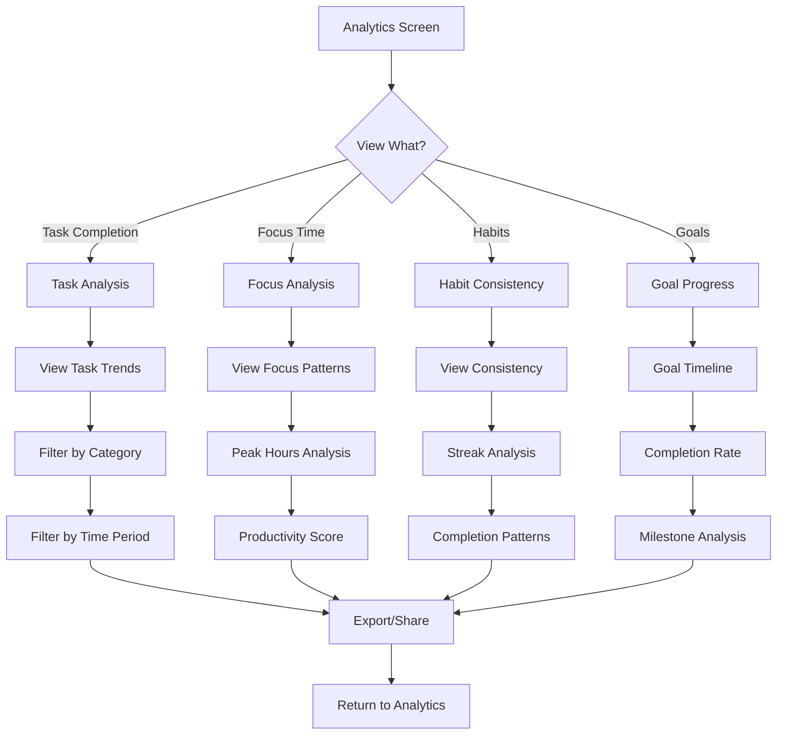

## 9. Achievement System Flows

### 9.1 Achievement Interaction Flow

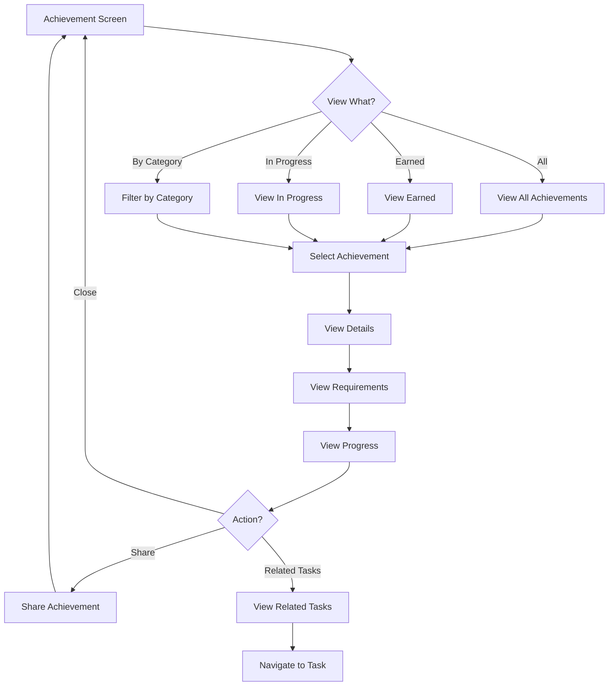

### 9.2 Achievement Trigger Flow

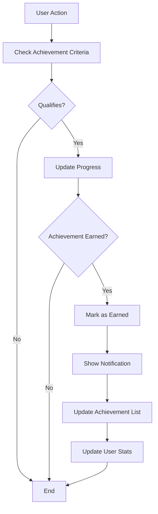

## Integration Points

These flows interact at multiple integration points to create a coherent user experience:

1. **Dashboard Integration**: Pulls data from Tasks, Habits, Goals, and Productivity systems to create a unified view.

2. **Category Cross-functionality**: Categories apply across Tasks, Habits, and Goals, providing consistent organization.

3. **Achievement Triggers**: User actions across all systems can trigger achievement progress and completion.

4. **Productivity Analysis**: Combines data from multiple systems to generate insights and recommendations.

5. **Profile & Settings**: Apply globally across all features and functions within the application.

## Mobile vs Web App Differences

While the core flows remain consistent across platforms, some UX adaptations exist:

- **Mobile**: Emphasizes quick actions, swipe gestures, and focused views optimized for smaller screens.

- **Web App**: Provides expanded views, keyboard shortcuts, and multi-column layouts for power users.

These differences are implemented at the UI level while maintaining consistent underlying logic and data flow. 